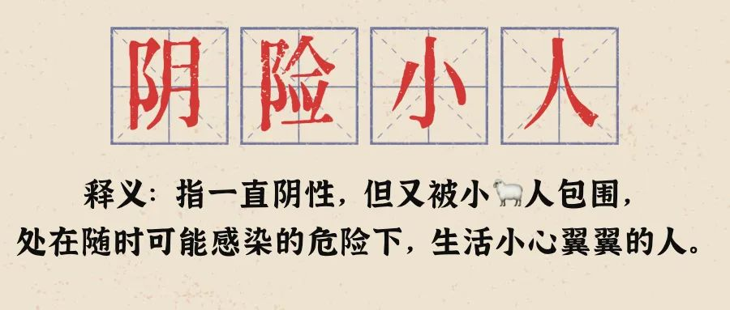

#【随笔】「阴险小人」的日常

早上起来，觉得没睡够，但是必需起床准备工作了。趁大宝还在睡回笼觉，点了根艾条一边依次给自己把合谷、神阙、关元、足三里灸上一遍，一遍顺便在几个屋子里转了一圈，算是「做法消毒」。

然后，刷牙前拿盐水洗了洗鼻子，又弄了杯盐水准备漱口。大宝问我：

> 你刚刚不是洗过了吗？

我告诉她这是漱口用的，她表示不解：

> 怎么会这么麻烦，难道洗鼻子时洗不到喉咙吗？

我表示：

> 不一样的，洗鼻子时，基本上水都是从另一个鼻孔流出来，洗不到喉咙的。

然后盛粥，准备吃饭。我晃了晃脑袋，觉得头疼得厉害，赶紧对大宝说：

> 糟了，头疼了！我觉得我的疑阳症加重了！！！

大宝不屑地说：

> 你已经有这各种症状快两周了好吗？

虽然这么说，她还是接过我递给她的干姜甘草汤喝了一杯。

我给她看了一眼公司一个7人小群里的消息，最早发烧的那位同事今天去了办公室，惊叹办公室没人了。有人开玩笑，大家都还是杨过，只有他是杨康。然后他们开始交流发高烧、水泥鼻、吞刀片的感受，我没敢出声，不知道另一位也没发言的同事是否也是和我一样的「阴险小人」。

……

晚上，我们正打算带着孩子出门玩一下，大宝忽然发现阿宝温度有些高，我赶紧找了温度计量了一下：37.4摄氏度，有点低烧了。大宝有点紧张：

> 完了，怎么办？

我愣了一下：

> 那还能怎么办？该咋办咋办呗……

阿宝精神头不错，我们还是带她到楼下完了一会儿，可是到处都是咳嗽声，而每一个靠近我们，咳嗽的人都让我们紧张不已地查看，两个孩子的口罩到底戴好没有。然后，阿宝竟然玩出汗了，用手一摸，似乎体温又恢复了正常。

睡前又测了一次阿宝的体温，37.2摄氏度，还是比我们都要高0.5度左右。该怎么处理呢？有些摸不着头脑……

唉，自己的头也更疼了，也不知是加班加的，还是昨晚没睡够，抑或依旧是焦虑疑阳🐑中？

大宝和孩子们都睡着啦，我还是洗洗睡去吧……