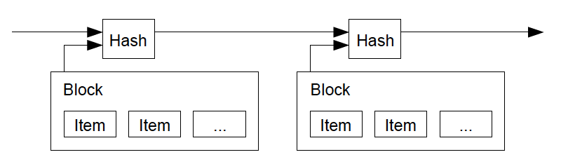

#【区块链】什么是区块链（八）

## 风险提示

**由于目前区块链领域里充斥着大量的资金盘、空气币。**而且，说起区块链，不可避免地涉及到金融、投资或者投机等话题。**投资有风险、决策需谨慎**，请各位朋友们擦亮眼睛，**风险自担**。

> “比特币交易作为一种互联网上的商品买卖行为，普通民众在**自担风险**的前提下拥有参与的自由。”
>
> “代币发行融资与交易存在多重风险，包括虚假资产风险、经营失败风险、投资炒作风险等，**投资者须自行承担投资风险，希望广大投资者谨防上当受骗。**”
>
> ——*摘自人民银行等五部委发布的《关于防范比特币风险的通知》*准备工作

## 比特币到底做了什么

### 技术方面

上次，比特币在技术领域所做的第二件重要的事情还没讲完：

#### 比特币用密码学原理重新定义了电子货币

上次提到了「双花问题」，那么不想引入一个「中心系统」的比特币，究竟构思出来一个什么新点子呢？一切从所谓「时间戳服务器」开始。

##### 时间戳服务器

关于时间戳服务器，白皮书原文里，就这么简单的四句话：

> The solution we propose begins with a timestamp server. A timestamp server works by taking a hash of a block of items to be timestamped and widely publishing the hash, such as in a newspaper or Usenet post [2-5]. The timestamp proves that the data must have existed at the time, obviously, in order to get into the hash. Each timestamp includes the previous timestamp in its hash, forming a chain, with each additional timestamp reinforcing the ones before it.
>
> 我们提出的方案从时间戳服务器开始。时间戳服务器计算包含多个需要被打时间戳的数据项的区块的哈希值并广泛地发布这个哈希值，就像在报纸或新闻组帖子里[2-5]。时间戳能证明要得到这个哈希值，显然这些数据当时一定是存在的。每个时间戳的哈希值都纳入了上一个时间戳，形成一条链，后面的时间戳进一步增强前一个时间戳。

请注意，就在这四句话里，中本聪不经意地引入了后来开创时代的词——区块链。当然，他本来只不过只是直接使用了计算机数据结构中的术语「Block 区块」和「 Chain 链」而已。这本是两个普通得不能再普通的计算机技术，谁曾想，它们被「Hash 哈希」撮合在了一起，竟然会有「金风玉露一相逢，便胜却人间无数」的效果呢？

大家还记得在上一篇「双花问题」中遗留下来的具体问题吗？

> *收款人的每一笔交易，都需要一个证据，那就是大多数人（系统节点）认可这确实是第一笔交易。*

现在，时间戳服务器把一系列交易，按顺序封装到了一个「区块 Block」里，再用带Hash 的「链 Chain」把一个又一个「区块 Block」串起来，确保他们的顺序也同样是井然有序。这就好像一系列有编号，有页码，有行号的记账簿，其中记录了所有、全部的交易。有了这个记账簿，想要确认哪一笔交易是某某收款人的第一笔交易，就易如反掌了。

那么接下来，怎么证明，这是大多数人（系统节点）认可的呢？又是一个创新概念被引入，下回再细说。

<待续>