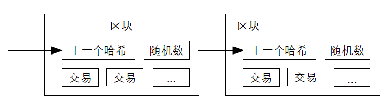

#【区块链】什么是区块链（九）

## 风险提示

**由于目前区块链领域里充斥着大量的资金盘、空气币。**而且，说起区块链，不可避免地涉及到金融、投资或者投机等话题。**投资有风险、决策需谨慎**，请各位朋友们擦亮眼睛，**风险自担**。

> “比特币交易作为一种互联网上的商品买卖行为，普通民众在**自担风险**的前提下拥有参与的自由。”
>
> “代币发行融资与交易存在多重风险，包括虚假资产风险、经营失败风险、投资炒作风险等，**投资者须自行承担投资风险，希望广大投资者谨防上当受骗。**”
>
> ——*摘自人民银行等五部委发布的《关于防范比特币风险的通知》*准备工作

## 比特币到底做了什么

### 技术方面

上次，还在讲这个章节

#### 比特币用密码学原理重新定义了电子货币

里关于时间戳服务器的事儿。那么有了时间戳服务器，形成了所有账本和交易记录按时间排序的「区块链」之后，怎么得到大多数人（或者说系统节点）的证明呢？

##### 工作量证明（POW）

中本聪使用了类似1997年Adam Back所提出的[哈希货币](http://www.hashcash.org/papers/hashcash.pdf)的工作量证明系统（下载不了这篇论文，可私信找我要）。不知大家是否还记得之前讲过，所谓好的「哈希相机」的特征：

> 1. 拍照快：给出原始数据，能迅速算出固定长度的摘要来。
> 2. 难还原：拿着摘要，在正常的时间内，几乎不可能还原出原始数据。
> 3. 摘要散：这是被称为「散列」的原因，哪怕是在数万字的原始数据中修改一个字母，摘要也会看起来完全不同，基本上均匀分布。
> 4. 无冲突：简单来说，两样不同的东西，不能拍出一摸一样的照片来。

中本聪为比特币选用的是SHA256算法，关于这个算法的选择，还有一个传奇故事，等下次我打个岔专门讲讲。今天先继续简单介绍POW究竟是怎么回事。Hash算法不是难以「还原」么，那就拿这个最难的事情当作「工作」好了。所以，当某个人（某个比特币节点）打包完网络上所有的交易记录，做好账本，要产生一个新的「区块」时，它必须再做这样一件事情来证明自己为此投入了最大化的工作量：

**找到一个数，对这个数进行Hash时，得到的Hash数值以若干个0比特开始。**

具体一点，得这么干（假设系统难度要求是8个0开头吧）：

1. 找一个随机数。
2. 对这个随机数，📷咔嚓来一张「Hash拍立得」，做个SHA256的Hash摘要。
3. 检查这个「照片」，看看摘要的前8位是不是8个0。如果是，结束。将这个随机数和这个区块一起打包，封账。如果不是，回到第一步。
4. 如果自己还没找到这个随机数，却接到通知说别的节点已经找到了。赶紧进行验证，也就是拿别人找到的随机数，自己做个SHA256的Hash摘要验算一下。前8位果然是8个0，就赶紧认怂，放弃做这本账的任务，而是基于这个最新已经封账的区块，开始下一个新账本的打包工作，同时继续第一步：找这个符合要求的，神秘「随机数」

当然，一旦找到这个数，任何其他节点可以非常容易地验证这个结论。谁让好Hash，就是拍照快呢！需要的0比特越多，找到这个数字就越困难，所需要工作量呈指数级增加。然而验证结果，依旧只需要一次Hash。

所以，简单来说，哪个节点最先找到了这个满足要求的随机数，哪个节点就有权把最新的交易记录进行打包，同时加上这个随机数，生成新的「区块」，并链接到上一个「区块」。接下来整个网络，就在这个区块的基础上继续记录新的交易。如果想要更改这个区块里已经记录好的交易数据，那么需要消耗算力，重新干一次找随机数这件事儿。由于后面的区块紧跟在这个区块之后，那么想要修改某个区里的交易数据，需要修改之后链接的所有区块才行。

中本聪用这种方式，同时解决了怎么得到「多数人/节点」认可的问题。并且让攻击变得从逻辑上不可行。具体怎么回事儿呢？

<待续>

