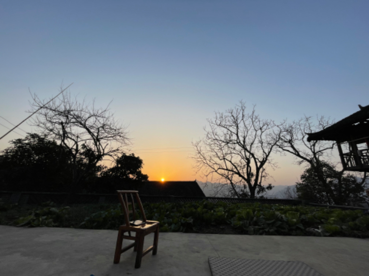

#【随笔】闲散的初六

屋后那家嫁闺女办喜的，在半夜里燃放了一阵烟花和鞭炮之后就安静了下来。想必是已经出门了吧。土家族嫁女半夜出门的规矩，也不知从什么时候开始的，过去的土司们又是靠什么维持着那显然专制且不近人情的统治呢？

公鸡打了几次鸣，天就亮了。这山里的公鸡从不老老实实只叫三次，而是从半夜起每隔一段时间就叫上一阵子。记得大宝说她小时候，如果有乱叫的公鸡，一般都会被杀掉，可如今所有的公鸡都乱叫，却再也没人觉得奇怪了。

太阳出来以后，天气就没那么冷了，我们带着孩子们去山里看外公外婆养的小羊羔。经过之前养鸡的山头前，发现那曾经养鸭养鱼的池塘已经干得裂开来，几个拳头般大小的田螺壳嵌在泥里，我捡起一个了，发现早已干透死透了！

我这才意识到，这几天寨子的停水，只是洗衣服不方便而已。再想起老童告诉我，今年大旱，新包下的几百亩地颗粒无收。要搁以前，哪里会如此轻描淡写，恐怕是要饿死人的天灾呢。

然而，寨子里的人从来没有断过粮，街上始终能买到湖北或别处运来的大米和粮食。寨子里往年吃水的井打不出水来，便有国家的资助，重新用机器打了深井，虽然泥沙多，没用多久就弄坏了水泵，但终究只是不便，过些日子就该可以修好了！

山上的嫩草也发了些出来，前两周出生的四只小羊羔没多少奶喝，阿宝的外公外婆就给它们每天喂一次奶粉，如今也是健壮地开始在石头上蹦来蹦去，开始学大羊撞角打架了。

太阳倏地就藏到了山后，弯弯的月牙已经在天顶等待着值班了。初六就这样快过去了，一天闲散，啥也不想干…

