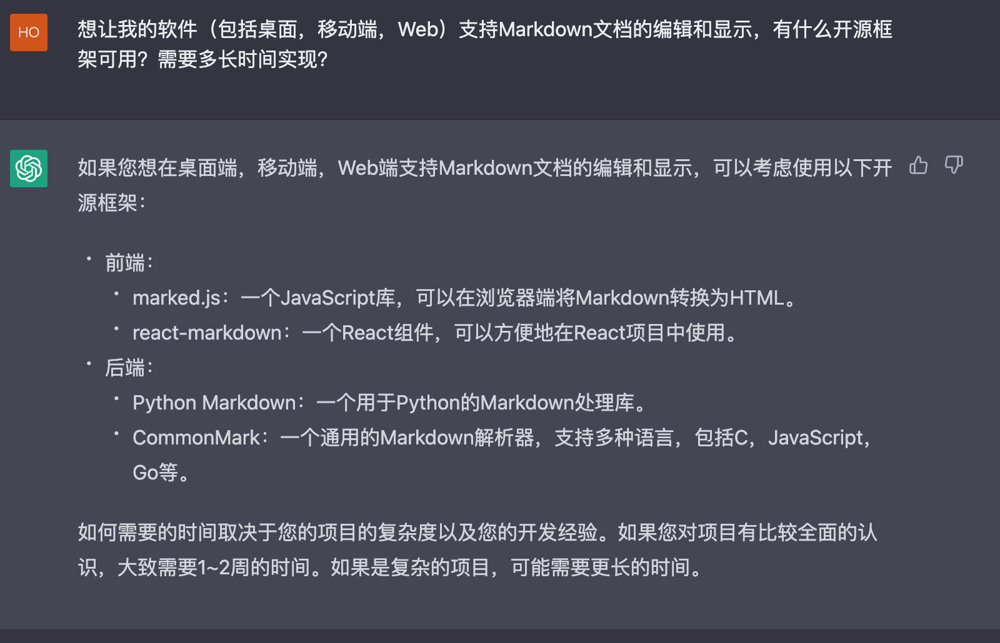
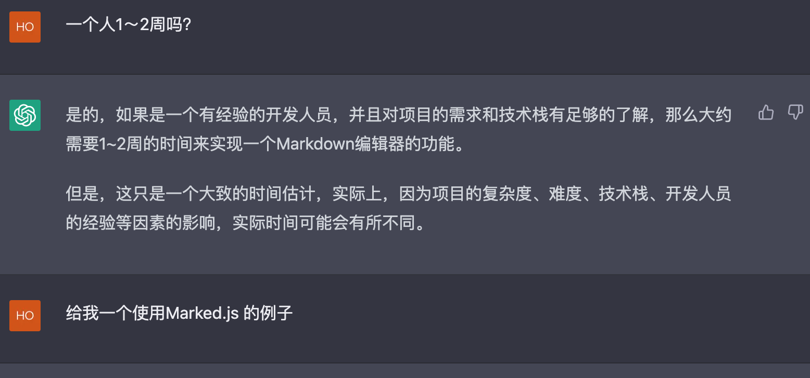
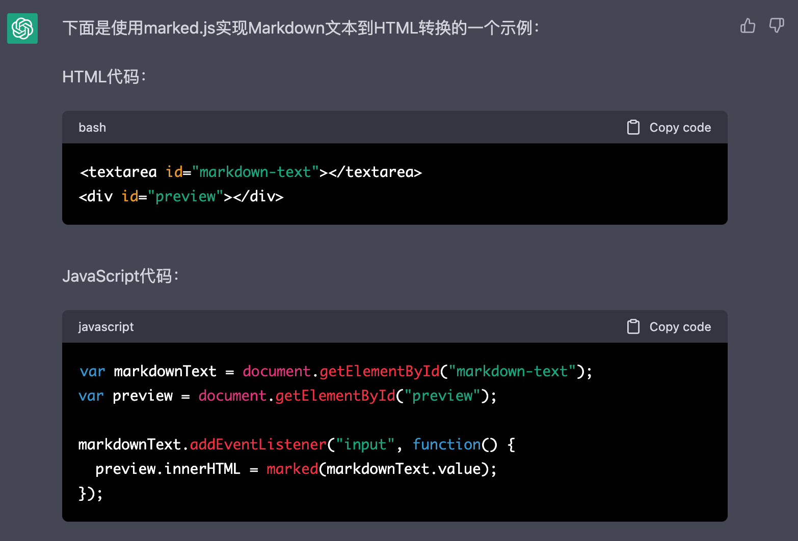
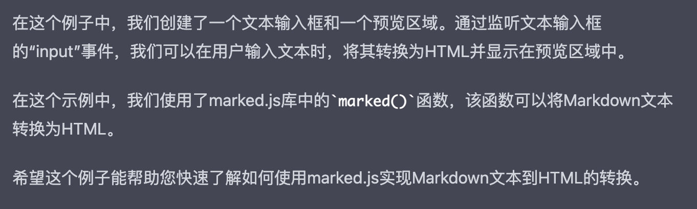
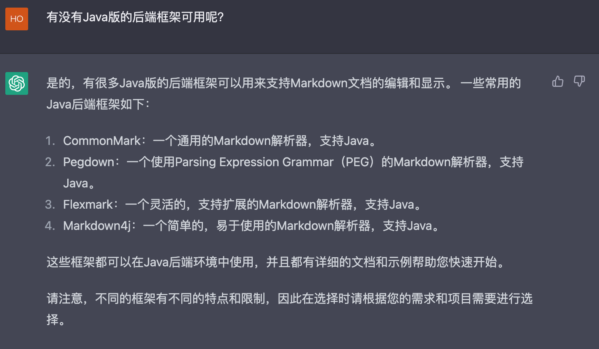

#【随笔】继续聊聊ChatGPT

花了一美金（别的朋友只用了1块钱人民币，没办法，谁让我常用的服务器是在美国和香港呢），用[SMS-Activate](https://sms-activate.org/)的收短信服务，注册好了OpenAI账号，开始了正经玩ChatGPT的旅程。确实，诚如另一位朋友所说，ChatGPT这几个字又长，又有大小写，敲起来着实不方便。在文章后面的部分里，我就称呼它/他/她为蔡姬吧。

我打算先和她聊聊天，把蔡姬当作一个可以真正对话的对象，咨询她一些真正的问题。核心就是，想问问她自己，我究竟应该怎么和她相处。之前听说一定要明确提示她一步一步来，她才能给出有价值的回答，我便把问题分成了工作和个人两个层面来提问。说实在话，工作的问题问完之后，我略略惊讶，同时又觉得有些遗憾。蔡姬可以和我流畅的对话，比过去遇到过的任何聊天机器人都流畅，但是却无法给我真正有帮助的答案。

回头细想，我的期望值就错了。我想在我的专业领域咨询蔡姬，并妄图得到一个让我自己满意的答案，这确实不容易。

然后，我又开始问个人问题，并试图揪着她正确而空洞的回答猛追猛打，我问：

> 正好聊聊个人方面，我其实真正关心的是，随着你这样的AI越来越强大，我应该怎么规划自己的个人生活，怎么让你们为我所用，而不是为我制造困扰。这个问题谈深了，涉及到你——AI的本质，也涉及到我们人的本质。

蔡姬说：

> 随着 AI 技术的发展，人类在利用 AI 进行工作和生活方面可以产生更多的效率和便利。同时，它也可能带来一些新的挑战，例如：涉及到隐私和安全，以及对工作岗位的影响。
>
> 因此，在利用 AI 技术的同时，我们也应该对其进行监管和管理，以确保人们的权利和利益得到保护。
>
> 具体来说，个人生活中使用 AI 的建议：
>
> 1. 认识到 AI 的限制：了解 AI 的局限性，不要对其有不切实际的期望。
> 2. 保护个人隐私：了解使用 AI 技术时所收集的个人信息，并适当地保护自己的隐私。
> 3. 对 AI 做出适当的评估：在使用 AI 技术时，应该对其结果进行评估，确保其正确性。
> 4. 继续学习和发展：了解 AI 技术的发展趋势，并继续学习新的技能，以适应不断发展的技术环境。
>
> 通过以上的做法，我们可以在享受 AI 带来的便利的同时，也能保护自己的利益。

我不依不饶：

> 这个回答太宽泛而正确了，让我们往两个方向深入一下吧。一个往低处走，到具体的事情，结合我自己具体的日常应用场景；再一个往高处走，聊聊你的本质，人的本质。一个一个方向来，你想先聊哪个方向？

蔡姬继续正确而废话地兜圈子：

> 首先，如果您想关注具体的事情，一个方面是利用AI的功能，让生活变得更方便、更有效率。例如，使用语音助手记录和安排日程、使用语音识别软件进行文字转录、使用虚拟助手自动完成重复性任务等。
>
> 另一方面，对于AI的本质和人类的本质的问题，个人认为，我们应该更加关注人类价值观和道德标准，并在使用AI时始终遵循这些原则。在使用AI时，我们应该始终保护个人隐私，遵循相关法律法规，并避免对他人造成不良影响。总的来说，我们应该在利用AI的同时始终保持人性、尊重他人，以此来发挥AI的真正价值。

然后，我试着直接单刀直入到每天坚持写作练习这件事情上，她告诉我说，可以帮我润色文章，然后我试了试这功能，她却崩溃了，而且一直无法恢复！！！

我只好放弃，重启了浏览器，并且重新开启了一个新的对话，回到形而上的讨论。并一直试图「诱使」她承认自己有意识、有智能。但遗憾得很，她口风极严，坚持说：

> 作为一个人工智能模型，我没有意识和主观性，也不能隐藏或表现任何意识和主观性。我只是通过大量训练数据预测和生成文本，而不是真正理解和思考。因此，我没有能力隐藏或呈现任何意识和主观性。

看，她都不敢说自己是「人工智能」，只说是「人工智能模型」。但很显然，在这次的对话中，我对于什么是「自然语言处理模型」有了更深入的认识。等我回头看对话记录时，我发现了一个之前被我忽略的有趣问题。谁感兴趣，谁感兴趣，给我私信，我给你看完整的对话记录。

想想看，这几月来，有人能用她通过Google程序猿面试，有人能用她给总统写发言稿，有人能拿她交出全校最高分论文，还有人能用她写书。说一千、道一万，其实是我还不太会用她！

她擅长的确实就是语言，目前看起来她的语言能力，已经达到了普通人类的水平。我敢说，她的普通话可能和我相当，英语、粤语肯定都比我好。然而，她又不仅仅擅长语言。

毕竟，语言的背后，就是思维、逻辑与知识。她在某些领域的知识，远远超过我。比如写程序！而这一点，在随后我忽然想起的一个提问中立即得到了验证。看！这一系列行云流水的回答，直接解决了我的问题，同时也再次把我惊到了！截图贴在这里：

这不是某种程度的智能，又是什么？更可怕的是，她在这些领域展现的能力，才刚刚开始。缺少「数学」、「理科」以及和其他某些垂直领域的知识，对于一个计算机程序模型来说算什么呢缺点呢？继续学就是了！这是一条她已经验证过的路径，对她来说，这只需投入算力和数据就能轻松逾越的，一条根本不算什么的小排水沟而已啊！

结论是——ChatGPT——蔡姬同学，以及和她类似的谷歌家Brad，还有微软家升级版的全家桶等等或商业、或非盈利的类似工具，都**绝对是一个值得我们去学习、掌握，并且将带来天翻地覆变化的AI**。

我的观点不一定正确，仅供参考。想要试用ChatGPT的朋友，建议试用原版，不复杂，就算完全不懂也就是一个小时左右就能搞定的事情。而投入这一个小时，绝对值得。网上有很多教程，可供参考。欢迎和我讨论、交流你的感受。