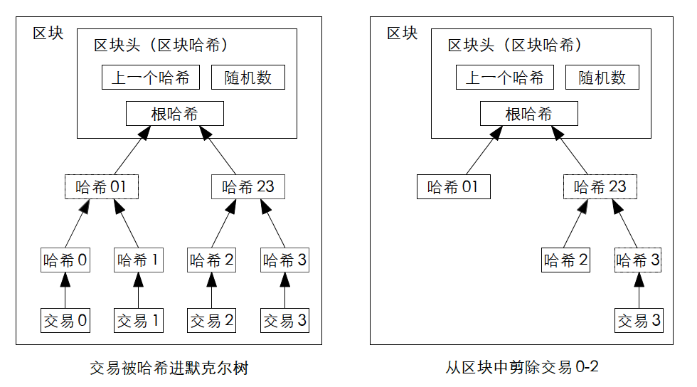

#【区块链】什么是区块链（十三）

## 风险提示

**由于目前区块链领域里充斥着大量的资金盘、空气币。**而且，说起区块链，不可避免地涉及到金融、投资或者投机等话题。**投资有风险、决策需谨慎**，请各位朋友们擦亮眼睛，**风险自担**。

> “比特币交易作为一种互联网上的商品买卖行为，普通民众在**自担风险**的前提下拥有参与的自由。”
>
> “代币发行融资与交易存在多重风险，包括虚假资产风险、经营失败风险、投资炒作风险等，**投资者须自行承担投资风险，希望广大投资者谨防上当受骗。**”
>
> ——*摘自人民银行等五部委发布的《关于防范比特币风险的通知》*准备工作

## 比特币到底做了什么

### 技术方面

#### 比特币用密码学原理重新定义了电子货币

##### 节省磁盘空间

前面一再提到，这里的每一枚电子货币，就是一条数字签名链——一系列交易记录。为了节省空间，中本聪做了这样的设计：

> 一旦某个货币的最新交易已经被足够多的区块覆盖，这之前的交易就可以被丢弃以节省磁盘空间。

为了实现这一点，比特币中使用了Merkle Ralf 在 1980 年《[Protocols for Public Key Cryptosystems](https://ieeexplore.ieee.org/document/6233691)》中提出的[默克尔树，又叫做哈希树](https://en.wikipedia.org/wiki/Merkle_tree)。默克尔树是这样一个典型的二叉树结构，由一个根结点、一组中间节点和一组叶节点组成：

* 最下层的叶节点包含存储数据或他的哈希值
* 非叶子节点（包括中间节点和根节点）都是它的两个孩子节点内容的哈希值

交易被哈希进默克尔树，简单来说，就意味着一层一层，对着「哈希拍里得」的照片再次拍一张「哈希拍立得」。所以，根节点的这张「哈希拍里得照片」本质上代表了下面所有叶子节点上的交易记录，最终只有它被纳入区块的哈希值。

老的区块可以通过剪除树枝的方式被压缩，树枝内部的哈希值不需要被保存。

中本聪做了个简要计算，认为按照这样的方式，就算把区块头一定要放在内存而不是磁盘，也不是问题。当然，存储和空间最终还是成为要被讨论的问题——这是后话。

<待续>