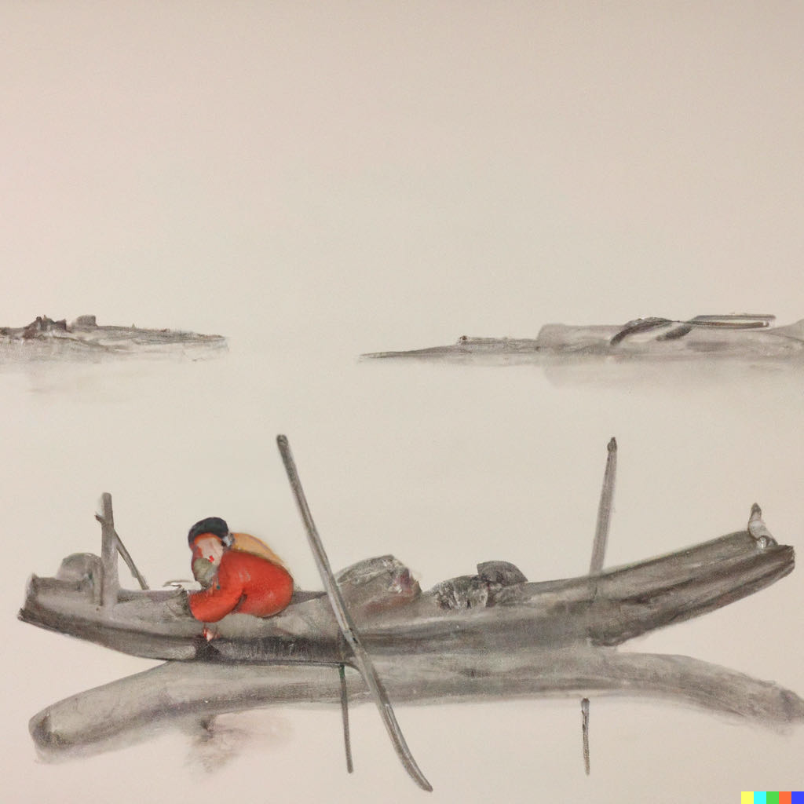

#【生命⋅修行】安之若命

这几天，大宝和我说她想通了一个道理：

> 我们的人生，和那些修仙小说里可能差不多呢。神仙下凡历劫，总要拿到一个剧本，有人生而富贵，含着金钥匙出生。也有人可以躺着享福一生。
>
> 我们的剧本，显然不是这种。不然，我们现在就已经开始享福了。我们拿到的剧本，很可能就是要先奋斗，而后有所得呢。
>
> 所以，那就安心地努力奋斗吧……

不禁想起，在《庄子·徳充符第五》里有这么一句：

> 知不可奈何而安之若命，唯有德者能之。

「安之若命」，想到这四个字一出现在脑海里，我就立刻想起了自己的另一个偶像——苏东坡。然后紧接着，我就想，如果让ChatGPT帮我接着写下去会怎样？

我先问了问：

> 把和“安之若命 ”有关的古代名句和出处都告诉我

蔡姬：

> “安之若命”是一句出自于古代汉朝文学家班固所著《汉书·司马迁传》的名句。原文为：“司马迁为人刻骨，卒以狱死，自述以至于死，罪不至於一死。然犹自持节安之若命，不屈不折，可谓壮烈矣。”
>
> 这句话的意思是指司马迁在被判处死刑之前，依然坚守自己的信念和原则，不屈不挠，甚至在面对死亡时也能保持镇静和从容。
>
> 这句话后来被广泛引用和传颂，成为一种表达人在面临压力和困境时仍然坚守信念，不屈不挠的精神风范的成语。

我：

> 还有哪里有这句话呢？

蔡姬：

> “安之若命”这句话在中国古代文学中被广泛引用和运用，除了班固所著《汉书·司马迁传》中，还有其他许多文学作品中出现过。
>
> 比如，唐朝诗人白居易的《赋得古原草送别》中有“离别家园四百年，同是人间觅茶仙。安之若命出尘埃，散作东风泪如雨。”的描述，表达了诗人在远离家乡和亲人，漂泊他乡的旅途中，仍然能够以平静的心态面对生命中的起起落落。
>
> 此外，清代文学家纪晓岚的《浴华亭记》也有“慨然以命安之，视死如归”的写照，表现了他在面对家族衰落和生命危险时的豁达和从容。

我：

> 庄子里呢？苏轼的诗词里呢？

蔡姬：

> 在《庄子·人间世》中，庄子也有一段类似的描述，他写道：“彼且与彼，其死也如婴儿之死耳。车之所覆，虽有蒺藜，不觉其厉。挫之以金石，不全其形。且夫古之至人，安之若命，故能极其寿数而无患者，以其不蹈人之流，故不受人之害也。”
>
> 这里的“安之若命”表达的是古代智者安然处世、对待生死如一的境界，他们虽然生活在世俗纷扰之中，但是仍然能够保持超然的态度，追求内心的平静与自由。
>
> 在苏轼的诗词中，也有“安之若命”这一成语的运用。比如他的《江城子·乙卯正月二十日夜记梦》中就写道：“黄金榜上央守，素车书中宰相。此事只今日，不关乎人力。世事如棋，乾坤莫测。香山红叶老，漫卷诗书寄。安得广厦千万间，大庇天下寒士俱欢颜，风雨不动安如山。呜呼！何时眼前突兀见此屋，吾庐独破受冻死亦足。”
>
> 其中“安得广厦千万间，大庇天下寒士俱欢颜，风雨不动安如山”一句，表达了苏轼对于宏伟的人生理想和高远的境界的追求，而“风雨不动安如山”和“安之若命”这两个词则强调了他对于人生态度的从容和坚韧。

我惊呆了，这个一本正经胡说八道的家伙，苏轼的《江城子·乙卯正月二十日夜记梦》什么时候把杜甫的文字揉了进去？再一查，《庄子·人间世》明明是这一句啊——「知其不可奈何而安之若命，德之至也」，我无奈地说：

> 那么，帮我把下面这段续写一下，扩充到500字
>
> ……

蔡姬：

> ……
>
> 人生有时候就像是一部剧本，每个人的剧情和角色不同，但我们都要扮演好自己的角色，完成自己的使命。大宝说的没错，我们可能是被安排在需要奋斗的角色中，只有通过不断努力才能获得成功和成就。
>
> 「安之若命」是一种人生态度，是一种从容和坚韧的心境。在庄子的经典中，他讲到了知道自己无法改变某些事情，就要顺从自然，接受生命的既定安排，不去逆流而上，不做无用的抗争，这就是「安之若命」。这种心态不仅仅是消极的顺从，更是一种积极的心态，要通过积极的奋斗和努力来应对困难和挑战。
>
> 苏东坡也是一个信奉「安之若命」的人，他从他的诗歌中表达了自己的心态和人生态度。在他的诗中，我们可以感受到他对于人生的从容和坚韧，对于公益事业
>
> ……

写到这里，她陷入了久久的沉思，似乎是意识到了，这根本是让我无法满意的文字，又或者是「公益事业」这四个字，实在歪到阴沟里，她自己也没法编下去了……

算了，原有的感悟已经被蔡姬同学带到阴沟里，不知所终了，或许这就是我将要安之的「命」吧。不管来的是什么，终究要耕耘的，还是自己这内心的一亩三分地而已。

怎么想、怎么做、如是而已！

----

本文由浩然 与 蔡姬 联合创作，插图由DALL-E2生成

