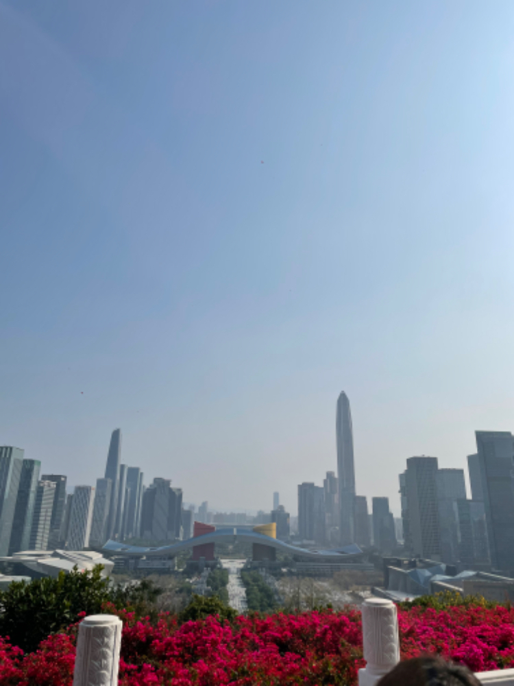

#【随笔】深圳的浪漫

爬上莲花山，想起 S 姐说，山顶广场邓小平雕像前没有开阔地，可以一直看到香港。连忙走到山前望过去，果然，两旁都是比山高的摩天大厦，中间是市民广场，会展中心，一直到很远处才是一排比远山（应该是香港的鸡公岭）要矮一截的楼房。也不知，那排楼是香港那边的，还是深圳这边的。

因为邓小平心心念念香港回归，却终于没能等到最后一刻，在 1997 年 2 月 19 日去世。为了能让莲花山上邓小平的雕像可以一眼望到香港，就有了一个不成文的规定，沿着山坡往南，不许修高楼挡住邓公的视线。这么多年过去了，这留在大家心中的规矩，竟然也一直没人破过。

据说，蛇口的那艘明华轮，也和当年邓小平去法国留学时乘坐的法国邮轮「昂特莱鹏」号有些渊源呢。

深圳人，尤其是深圳的老领导们，看来是真心感恩着邓小平在这里「划圈」的恩情。以至于会如此浪漫地向他致敬多年！