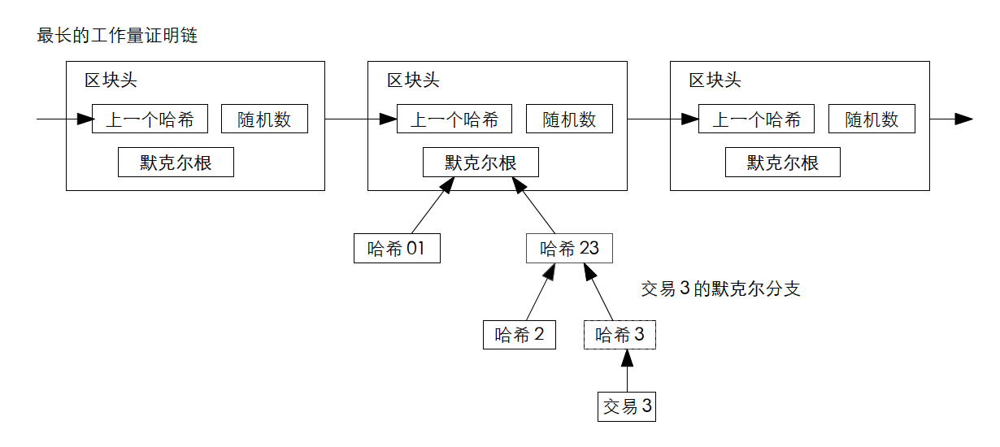

# 【区块链】什么是区块链（十四）

## 风险提示

**由于目前区块链领域里充斥着大量的资金盘、空气币。**而且，说起区块链，不可避免地涉及到金融、投资或者投机等话题。**投资有风险、决策需谨慎**，请各位朋友们擦亮眼睛，**风险自担**。

> “比特币交易作为一种互联网上的商品买卖行为，普通民众在**自担风险**的前提下拥有参与的自由。”
>
> “代币发行融资与交易存在多重风险，包括虚假资产风险、经营失败风险、投资炒作风险等，**投资者须自行承担投资风险，希望广大投资者谨防上当受骗。**”
>
> ——*摘自人民银行等五部委发布的《关于防范比特币风险的通知》*准备工作

## 比特币到底做了什么

### 技术方面

#### 比特币用密码学原理重新定义了电子货币

##### 简单支付验证

前面林林总总讲那么多关于中本聪在比特币系统上发明的时间戳服务器啊、区块链啊、工作量证明啊，归根结蒂就一个目的——存下「有史以来所有的交易」，以便验证这一笔新的交易是正常的交易、而不是『双花』甚至『多花』的骗子交易。

虽然可以用「剪枝」的方法节省存储空间，但想想就知道，所有的交易依然是大海一样的存在。根据[Blockchain公布的数据](https://www.blockchain.com/explorer/charts/blocks-size)，2009年2月23日时，比特币的区块大小（存储所有交易的那本大书所占的空间）还只不过1.156MB，而十四年后，2023年2月19日，这个数字已经翻了将近50万倍，达到了456.722.015MB。

一个优秀的软件系统架构师，往往能够清晰地预见到将来。显然，中本聪就是这样的架构师。考虑到某种应用场景——天知道他怎么知道，后来的主流场景，都是跑在平板、手机这样的终端上的钱包软件为主——在最初的白皮书里，他就设计了这样的简单支付验证方法：

> 1. 只下载最长链的区块头副本
> 2. 向其他节点确认自己确实拥有了最长链，下载包含需要确认交易（比如下面图里的交易3）所在区块的默克尔树分支
> 3. 验证一下这个交易的哈希，以及一路上到这个区块默克尔树根节点的哈希
> 4. 再向其他节点确认、验证一下这个区块是不是在最长链里，并且后面已经跟上了下一个区块（至少有6个节点验证了这一点）

简单来说，SPV节点不是自己做验证，而是偷懒地通过其他节点的验证来间接验证。他并不是把所有交易记录下载下来，验证当前交易是否存在双花。而是只把整本交易记录每一分册的摘要下载下来，同时再把有这笔交易的那几页纸下载下来。然后通过两件事儿确认这比交易的有效性：

1. 这笔交易确实在交易记录中
2. 其他（至少6个节点）都觉得这交易没问题

这样一来，存储量至少可以节省1000倍左右吧，算起来500M或者就算再翻一倍到1个G，现在随便哪款手机、平板都不是问题。

当然了，既然要偷懒就会有安全隐患。SPV依赖的是他周边帮他做确认的那些节点，假如一个SPV节点被「骗子节点」包围，那么他也只好被骗了。他只能尽力地、随机地多去连接不同的节点，以便减少被骗的风险。

同时，由于SPV只下载自己关注的交易信息来进行验证，这样也容易泄露出这个SPV节点和相关钱包地址之间的特殊关系。于是，就更有可能通过这些，嗅探到比特币钱包地址与用户之间的关联关系。

后来，大家开发出了一种Bloom过滤器解决这个隐私问题，这是后话。

<待续>