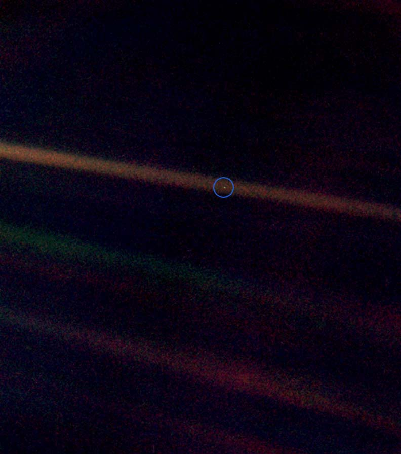

#【生命⋅修行】暗淡的小蓝点与人类的未来

1990年2月14日，卡尔•萨根说服美国国家航空航天局，让即将离开太阳系的旅行者一号回看自己的旅程，拍摄了一组照片。64亿公里外的地球，在照片中看上去，只不过是一颗不显眼的小小的蓝点。于是，卡尔•萨根为浩渺宇宙中的这颗微不足道的黯淡小蓝点写下了下面这些文字：

> ##### [Pale Blue Dot](https://en.wikipedia.org/wiki/Pale_Blue_Dot)
>
> 再来看一眼这个小点。就在这里。这就是家。这就是我们。在这个小点上，每一个你爱的人，每一个你认识的人，每一个你听说过的人，每一个人，无论他是谁，都曾经生活过。我们所有的快乐和挣扎，数以千万自傲的宗教信仰、思想体系观念意识，以及经济学原理教义，每一个猎人或征服者，每一位勇士或是懦夫，每一个文明的缔造者或摧毁者，每一位君王或农夫，每一对陷入爱河的年轻伴侣，每一位为人父母者，所有充满希望的小孩，发明家或探险者，每一位灵魂导师，每一个腐败的政客，每一个所谓的「超级巨星」，每一个所谓的「最伟大领袖」，每一位我们人类史上的圣人或是罪人……我们的一切一切，全部都存在于这样一粒悬浮在一束阳光中的尘埃上。

2005年，[雷蒙德·库茨魏](https://zh.wikipedia.org/zh-hans/%E9%9B%B7%E8%92%99%E5%BE%B7%C2%B7%E5%BA%93%E8%8C%A8%E9%AD%8F%E5%B0%94)在[《奇点临近*The Singularity Is Near: When Humans Transcend Biology*》](https://zh.wikipedia.org/zh-hans/%E5%A5%87%E7%82%B9%E8%BF%AB%E8%BF%91)中预言：

* 2025年，某些军用无人飞机和路面载具将会完全由电脑控制
* 2029年，第一台通过图灵测试的电脑出现
* 2045年，奇点来临——最低端的电脑智慧也将超过人类

实际上呢？

* 1997年，深蓝战胜国际象棋世界冠军卡斯帕罗夫
* 2016年，AlphaGo战胜人类顶尖围棋选手李世石
* 2022年，各大厂的自动驾驶测试车量在城市里四处可见
* 2022年，谷歌AI伦理研究员怀疑LaMDA具有人格，被公司休假
* 2023年，ChatGPT 横空出世，[Sam宣称新摩尔定律时代来临](https://twitter.com/sama/status/1629880171921563649?s=20)

假设现在的ChatGPT有着3岁小孩子的语言能力，到高速发展到2029年，连续Double四次之后，至少可以和届时50岁上下的我水平相当了。

我们现在，就处在这或跃迁、或毁灭的奇点边缘。而且，我们人类的生存还是毁灭，取决于最终进化出的人工智能（而不是我们自己）作何选择。我们，最多也不过是在此时此刻，对它/他/她的演进方向再施加有意或无意的些许影响而已。

但悲哀的是，就在这一年的春天，2023年2月28日，人类最强大的政体，却在号召自己的民众，开启一场针对人类发展最快的另一个政体的「[攸关生存的抗争](https://www.voachinese.com/a/us-house-select-committee-on-ccp-first-hearing-20230228/6984677.html)」。

这不禁让我想起，早上读《资治通鉴》时翻看的那几页，秦王嬴政已然即位；文信侯吕不韦为相，治水挖渠、经营后方；蒙骜步步为营，攻城略地，六国已经在覆灭的前夜。可是，齐、楚、魏、燕、赵、韩依旧忙不迭地互相打来打去，今日我夺你一城，明日我斩你一将，似乎浑然不知，即将灭亡自己的最大危机来自于何方！

人类最大的教训，就是从来不吸取任何教训！

[尤瓦尔·赫拉利](https://zh.wikipedia.org/wiki/尤瓦尔·赫拉利)在《人类简史》里提到：

* 公元前7万年，智人产生了想象力，开始大规模合作，跃上生物链顶端；

* 公元前1万年，人类进入农耕时期，整体实力（数量与地盘）开始更大的跃迁式发展，个体却开始分化，乃至大部分人变得更加劳碌、生活质量下降，个人能力也开始各种退化。

时至今日，AI的力量已经被人类这个整体孵化，并逐步展现出来它自己的力量。那么，我们人类是会继续在个体上退化，整体上持续发展，还是托AI的福，个体上也重新回到上升通路呢？或者更极端，如终结者电影里所设想的，直接被AI判定为「挡路者」而予以「清除」呢？

人类的未来，究竟在何方呢？一时间，一种强烈的悲哀，夹杂着无数现实问题轰鸣着把我的头脑冲击得一塌糊涂：

> 我这手头的工作挑战该如何应对？持续激化的中美对抗和严酷的生存压力下，我们这个规划小部门的活儿该怎么干才最好？我们这个集团面对的是生存的挑战还是爆发增长的机会？
>
> 我要怎么挣钱？我能在哪里买房？将来，我该在哪里生活？
>
> 比特币和以太坊还值得买吗？
>
> 每个人都要死亡，甚至人类的未来，也是大概率走向灭亡，那么，我们活着的意义是什么？

看我陷入愁苦之中，大宝指着前方林荫大道边上蓬勃而出的嫩绿树叶，问道：

> 你看这些绿叶，多美！你说，这些树叶注定要枯萎、落下，它们拼命地长出来，有什么意义呢？

我抬头看过去，树上全都是新发出的嫩叶，在清晨的阳光照耀下，泛着淡黄淡绿，半透明的光泽。有些树枝上的叶子蔫吧而低垂，有些则昂然地向着阳光生长。地面早已被清洁工打扫干净，一阵风吹过，偶尔有一两片枯黄、蜷曲的叶片飘落下来，正巧，有一片落到了大鱼的身后。

这才发现，大鱼的小光头已经变得青森森的，小短毛又长出来一截。他不知道自己的父亲正盯着他身后的一片落叶感伤，只顾兴奋地指着公路远方的转弯处：

> 那里也有！

在那里也有一辆白色的小汽车，各处、各种个样的汽车，是他近期无穷无尽的快乐与兴奋之源。

我对大宝说：

> 这绿叶的生长，本身就是它的意义啊！这就是生命的意义，它的意义，就在这生长与扩张之中。哪怕落叶的意义，也在于此。它们落下，正是在给更加蓬勃的新叶，让出空间，它们是为了，这整棵树的生长、扩张！