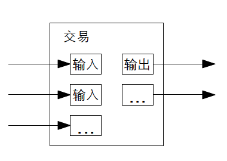

# 【区块链】什么是区块链（十五）

## 风险提示

**由于目前区块链领域里充斥着大量的资金盘、空气币。**而且，说起区块链，不可避免地涉及到金融、投资或者投机等话题。**投资有风险、决策需谨慎**，请各位朋友们擦亮眼睛，**风险自担**。

> “比特币交易作为一种互联网上的商品买卖行为，普通民众在**自担风险**的前提下拥有参与的自由。”
>
> “代币发行融资与交易存在多重风险，包括虚假资产风险、经营失败风险、投资炒作风险等，**投资者须自行承担投资风险，希望广大投资者谨防上当受骗。**”
>
> ——*摘自人民银行等五部委发布的《关于防范比特币风险的通知》*准备工作

## 比特币到底做了什么

### 技术方面

#### 比特币用密码学原理重新定义了电子货币

##### 合并与拆分

既然，在比特币里，**我们定义一枚电子货币就是一条数字签名链**。那么，单独追踪每一枚电子货币其实也是可行的。但是，把一笔转账按照最小单位，拆分成许多交易，显然太笨拙了。所以，中本聪在这里采用了一种灵活的方法，也就是允许在交易中把金额合并或者拆分。

就好像我们过去使用纸币或者硬币的现金买东西时一样：购买95.5元一双的运动鞋，我可以用一张50元、两张20元、一张5元的纸币再加上一枚1元的硬币。当然，卖鞋的商家还会找回给我一枚0.5元的硬币。

对于比特币来说，输入可以是一条，也可以是多条，输出则最多是两条，一个是给收款方，另一个是找零（如果有的话），退回还给付款方。

可以想象，这是一条扇形的输出链条，一笔交易依赖多个之前的交易，而这些被依赖的每一笔交易，又各自依赖于更多的其他交易，直到最初挖矿时得到记账报酬的那一笔初始交易。这形成了一个庞大的扇形交易网络。

在传统的金融系统中，这种多层级的交易网络可能会导致一个交易的历史记录非常庞大，需要抽取完整的交易历史记录才能验证该交易的有效性。而在比特币中，这种多层级的交易网络并不会成为问题，因为每笔交易只需要验证它所依赖的前一笔交易的有效性即可，而不需要完整的交易历史记录。

因此，比特币的交易验证是基于前一笔交易的有效性进行的，而不是依赖于整个交易历史记录。这使得比特币网络更加高效和可扩展，因为交易的验证只需要依赖于有限的交易信息，而不需要考虑整个交易历史记录的复杂性。（以上两段，来自聪明的蔡姬）

至于交易验证，之前的好几篇文章一直在说这事儿。

<待续>