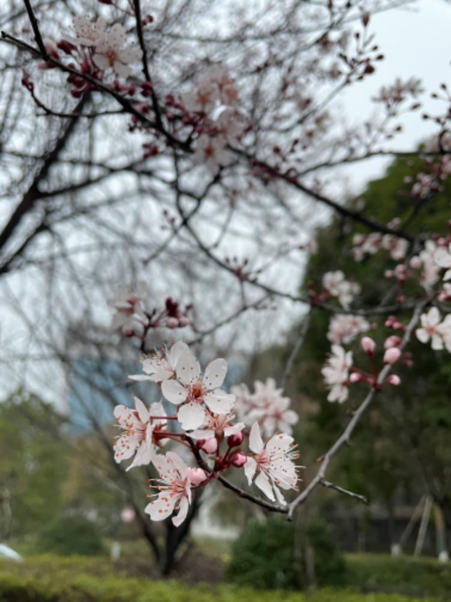

#【随笔】一树樱花开

早上起来，想在酒店附近找个可以简单活动一下的地方，可是在地图上却找不到什么可见的绿地。

或许，可以去走去附近的那个学校看看？我一面这么想着，一面下了楼。天阴沉沉的，雾气弥漫，地面上也有些湿漉漉的，也不知是下过雨还是被雾气濡湿了。

绕着酒店走了半圈才发现，想要走到地图上那个学校还得穿过酒店门口的高速路，再绕好几个圈，踌躇了一会儿，我干脆放弃了之前的企图，改而绕着酒店的楼转起了小圈。

几十米之外，高速公路上传来持续的轰鸣声。酒店周围没什么绿地，和周围的几个研究所之间也没什么围墙，稍微空一点的地方都已经被用作了停车场。看样子，绿化最好的地方其实也就是在酒店周围这一亩三分地了。四周看了看，一树怒放的樱花吸引了我的目光。我又稍稍转了一圈，都是普通的楼间树木，半秃并且窄窄的草坪，目光所及，再也没有比这株树更美的地方了。

我回到了樱花树下，最低的树枝几乎直接碰到头顶，每一个树枝上都有好几朵挺着湿润的花蕊，拼命怒放的花，还有一堆藏在花瓣后，花萼中粉嫩粉嫩的花苞。

站在树下，终于觉得有些神清气爽，竟然也在轰鸣的车流声中，听到了几声鸟叫，春天的感觉！