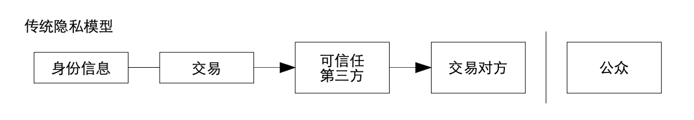
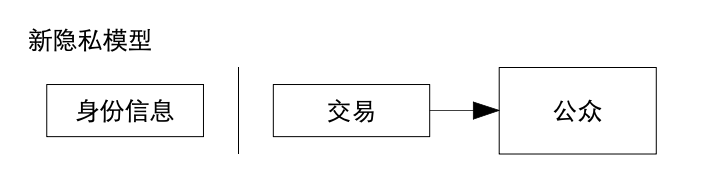

# 【区块链】什么是区块链（十六）

## 风险提示

**由于目前区块链领域里充斥着大量的资金盘、空气币。**而且，说起区块链，不可避免地涉及到金融、投资或者投机等话题。**投资有风险、决策需谨慎**，请各位朋友们擦亮眼睛，**风险自担**。

> “比特币交易作为一种互联网上的商品买卖行为，普通民众在**自担风险**的前提下拥有参与的自由。”
>
> “代币发行融资与交易存在多重风险，包括虚假资产风险、经营失败风险、投资炒作风险等，**投资者须自行承担投资风险，希望广大投资者谨防上当受骗。**”
>
> ——*摘自人民银行等五部委发布的《关于防范比特币风险的通知》*准备工作

## 比特币到底做了什么

### 技术方面

#### 比特币用密码学原理重新定义了电子货币

##### 隐私

首先，比特币的隐私级别其实远远比不上现金。不过，相比银行系统，他还是提供了一些与之类似的基本隐私能力。

传统的银行模型，通过限制相关的信息访问，来达到一定的隐私级别。比如，大家耳熟能详的瑞士银行，就是凭着严格的保密制度闻名于世。1934 年瑞士的《银行保密法》规定：

> 任何储户都可选择自己认为妥当安全的方式在瑞士的银行开户存款。储户被允许使用化名、代号或数字来代替真名实姓。不但开户存款时可以委托代理人办理，而且取款或转账时银行也完全按照与客户事先约定的章程办理，财产的真正拥有者可以做到永不露面。银行为储户绝对保密，银行职员在任何情况下都不得泄露储户秘密（哪怕泄露给国家），若有违反，将被罚款５万瑞士法郎或蹲六年大牢。

这条隐私的防火墙，完全是靠银行自己维护着的。即便是瑞士银行，也因为以美国、欧洲这些大国政府为主的国际社会持续多年「施压」，一步一步放弃了原来享誉世界的严格保密制度。

由于比特币依赖于交易的公开发布，那么银行所采用的传统隐私模型就没法用了。于是，中本聪为比特币设计了一个基本的阻断信息流方式，来保留一定的隐私能力，那就是——保持公钥匿名。

这个和证券市场的信息保密级别类似，每笔交易的时间和交易量，即行情是公开的，但是不会显示交易双方是谁。

除此之外，中本聪还为隐私增加了一点额外的防火墙，比特币系统可以支持对每笔交易使用新的密钥对。这样，进一步提高了通过公钥关联并找到公钥拥有者的难度。

但是，和物理世界的现金（不论是纸钞还是黄金）不同，比特币本质上不是匿名货币。身份信息和交易之间关联信息的防火墙，其实全靠用户自己小心保护。实际上，除了那些资深数码朋克，几乎所有的普通用户都做不到隐私不泄露！

所以，后来才有了其他真正匿名的数字货币系统（这是后话）。

<待续>