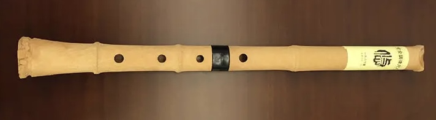

# 【随笔】吹响尺八

新买的尺八·悠到了，我非常开心。在大宝的鼓励下，我终于把一件可能一直属于「将来我想要做的事情」，变成了此刻我可以做的事情。

撕开顺丰的快递外包装，里面是一个极其简陋的纸盒子。打开后，映入眼帘的是白纸包着的两截管子，小心翼翼地把纸打开，正是尺八·悠的本体，淡黄色仿竹的颜色与纹理，沉甸甸地，份量超乎我的想象。上管贴着一张标签，店家说如果要退货，原包装盒与这张标签千万不能弄坏了。在网上找了张它的照片，安装起来就长这样，也是朴素得很。

我试着对准切口，吹了一下，调整了几次角度之后，竟然就吹响了。我不禁回忆起小时候，在妈妈朋友家拿起竹笛，就吹响笛子之后的那股得意劲儿，以及妈妈朋友当场就因此把笛子送给我之后的开心时刻。也有些遗憾，自己终究止步于吹响竹笛而已，并没有学会这个乐器，却因此对笛、箫一直心心念念快四十年。

大宝让我赶紧别吹，怕吵醒了已经睡着的大鱼。停了会儿，她又说：

> 这个声音还挺好听的！

我咧嘴笑了，开心地说：

> 是吧？我也喜欢这声音！

在网上搜了搜下教程，B 站上有不少。我想按照 Jim 的学习方法，先好好练习那最重要的 20%的技巧，却发现，不知道啥是最重要的 20%的技巧。

可能还是要回归最基础吧？至少，吹响，吹准是一定需要的练习。在 B 站听了两三个入门教程的开头，发现都逃不掉最基础的长音，那就从这里开始吧！

放下手机，拿起尺八，却惊奇地发现：

> 我，竟然，吹不响它了！！！