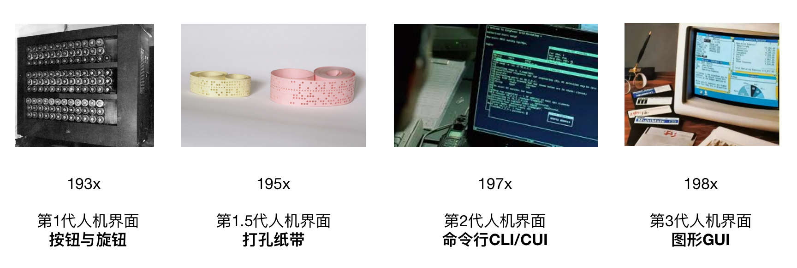
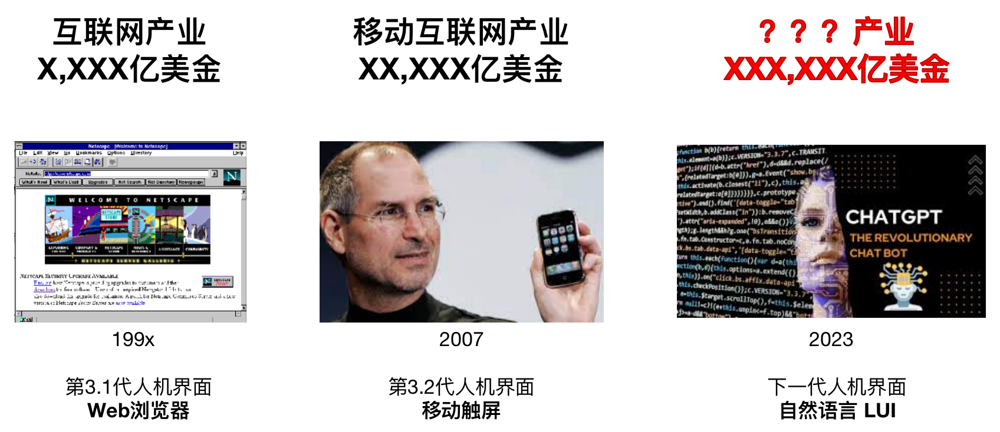

#【区块链】ChatGPT为代表的AIGC与LLM对整个IT趋势的影响

## 蔡姬如何说

其实，就这个问题，我先问了一下蔡姬：

> 你先详细说说，ChatGPT 这样的大语言模型成熟后，整个IT技术趋势会有怎么的变化和影响。

蔡姬说：

> 当大型语言模型（如ChatGPT）成熟后，整个IT技术趋势将会出现以下变化和影响：
>
> 1. 自然语言处理（NLP）技术将得到飞速发展，从而推动智能客服、智能问答、自动翻译等相关领域的发展。
> 2. 聊天机器人、智能语音助手等产品将进一步普及，为企业提供更高效的客户服务和沟通方式。
> 3. 内容生成和自动化写作将会得到极大的提升，从而在内容生产领域带来巨大的改变，例如新闻自动化写作、广告内容自动生成等。
> 4. 语音识别技术将会更加普及，进一步推动智能家居、智能交通等领域的发展。
> 5. 大型语言模型将会成为企业数据分析和决策的重要工具，为企业提供更准确、更全面的数据分析和洞察。
> 6. 在安全领域，大型语言模型也可以被用于网络攻击和防御，例如模拟攻击、漏洞扫描等。
>
> 综上所述，大型语言模型的成熟将会推动整个IT技术趋势的发展，涵盖自然语言处理、内容生成、语音识别、数据分析、安全等多个领域。企业需要及时跟进这些技术趋势，以保持竞争力。

她说的基本没错。不过，

##  我目前的观点与假设

**ChatGPT = AI时代的Netscape / iPhone**

虽然都说不要随便「类比」，容易造成我们对新事物的肤浅、错误认知。但我还是忍不住要抛出这个「类比」（非我原创，最初是从王建硕那里听来的），它确实能帮我更好地向人讲解这个新事物。

### Netscape 与 iPhone

* 1994年，以Netscape 为标志，开启互联网时代
* 2007年，以iPhone为标志，开启移动互联网时代
* 2023年，以ChatGPT为标志，开启AI时代（或NGUI）时代

### 五点假设

1. 假设一：AIGC 只是AI 时代应用领域之一
2. 假设二：LLM成为IT基础设施新分界线（网络、云计算层继续下沉）
3. 假设三：所有IT技术领域都必须重新考虑LLM带来的影响
4. 假设四：初期被冲击最大的行业收益最终收益会最大
5. 假设五：Web3 / 区块链将与ChatGPT / LLM 带来应用重构浪潮结合，落地成为 IT 基础设施层的重要部分

<待续>