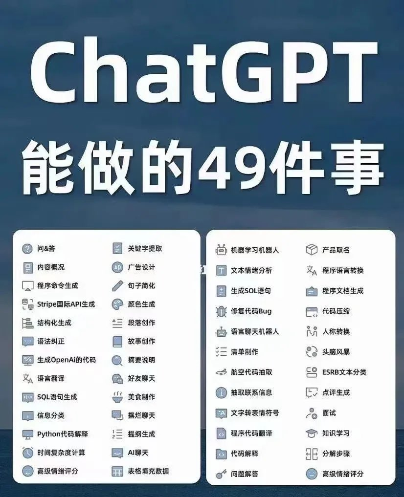

# 【区块链】ChatGPT为代表的AIGC与LLM对整个IT趋势的影响（续一）

## 我的观点和假设

### 假设一：AIGC 只是AI时代应用之一

由于ChatGPT是紧随着AI生成图片的StableDiffusion之后爆火的（至少在我印象中是如此），以至于大家首先的反应是——AIGC时代来临了！

AI生成文本，AI生成图片，乃至AI生成视频等等。总之，一切内容都可以由AI生成，UGC变成了AIGC。游戏、设计、广告、自媒体、文案师等等行业的老板、员工或兴奋、或焦虑，不一而足……

####  ChatGPT自己怎么说

然而ChatGPT能做什么呢？蔡姬自己这么说：

> As an AI language model, ChatGPT can assist you in various tasks such as:
>
> 1. Answering questions: You can ask ChatGPT any question you have, and it will try to provide you with the best possible answer based on its training and knowledge.
> 2. Generating text: You can use ChatGPT to generate text, such as writing a blog post or creating content for your website.
> 3. Translation: You can use ChatGPT to translate text from one language to another.
> 4. Summarization: You can use ChatGPT to summarize a long piece of text into a shorter version.
> 5. Chatting: You can have a conversation with ChatGPT, just like you would with a human.
> 6. Personalization: ChatGPT can learn from your interactions and provide personalized responses based on your preferences.
>
> **Overall, ChatGPT can be a useful tool for a wide range of applications, from personal to business use cases.**

它咬定自己是AI语言模型的定位，回答问题，生产文本，翻译，汇总，聊天，以及……「因人而变」。

至于OpenAI 的那些API呢？能干的事情就更多了，蔡姬如是说：

> OpenAI API provides a range of powerful tools and capabilities for building intelligent applications. Here are some examples of what you can do with OpenAI API:
>
> 1. Language understanding and processing: OpenAI API can help you analyze and understand natural language text, perform sentiment analysis, and generate natural language responses.
> 2. Text generation: You can use OpenAI API to generate high-quality text content, such as articles, product descriptions, and marketing copy.
> 3. Translation: OpenAI API can help you translate text between different languages.
> 4. Image analysis: OpenAI API can help you analyze and understand images, such as identifying objects, faces, and scenes.
> 5. Chatbots and virtual assistants: You can use OpenAI API to create intelligent chatbots and virtual assistants that can understand natural language inputs and generate appropriate responses.
> 6. Data analysis and insights: OpenAI API can help you analyze large amounts of data, identify patterns and trends, and generate insights and recommendations.
>
> Overall, OpenAI API provides a powerful set of tools for building intelligent applications and unlocking new insights from data.

诸多变化都藏在它说的第6点里，“Data 分析与洞察”，可以用来构建智能应用，并从数据中找到新的“见解”——“insights”。

###  OpenAI能做的49件事

当然，OpenAI 自己在官网给出的例子远不止这6点，有人把这些Example换了个说法，叫做——OpenAI能做的49件事：

我们看到，虽然大部分样例与内容生成相关，但「代码生成」、「命令生成」、「分解步骤」等等这些功能，却显然有着进一步组合的潜力。

###  AutoGPT 与 ChatGPT Plugins

于是很快，就有人搞出了一神奇的实验性开源项目——[AutoGPT](https://github.com/Significant-Gravitas/Auto-GPT)，有OpenAI的Key，照着[指南](https://autogpt.net/wp-content/uploads/2023/04/AutoGPT-PDF-Guide-1.pdf)就可以在Docker上跑起来。用GPT的API为核心，自动分解任务、自动执行任务。于是，更多的事情，可以用GPT完成了。比如根据用户的需求，自动搭建一个促销网站。

练OpenAI 都对这个项目赞不绝口，当然，他们很快就推出了类似的东西——ChatGPT Plugins。4月20号，Greg Brockman 在TED的演讲上做了一个Demo，给大众Show了一把如何自动生成购物清单、自动发推，以及如何自动做数据分析。

把ChatGPT当作自然语言接口来看，基于它能做的事情就太多了。AIGC显然只是沧海一粟而已。

<待续>