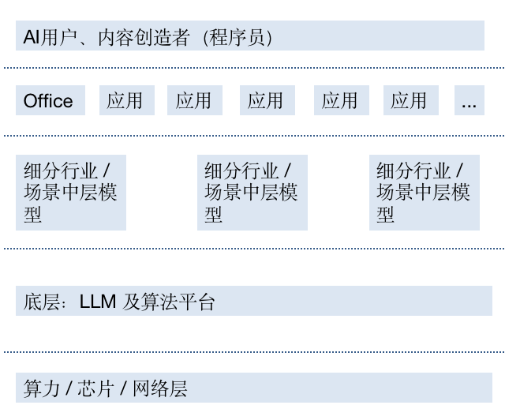
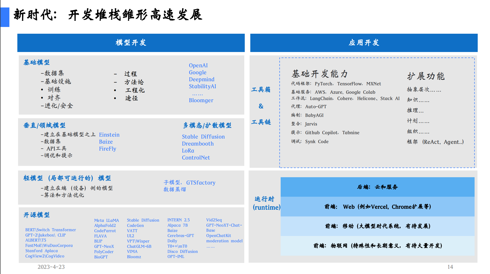
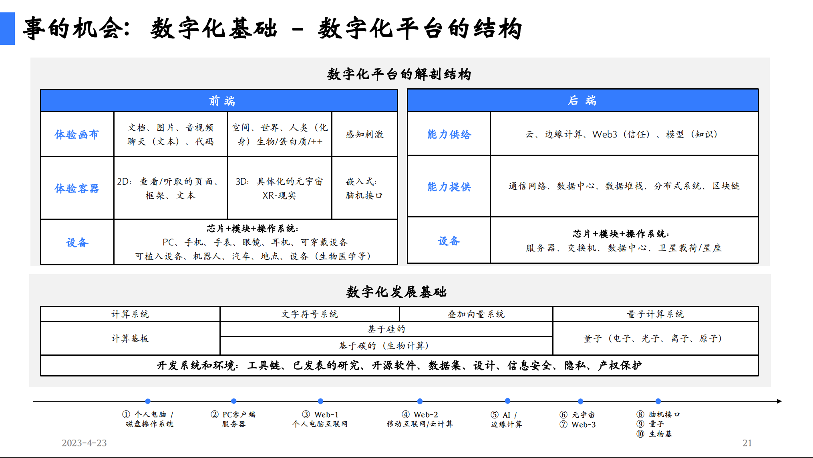

# 【区块链】ChatGPT为代表的AIGC与LLM对整个IT趋势的影响（续二）

## 我的观点和假设

### 假设二：LLM成为IT基础设施新分界线（网络、云计算层继续下沉）

我曾经画过一张简要的图，意图说明通用层的LLM模型，以及细分行业的模型将是原来IT基础设施（芯片、算力、云……）之上的一个重要分层。

前段时间，路奇的演讲中也有这样两张片子，一个讲述了基于大模型正在形成的开发堆栈：

另一个则从前端、后端的角度打开讲了讲数字化基础的结构：

归根结底，由于LLM的加入，并变成承上启下、无法绕开的重要一层。原有IT基础设施的上层（APP、SaaS）、下层（云计算乃至更底层的基础能力）都必须要考虑LLM的影响进行重新梳理。

对于开发者而言，基于LLM做应用开发与部署，和过去10余年转向云计算的应用开发一样，变成一个普遍的趋势。

底层依旧重要，但他们越发呈现出水、电一样的基础设施特征，而不是一个好的、大的生意。