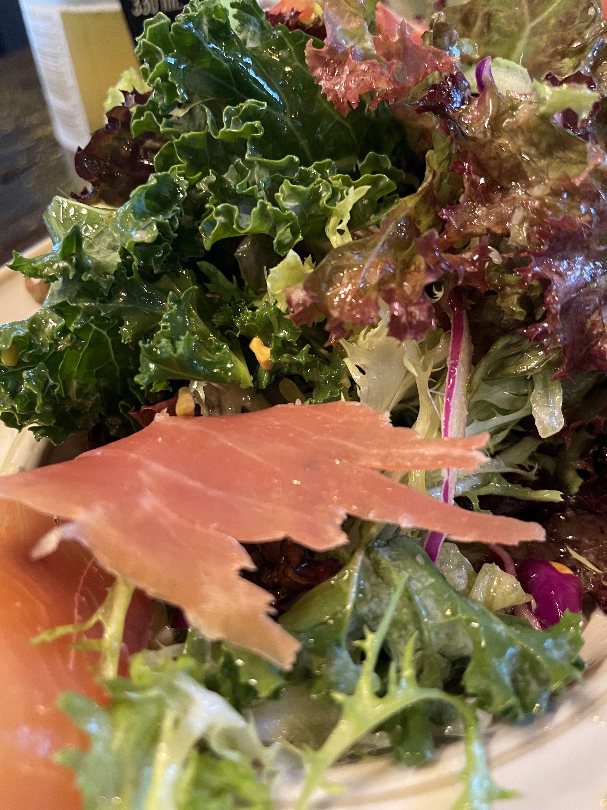
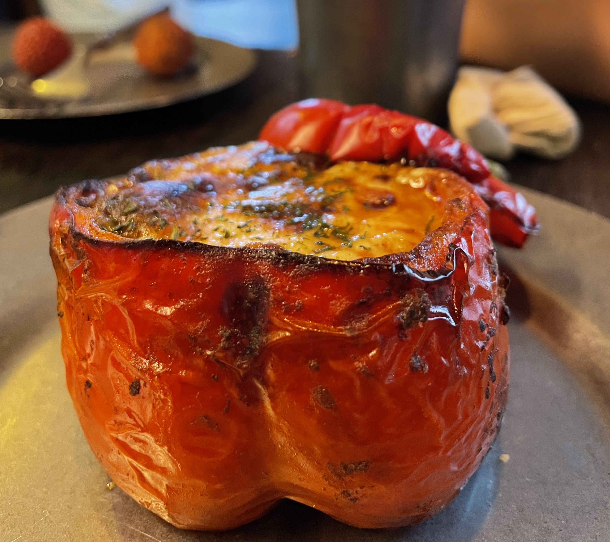

# 【随笔】酒吧世界与我们

在海边一棵大榕树下休闲地坐了一下午，回程时我想走路。大宝说，S姐告诉她，在荔园路上有很多好吃的，于是我们就跟着导航往荔园路的方向走过去。

路上先吃了几个烤串，又在一个十字路口的小摊上买了几斤荔枝，然后边走边吃，很快肚子就被荔枝给塞饱了。

这时，发现了路边有一个叫 G&G创意社区的地方，看起来极像一处美食小摊集散地，便赶紧推着婴儿车拐了过去。不知道是不是还没到这个地方正经儿的营业时间，只见几乎大部分摊位都还板凳脚朝天没有开张。大宝看中了一处买可颂的小店，去买了一份牛油果可颂。阿宝和大鱼则嚷嚷着要喝果汁，我只好带着他们到隔壁的「混果汁」给他俩一人来了一杯饮料。

吃喝完毕，我们发现旁边有一家像是酒吧的地方，好像很有气氛，人还特别多，简直就是这里人气聚集所在。按耐不住好奇心，加上正好在窗边看到一个座位，我们决定进去坐坐凑一下热闹。孩子们还能从窗台爬进爬出玩个痛快，简直不要太合适。大宝点了两个小吃，我却不知为何，变得昏昏欲睡地有些提不起精神。正好大宝在好奇一旁冰柜里黄色Corona的瓶子里装的是什么酒——不如来点酒精？再说，自从怀上大鱼，大宝也有三年没喝酒了。这么一想，索性点了一瓶Corona了，然后和大宝聊因为和新冠重名，这个墨西哥啤酒在美国销量骤降的谣言故事（写到这里，我忍不住去网上搜了一下，却见知乎上说，实际上或许因为新冠，Corona全球销量是大增不少的）……

也许是心理作用，酒还没上来，心情已经明亮了不少。便静下心来，尝了尝眼前的两盘点心，又环顾了一下四周，却发现这里居然是衣着清凉、靓丽的女孩子居多。厨房亮堂堂就在我身后，里面热气腾腾，几名年轻、纹着花臂的帅哥厨师忙得热火朝天。没有空位，身边的一位情侣刚走，就有几个女孩子拿着排号进来，和服务员说自己有7、8个人，愿意先等着，等旁边的人（也就是我们？）吃完再拼桌。

意大利火腿沙拉又咸（火腿）又苦（苦菊），秘鲁碳烤辣牛肉酿波椒（大红彩椒）味道倒是不错，但啤酒完全不是我俩的心头好（只觉得苦，没啥特别的味道，我上次喝Corona或许是很多年前在墨西哥出差的时候，自己是完全记不得它好喝不好喝了）。孩子们吃完了沙拉里的青提，依旧还是只爱剥荔枝。不过，听说我们最终放弃了点意大利面，阿宝颇为不开心。

一时间，我觉得有些恍惚——虽然，此刻交叠在这同一时空，但实际上，这酒吧里纵情欢乐的那些其它年轻男孩和女孩们，恐怕和我们压根没生活在同一个世界。我们不太能理解他们的欢乐，也不知他们看我们是否同样不可思议呢。

今天，大宝和我回顾起酒吧里的那段时间，忍不住感慨——纯粹凑了个热闹，还不如打两趟太极拳来得舒爽开心呢！