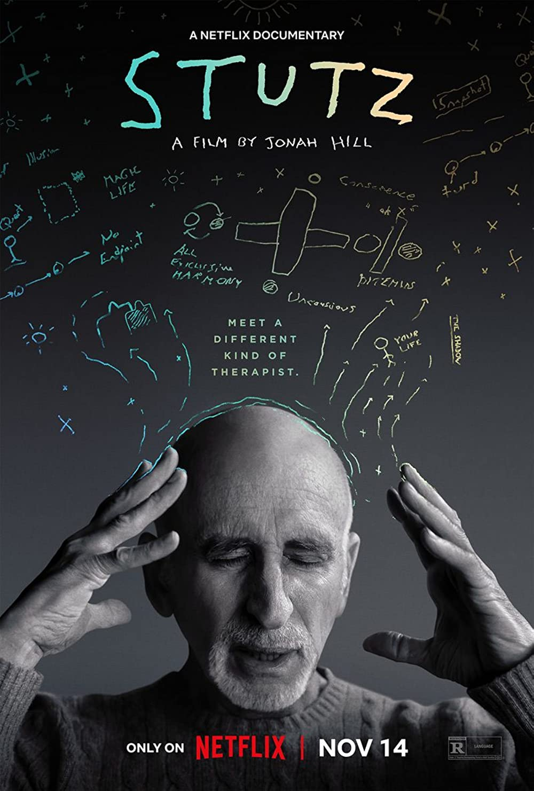
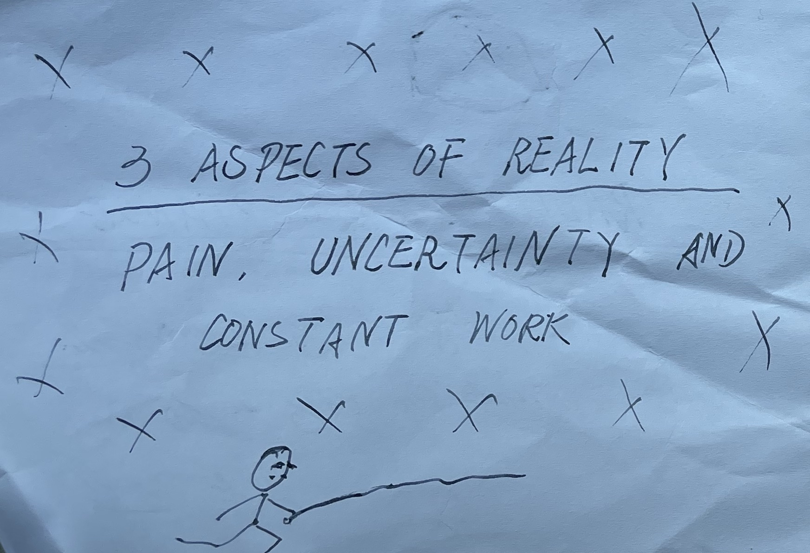
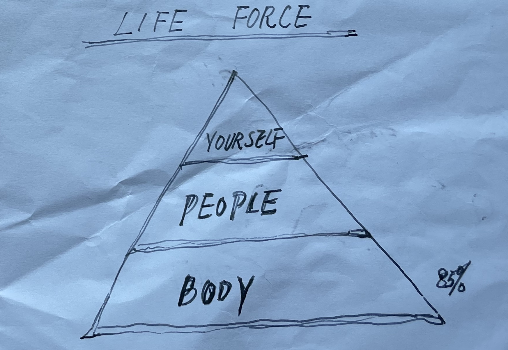
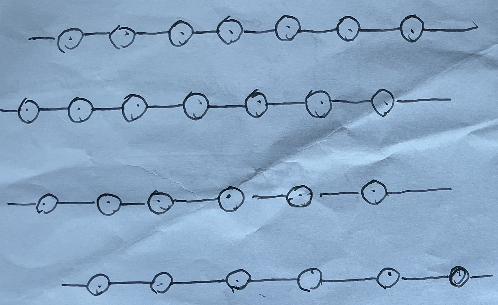
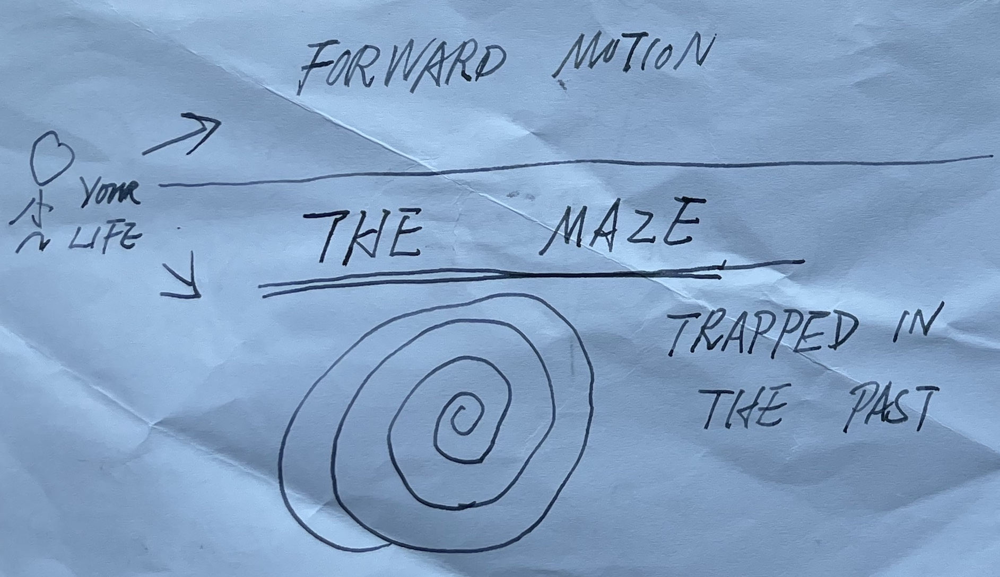
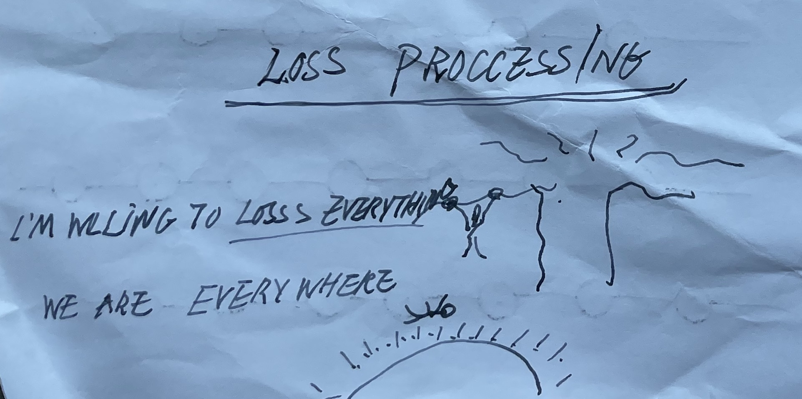
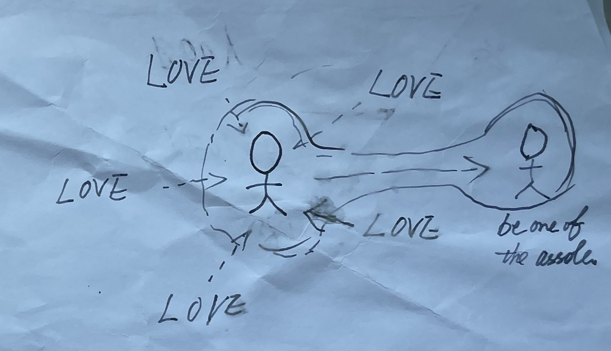
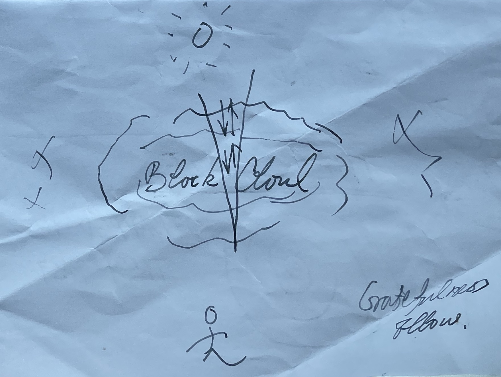
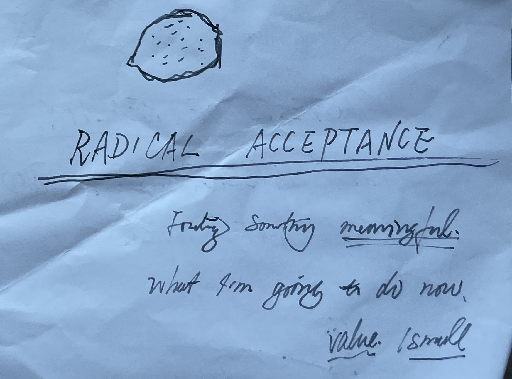

# 【生命⋅修行】斯图兹Stutz的疗愈之道

最初是在和菜头的文章里看到推荐网飞的纪录片《Stutz》，断断续续在B站把一个半小时的片子从到到尾看完了，觉得非常好。那些小工具、办法确确实实地在某个时间点帮到了我。甚至也某次给大宝「支招」时，得到了她的肯定。

上个月又抽时间断断续续看了一遍，心想这些有用的工具，自己还是要记录一下，以便需要时能随手取用。于是，就有了这几张自己手绘的小卡片和本文。

### 生命的终极实相

Stutz的核心观点，生命要面对三个无法逃避的终极实相：**痛快、不确定性、持续地工作**。而所有那些他在影片中展示过的工具，都是我们可以拿来使用的。我们可以利用这些，更好地面对这终极的实相，穿越那些阻止我们成长的“Part X“。

### 生命力的三个部分

Stutz认为，生命力本身就能过解决或者说疗愈大部分问题。只要去做这些事情，就一定会有效果。他画了一个生命力的金字塔，解释生命力来源的三个部分：

	

他说，85%的问题，都可以在「与自己的身体链接」这一层面解决。其实，也就是做好按时作息、规律饮食、合理运动这些最基本的事情就好了。当然，生命力的疗愈效果，是需要一些时间才能看到。

第二层是与人的链接，也就是去找人聊天，找亲朋好友一起吃饭等等。不需要确保这次「社交活动」一定是愉快的或者怎么样，只要主动去行动，比如主动去约人吃饭，就会有效果。

第三层是与自己的链接，Stutz建议的方法，就是「书写」——只要开始写，持续地写，你就能一点点与自己的深层次的内心建立更多的链接。

### 串起珍珠项链

Stutz说，要相像自己是一个串珍珠项链的人。我们的每一个行动，就是给项链串上下一颗珍珠。

每一颗珍珠都是同样的，有着同样的价值。当然每一颗珍珠里，也都有个「脏东西」，那些让人不舒服的部分。或者换一个角度说，每一粒沙子，外面都包裹着一粒晶莹、美丽的珍珠。

### 迷宫

我们常常会被过去发生的事情、看法抓住。这是一个陷阱，我们必须要跳出来，往前看，继续行动。

### 练习面对失去一切

这是一个冥想的练习，想象自己抓住树枝，吊在一棵树上，而树枝就要断了。说出这句：「**I'm willing to loss everything**」，然后松开树枝，让自己自由下落。然后一直落到像太阳一样的大火球里，被火焰完全融化，融入光中，再随着光遍布各处。说出这句：「**We are everywhere！**」

### 爱的融入练习

这又是一个冥想练习，首先想象自己被爱环绕、包围，然后周围爱的能量注入自己身体，充满了全身。接着，形成一股爱的热流，注入到对面那个最最混蛋的家伙身上，最终，自己与这个混蛋被爱的能量融为一体。

### 感恩之流的练习

这也是一个冥想，和常见的感恩练习类似。首先回想那些值得感恩的事情，无论大小，以及那种感恩的感觉。在一件、又一件感恩事情之后。把这种感恩的感觉想象成一股感恩之流，破开头顶遮住阳光的乌云，看到阳光。

### 全然接受——挤柠檬汁的条件反射

Stutz说，要养成一种条件反射般的习惯，发生任何事情，都要像挤柠檬汁一样，从里面找到一些有意义的事情，那些有价值的小事。然后，聚焦在下一步的行动上——现在，我要做些什么呢？

### 总结

归根结底，Stutz的方法本质就是接受现实并行动：先接受现实——三大终极实相、像挤柠檬汁一般榨出其中有意义的部分；然后继续行动——在生命力金字塔的三层上行动，串起项链上的下一粒珍珠，离开过去的迷宫；同时，用感恩之流冲破心理乌云的遮蔽，用爱将自己与他人融合，用愿意「失去一切」的态度锤炼自己的心力。

最难的，是真正拥有「愿意失去一切」的态度。

是啊，如果我们真的能做到「**I AM WILLING TO LOSS EVERYTHING！**」，那还有什么问题、什么困难不能克服呢？毕竟赤条条地来到这世间，也终将赤条条地离去。既然没打算、也不可能活着离开这世界，那还有什么是值得恐惧的呢？