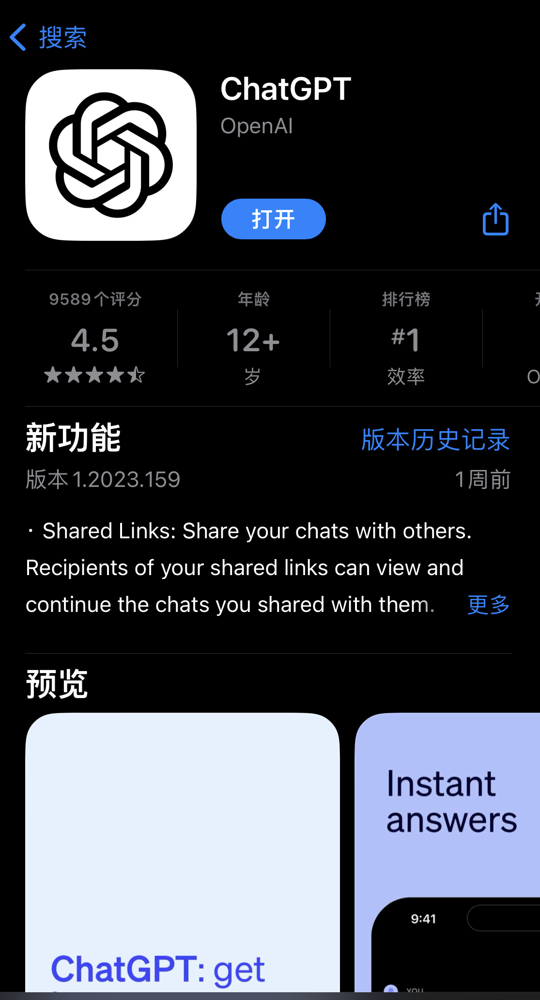
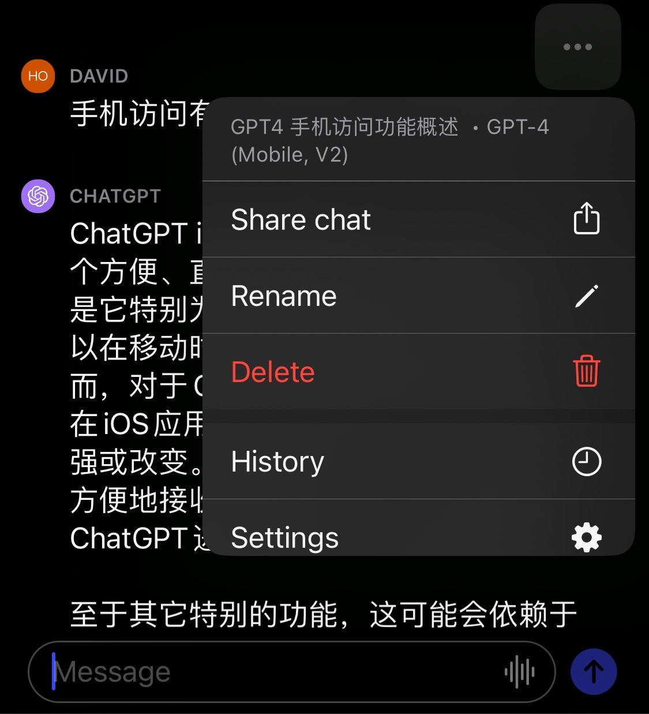

# 【教程】如何安装Chat GPT官方iOS应用程序

**【写作课作业D.011】**

### 关键字：ChatGPT、OpenAI、iOS

最近越来越经常地拿ChatGPT当作翻译工具用，于是，忍不住内心的冲动，请在美国的朋友帮我充了个Plus帐号，只为了试试GPT4。终于看到了GPT-4的字样，内心颇有些兴奋。然而，看到最下面那行字，还是觉得有点扎心：

接着就看到有朋友说，在ChatGPT的应用里就没有这个数量限制。于是呼，决定抽出点时间，撸起袖子，把这iOS的应用装起来。

当然，有个前提条件，我肉身在泰国，用的一张当地的电话卡上网。如果是在国内，可能会因为网络原因遇到某些问题，需要先想办法解决才行（注意，只是可能。也有人说无需任何代理工具）。

总共就两步。

### 1. 注册苹果美区Apple ID

关于这一步，在知乎和小红书上都有许多「保姆级教程」，看了2023年的几篇新文章，基本靠谱，随便照着一个一步一步做就可以。提前做好以下准备：

- 一个能接收短信的国内手机号

- 一个全新邮箱（指从没注册过Apple ID的邮箱）
- 一个准确有效的美国地址（我用的之前注册美国公司时注册代理商的地址和电话，也可以用所谓的「美国地址生成器」，建议用5个免税州的地址和电话）

另外有几个注意事项：

- 出生日期：一定要设置成大于 18 周岁的日期，否则会导致部分应用由于年龄限制无法使用。

- 电子邮件：建议新注册一个全新的从未注册过 Apple ID 的邮箱，比如 163 邮箱。

- 手机号码：亲测，注册过中国区 Apple ID 的手机号码可以用来注册美区账号，不会产生冲突。

- 密码：设置密码时，密码中不要包含有名字、生日、邮箱中的信息，否则会卡在验证码那一步。

#### 第一步，创建ID：

到https://appleid.apple.com/account 创建ID，记得国家地区选美国

#### 第二步：登录苹果ID：

1. 手机上打开App Store，退出当前账号（点击右上角的头像，然后拉到末尾，点击**退出登录**）。
2. 再次点击头像，输入之前注册的美区账号、密码，点击**登录**。
3. 随便下载一个免费的软件。这时，会弹窗说这个ID从未在商店使用过，点击检查。注意付款方式不用选，账单寄送地址输入正确的美国地址与电话即可。

### 2. 下载OpenAI 官方出品的ChatGPT APP

接下来就简单啦，搜索ChatGPT，注意选择OpenAI官方出品的这个。千万别被一众蹭热度的软件蒙蔽了。

下载完成后，就可以放心享用无限量GPT4 大餐了。是不是真的不限量我不知道，反正没有像网页版那样，提示说3小时限量25条对话。如果想知道当前会话用的那个引擎，点右上角那三个点“**...**”就能看到。

这个APP在泰国可以直接用，听说现在香港也可以直接用。也不知道还有哪些地区已经被放开了，总之可用的地方正在越变越多。或许不用多久，Android的应用出来，会有更多人能方便地使用上这GPT4的AI大餐吧。