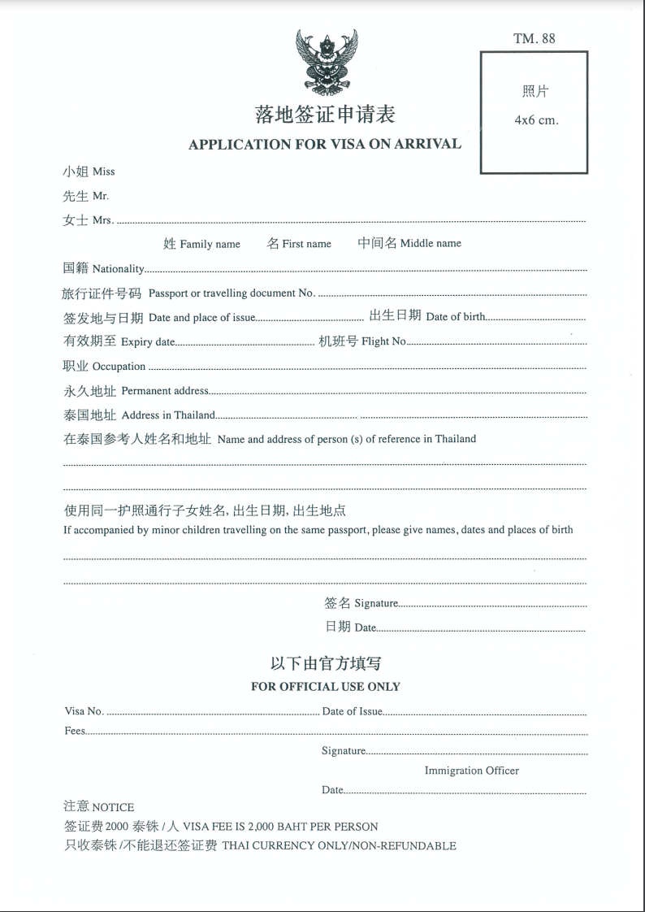
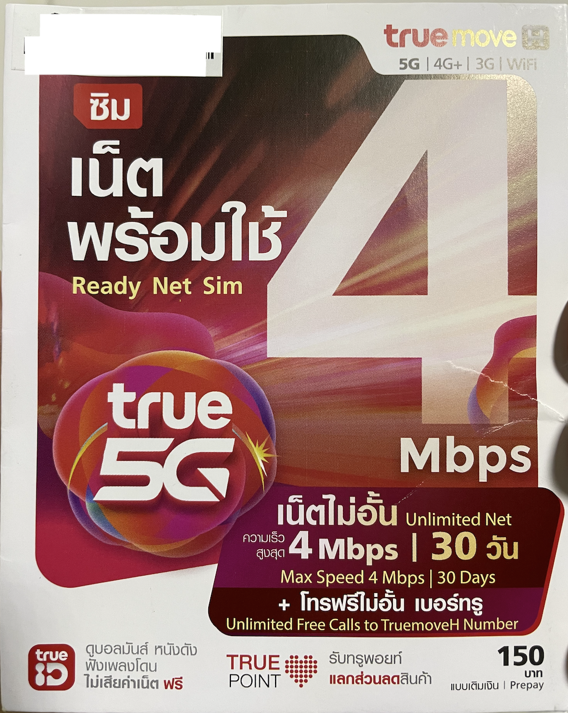

**【写作课作业D.012】**

# 【教程】第一次去泰国短途旅行要做些什么准备

### 必需品

如果有时间，提前办理签证更便宜。单次入境的不管是电子签还是贴纸的签证，都只要240人民币左右。如果时间仓促，落地签也很方便，只需要：

1. 至少6个月有效期的护照
2. 填好落地签申请表，建议去[官方网站下载中文申请表](https://www.immigration.go.th/wp-content/uploads/2022/10/2%E0%B9%81%E0%B8%9A%E0%B8%9A%E0%B8%9F%E0%B8%AD%E0%B8%A3%E0%B9%8C%E0%B8%A1%E0%B9%83%E0%B8%9A%E0%B8%84%E0%B8%B3%E0%B8%A3%E0%B9%89%E0%B8%AD%E0%B8%87%E0%B8%82%E0%B8%AD%E0%B8%A3%E0%B8%B1%E0%B8%9A%E0%B8%81%E0%B8%B2%E0%B8%A3%E0%B8%95%E0%B8%A3%E0%B8%A7%E0%B8%88%E0%B8%A5%E0%B8%87%E0%B8%95%E0%B8%A3%E0%B8%B2-%E0%B8%AA%E0%B8%B3%E0%B8%AB%E0%B8%A3%E0%B8%B1%E0%B8%9A%E0%B8%84%E0%B8%99%E0%B8%88%E0%B8%B5%E0%B8%99-%E0%B8%95%E0%B8%A1.88.pdf)，提前填好
3. 4x6cm 白底免冠照片一张

然后，提前定好往返机票，还有酒店，备上至少2200泰铢，就可以出发了（入境处官方要求是至少带1万泰铢，我落地后在机场ATM取了5000泰铢，手续费220泰铢）。

落地签有很多人排队，建议把表格早早填好（职业简单一个词就OK；泰国地址填要入住的酒店地址；听说泰国参考人姓名和地址可以不填，我填了一个朋友的名字，地址和电话依旧用的酒店的），下飞机抓紧往前走，估计至少能少排半小时队。签证费2千泰铢，大家一般都会给200元小费，夹上2200就好。审核的人想必会看在小费的份上，认为你是个Good Guy，于是手松一点。

### Nice to Have

1. 提前开通手机的国际漫游功能，包括数据漫游。选个最便宜的包（不要超过30），原因后面说。我是直接用移动30元封顶的流量。这样，下飞机就能微信报个平安什么的，看地图打车什么的也需要用到流量。
2. 提前下载好一个叫做Grab的软件，这个东南亚都在用，订餐、叫车都是它，相当于滴滴和美团合体吧。比机场直接叫出租稍微便宜一些，司机懂英语的概率也更高，能方便沟通。如果要在机场直接打车，记得顺着出租车的标志走，出机场门，然后右手边有一排白色的机器，先取张票，再按照票上的停车位号码去坐车。
3. 下载好翻译软件和地图软件，比如Google 翻译 和Google 地图，以便找路。 看花花绿绿的泰文，以及和不懂中文、英文的当地人交流（其实，大部分时候用不上翻译软件）

### 入境后第一件事

买电话卡。通常不建议在机场买。到酒店后，带上护照（切记必须要护照）楼下随便转转，500米内必有7-11。有一种True Move 4Gmbps 的30天无限流量卡，面值150泰铢，不用费心，无脑买入就好，毕竟折合人民币30元不到，无论是网速还是流量都足够好用。这样可以多花点时间、精力在其它事情上。

有了这个卡以后，移动漫游的钱就可以省了。毕竟一天的钱可以花一个月呢，不香么！

按说还有更便宜的8天卡，但大部分7-11 都没货。所以，直接买这个30天的就好。让店员帮你安装好，办理激活手续。通常，还要耐心再等一会儿才能用。

----

以上，就这些，希望对你们也有用。
