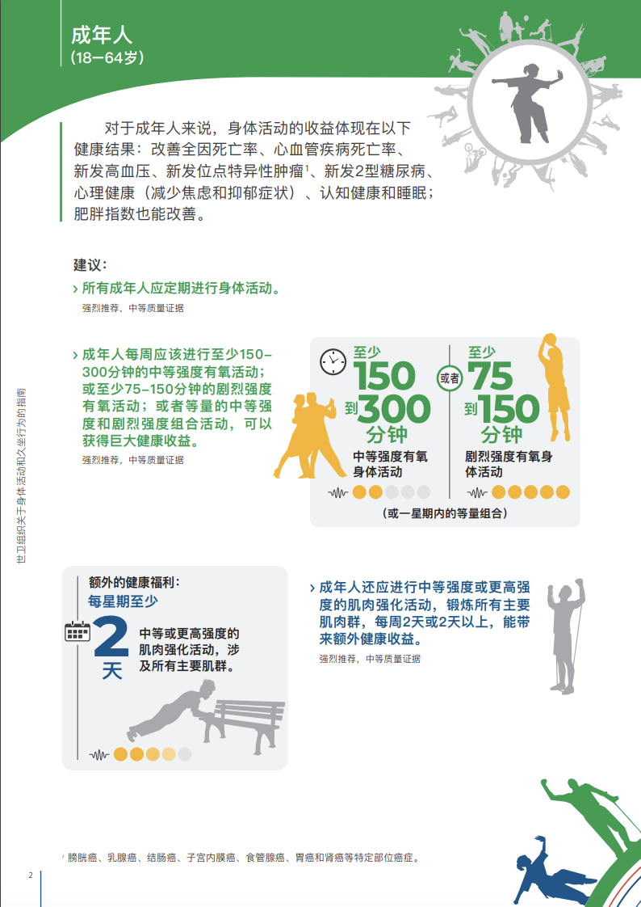
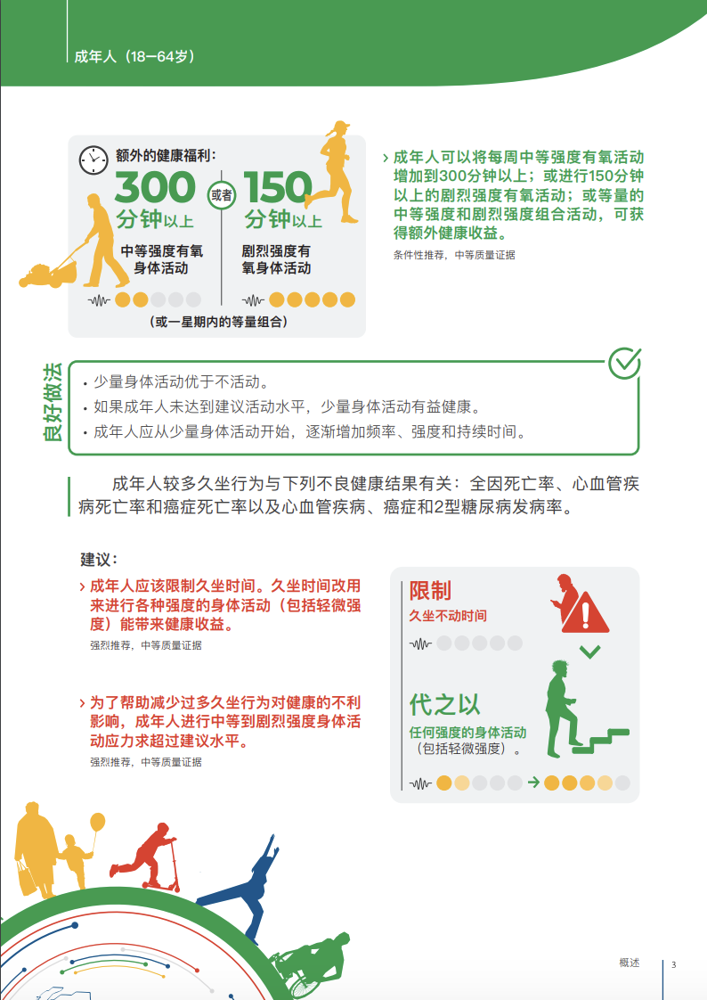

# 【生命⋅修行】坚持做简单而正确的事情

> 天下之難作於易，天下之大作於細
>
> ——《道德经》

或许是同样意识到我的「负面情绪」对她的影响，加上最近几天加强锻炼后的体会。大宝建议我重新开始「囚徒健身」的训练。她说：

> 白天困顿睡不醒，晚上却常常睡不着，这是典型的白天运动量不够啊！

我有点担心和疑虑，表示如果只用这种健身、练肌肉四肢的法子会不会消耗太过？她说：

> 我觉得不会，你想啊。我们普通人的身体，适应的是古时候那种狩猎、农耕的环境和活动强度。但是现在正常的情况下的运动量，远远少于我们身体正常需要。
>
> 昨天下雨，我们一整天下来就只走了两、三百步。
>
> 这种情况下，多做些「囚徒健身」的基础训练，最多能达到身体需要的正常水平。离过度和消耗太大还远着呢。

这正是Stutz金字塔的最下面一层——与自己身体的链接，正常的作息、经常的运动——能解决80%以上问题的那一层：好好睡觉、多运动；正常饮食、正常作息而已。

这真是简单并且正确的事情，只是需要坚持！网上常常有人说，要做所谓「**难而正确的事情**」，我觉得那都只是为了人类的「虚荣心」整出来的噱头罢了。其实真正需要的，是扔掉做「难」事的虚荣，**坚持**做那些**简单而正确**的事情就好。

在《[世卫组织关于身体活动和久坐 行为的指南 WHO guidelines on physical activity and sedentary behaviour](https://apps.who.int/iris/bitstream/handle/10665/336656/9789240032156-chi.pdf?sequence=29&isAllowed=y)》里，给成年人的建议是这样的：

少动好过不动，多动一点是一点，运动的健康习惯还是不能丢了。正好，夏天也是运动的好时节：

> 夏三月，此谓蕃秀，天地气交，万物华实，夜卧早起，无厌于日，使志无怒，使华英成秀，使气得泄，若所爱在外，此夏气之应，养长之道也。逆之则伤心，秋为痎疟，奉收者少，冬至重病。
>
> ——《黄帝内经•素问•四气调神大论篇》