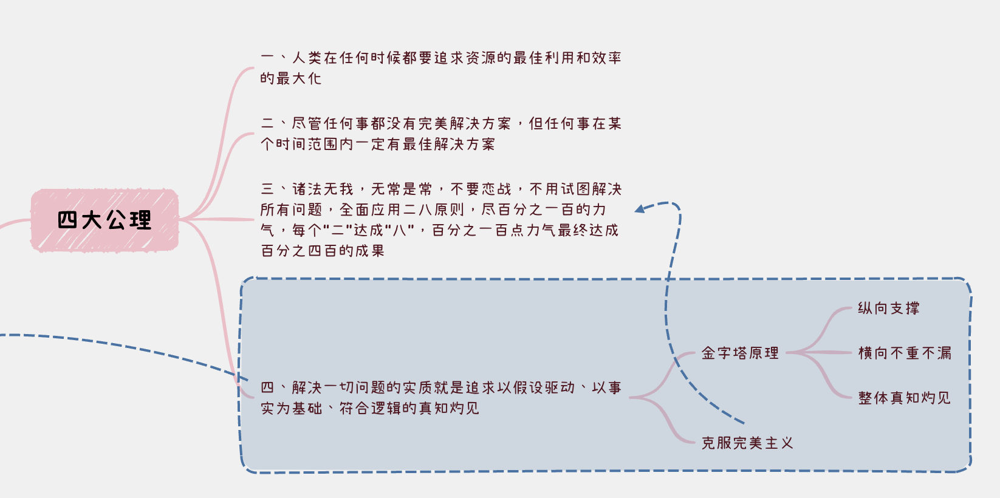

# 【生命⋅修行】要把时间精力花在哪里

前几天，大宝和我感慨人生时间太少太珍贵，大约意思是：

> 不管做什么事情，哪怕只是拍个美食视频发到小红书，只求完成、不求完美这样简单的事情，都一样要会花费很多的时间和精力。一天能有精力做事情的时间，总共就那么点。一周也很快过去、一年也一样。
>
> 我们结婚很快就满七年了，也是一晃而过！
>
> 「**要把时间、精力花在哪里？**」，真是和投资时，考虑「要把钱花在哪里？」一样，是一个非常非常重要的问题和选择。

这件事情太过重要，以至于我对此颇有些选择困难症！可问题在于，陷入选择困难本身，也是一个选择：对此时此刻的时间精力花在哪里的选择！

可能对我而言，最主要的障碍是那种「完美主义倾向」。生命中所有事项的优先级排序标准，理论上是非常清楚的。我基本上，认可卓别林诗中那句关于「简单」的论述：

> As I began to love myself I quit stealing my own time, and I stopped designing huge projects for the future. Today, I only do what brings me joy and happiness, things I love to do and that make my heart cheer, and I do them in my own way and in my own rhythm. Today I call it **SIMPLICITY**.
>
> >  当我开始爱自己，我不想再偷走自己的时间，我停下来不再去为将来构想庞大的计划。今天，我只做那些能带给我快乐与幸福的事情，那些我热爱并且能让我心为之欢呼的事情，并且只用我自己的方式、自己的节奏去做这些事情。今天我管这叫做**简单**。

但是，我会忍不住给这个「**简单**」的原则，增添一条理论上正确的「**扩展要求**」——去做那些总体上、累计（跨越时间线）能带来的**幸福感**最大的事情。

这个扩展，理论上是没错的。比如刷手机刷太久，当时是Joy & Happy；但之后会不舒服、不爽，而且身体健康和作息受影响，甚至之后很长时间会持续不爽。

然而，人的智慧实在是有限，想要判断究竟什么事情「**能累计带给我快乐与幸福最多**」，似乎变成了一个不可能的问题。

比如，昨天没有运动，今天我是不是应该去锻炼一下？手头有一件工作做得一直不能让自己满意，我是不是应该再寻找一些方法和工具来重新梳理一次这个工作？这件工作没有进展，我要不要暂停下来，先去做另一件事情？

写到这里，我忽然想起冯唐在《金线》里提出的四大公理中的前三个，说的不就是这个事儿吗？

**一、人类在任何时候都要追求资源的最佳利用和效率的最大化**

**二、尽管任何事都没有完美解决方案，但任何事在某个时间范围内一定有最佳解决方案**

**三、诸法无我，无常是常，不要恋战，不用试图解决所有问题，全面应用二八原则，尽百分之一百的力气，每个“二”达成“八”，百分之一百点力气最终达成百分之四百的成果**

唉，在这事儿上痛苦原来还是缘于自己修行不够。埋头再练吧！！！