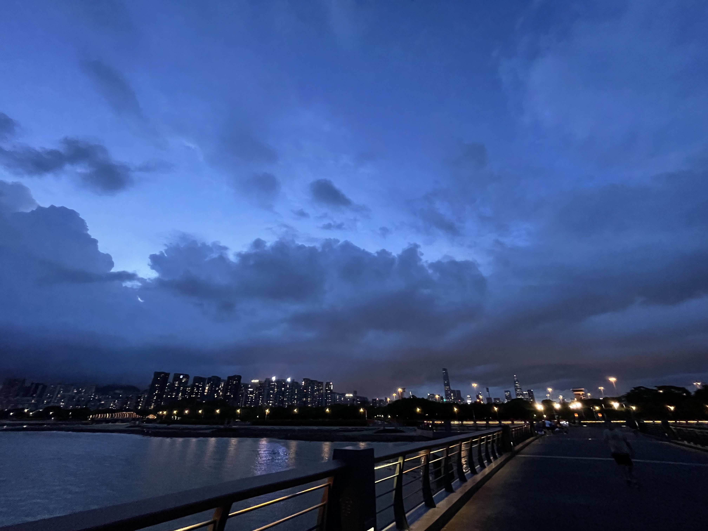
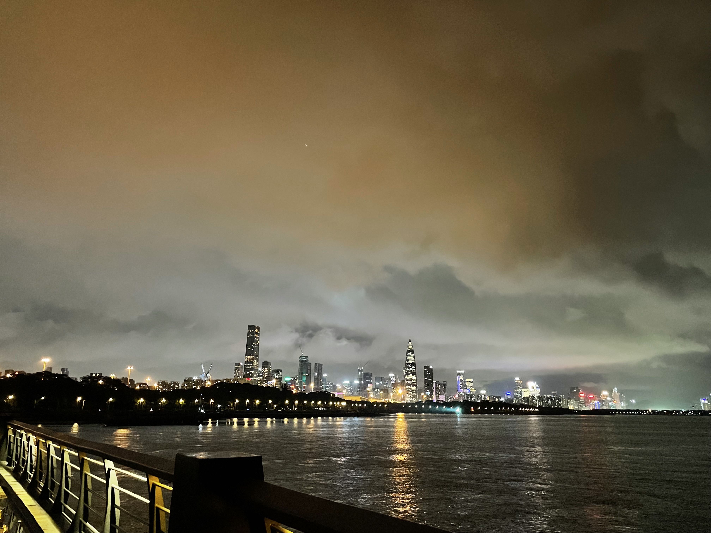
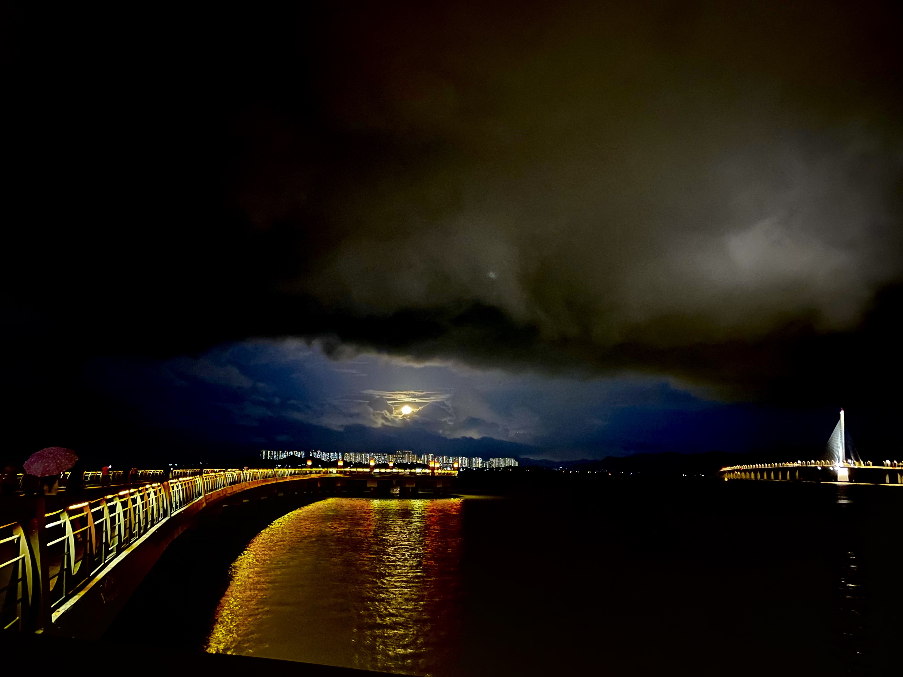

# 【随笔】海上明月伴潮生

> 春江潮水连海平，海上明月伴潮生。
>
> 滟滟随波千万里，何处春江无月明。
>
> —— 《春江花月夜•张若虚》

闷在桌前整了一天的文档，腰酸背痛。原想着趁太阳落山晚，阳光还在，出去晒着太阳转一转。可忽然一件临时的事情处理完，就到了快晚上七点。太阳显然早已经藏到了南山背后，估计再有十几分钟就要彻底落入地平面之下了。而一大片黑云也央乌央乌地从西北方涌上来，一副要下暴雨的架势。我在屋子里滴溜溜来回转了几圈，犹豫了一会儿，终于决定：对于这内心酝酿着想做的小事情，还是坚决地「叉手立办」为最好。于是穿上运动鞋，抄起包，塞进去一把雨伞和半瓶矿泉水，就下楼去了。

不知不觉就到了海边，天还没全黑，发现深圳湾大桥两旁有新修的观景平台，一直伸到海中间，平台上还点着漂亮的橙色灯笼，像极了20年前我在《魔兽世界》整天钓鱼、烤鱼的泰达希尔黑海岸。我决定趁今天，把两个观景平台都转一转，看一看究竟风景如何。栈道很长，果然是看深圳湾大桥和深圳夜景的好地方。以前还觉得香港更加灯火通明，现在对比之下，还是深圳沿岸的楼宇鳞次栉比、灯光更美一些。出门前刚刚从南山边升起的黑云，已经完全覆盖了来时的区域，想必黑云之下已经是风雨交加了吧。

观景平台上有一个穿连衣裙的女子，靠着一辆自行车，正对着大海和大桥在练习吹竹笛。虽然不熟练，但也恰恰成曲，与海风和涛声交响呼应，给这里的风景增色不少。我暗想，自己要是也能把尺八练好，至少达到这样的水平就好了。找到这么一个风景优美的地方，吹一两首自己喜欢的曲子，该有多么惬意啊。其实，尺八就在我的背包里。可是，实在不好意思拿出来。

等走到另一个栈道上，天已经全黑了。风更大了，边防武警的探照灯时不时地扫过。一个女人在平台上大声地打着电话，似乎是在帮助解决某个即将上线的系统问题，声嘶力竭、疲惫不已。木板上还有许多积水没干，我压了压腿，还是觉得风大，吹得头晕，便掉头往岸边走。

还没走上两步，只听一阵噼啪的雨声由远及近地袭来。我抬头一看，原来是那片黑云，已经被风吹到了头顶。我连忙打开伞，雨点噼里啪啦地砸了下来。平台上观景和锻炼的人们开始吵闹地跑动起来，我不禁暗自庆幸，自己还是有先见之明，拿上了雨伞，此时此刻因此从容了许多。

走了一半，忽然感觉天地之间静了下来。我有些迷惑地停了下来，四顾张望。发现就在身后，一个金黄而明亮的大圆盘出现在海面上空。哇哦，那是月亮吗？简直太美了！我目不转睛地盯着它，风小了，但雨还在下。金黄色的月光洒满了海面，跳跃不已。我想要掏出手机来，拍下这一幕给大宝分享，于是雨伞歪倒了一边，不时有雨点砸在脸上、身上和手臂上，每一滴水珠，此时竟然也闪耀着月亮的金色光辉。

手机拿出来时，月亮就缺了一角。我开始怀疑之前看到的圆月只是幻觉。但很快，月亮就只剩下了一多半，我这才明白，它要躲到云里去了。不由得放下手机，贪恋地注视着它迅速地钻进云背后，直到最后把那朵云描绘成一个带着金边的美丽剪影。

我刚把照片发给大宝，却欣喜地发现，月亮又探出头来，特意给我机会，让我又拍了一段视频，才再次钻进厚厚的云层之中，再也不见。我翻了翻日历，今天果然农历五月十六，正是月圆的时候。不过，此时此刻，大宝在老家是看不到月亮的，月亮还躲在他们屋后的大山之中呢。

呼呼～想要千里共婵娟，也只好通过手机了！

> 明月几时有？
> 把酒问青天。
> 不知天上宫阙，
> 今夕是何年。
> 我欲乘风归去，
> 又恐琼楼玉宇，
> 高处不胜寒。
> 起舞弄清影，
> 何似在人间。
>
> 转朱阁，
> 低绮户，
> 照无眠。
> 不应有恨，
> 何事长向别时圆？
> 人有悲欢离合，
> 月有阴晴圆缺，
> 此事古难全。
> 但愿人长久，
> 千里共婵娟。
>
> ——《水调歌头•明月几时有  苏轼》