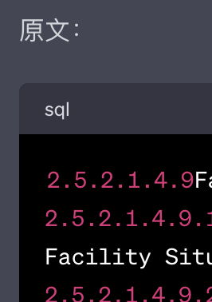
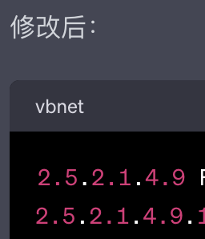

# 【区块链】疯掉了的GPT4

最近一段时间，我已经越来越习惯于依赖「蔡姬缶」——GPT4了。原因很简单，它的英语能力远远超过了我。所有和英文输入/输出有关的工作，有了它的帮助，都能更接近我心目中期望的结果，并且可能要少花90%以上的时间。可能也是心理作用，我开始越来越觉得GPT3.5不够好，不够用了。其实，如果只是英文上。我的水平不足以清晰地分辨这两者有多大的区别。但从中文能力的表现看，GPT4肯定比3.5强一个明显的档次。

然而，我昨天整出了一个幺蛾子。

大致情况是这样：我有一份英文文档，于是开启了GPT里一个叫做ChatPDF的插件，把这篇文档扔了进去。要求「蔡姬缶」同学考虑这篇文章的上下文，开始优化另一些文档的输出——当然是英文。有时候是让她修改一下文字，有时候会让她增加几句内容，我给出中文内容和意见，让她把调整英文。

忽然，在某一个段落的时候。ChatPDF的插件开始报错，首先是说那个PDF文件加载失败。我点开错误信息看，地址是它自己的一个临时地址。于是，我又重新上传、加载了一遍。还是报错，我再试，中途竟然好了一次，不久又开始报类似的错误。

这时，我发现「蔡姬缶」的输出开始明显出问题了，起初只是格式错误。她执着地用Markdown的代码标识，把部分输出框起来。类似这样：

怎么说她也不听。

然后，再忽然，她就开始和我说车轱辘话了。就是上面这样错误的输出，输出完后。她会来一句：

> 对不起，我之前的回复出现了错误。以下是……

然后接着是同样错误、混乱的内容。最让我震惊的是，她似乎在这时没有了输出长度限制，能够给我一口气输出两三屏幕的内容，这还不算那代码框里，其实一行是一整个小章节，横着又可以滚动是的屏不止！！！

最终，这个疯掉的「蔡姬缶」把我也搞得几乎抓狂，必须使劲忍住才能不骂娘。好在，这时屏幕上来了一行提示，告诉我3小时的额度又用完了。我想了想，关了屏幕决定好好冷静冷静。

----

这件事给我的教训是。说到底，「蔡姬缶」再厉害，她也只是计算机程序，是程序就会有Bug。我必须在将来使用她帮助自己的时候，牢牢记住这一点：

> 只要是程序，就会有Bug！

当Bug出现时，我要有准备，别让影响变得太糟糕……

话又说回来，**只要是人，不也都会犯错嘛**？