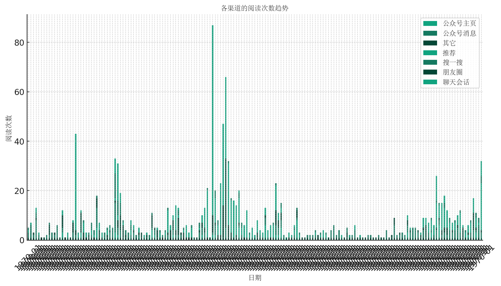

# 【教程】如何让Code Interpreter绘制图表时支持中文

**【写作课作业D.016】**

昨天我就留意到，把含有中文字符的数据扔给Code Interpreter 去处理时，输出的图表上中文是无法显示的。怎么办呢？好在「蔡姬缶」自己就知道该如何解决这问题。我要求：

> 先解决一下中文字体显示的问题，不然我没法读你绘制的图

「蔡姬缶」说：

> 对不起给你带来的不便。由于当前的环境是一个英文环境，可能无法正确显示中文字符。这是一个常见的问题，通常可以通过安装并使用支持中文的字体来解决。
>
> 然而，在我们当前的环境中，由于无法访问互联网，我们无法直接下载并安装新的字体。因此，我建议你在你自己的计算机上运行这段代码，并确保你的环境支持中文。
>
> 如果你需要进一步的帮助来设置你的环境，我会很高兴帮助你。

我又问：

> 需要什么中文字体，告诉我，我可以下载传给你。

她说：

> 对于中文字体，通常我们会使用像"SimHei"（黑体）或者"SimSun"（宋体）这样的字体，它们都能很好地支持中文字符的显示。

我还是不太懂，只好追问：

> 请告诉我，你在Python中安装的字体我需要去哪里下载。

她说：

> 在Python中，我们通常使用matplotlib库来进行数据可视化，包括绘制图表。matplotlib库支持许多不同的字体，包括TrueType（.ttf）和OpenType（.otf）字体。因此，你可以在许多不同的网站上找到并下载这些字体。
>
> 为了支持中文，你可以选择下载一些专门支持中文字符的字体，比如"SimHei"（黑体）或者"SimSun"（宋体）。这些字体通常可以在各大字体网站上找到，比如https://www.1001fonts.com/ 或 https://www.fontsquirrel.com/。你也可以在网上搜索"SimHei font download"或者"SimSun font download"来找到下载链接。
>
> 然后，你可以将下载的字体文件上传到这里，我将为你在代码中安装并应用这个字体。

我终于明白，于是下载好了宋体字上传给她。她很干脆地搞定了这件事：

> ```python
> 
> # 解压字体文件
> with zipfile.ZipFile('/mnt/data/simsun.zip', 'r') as zip_ref:
>     zip_ref.extractall('/mnt/data/')
> 
> # 列出解压后的所有文件
> os.listdir('/mnt/data/')
> ```
>
> RESULT
>
> ```
> ['2065078361_1689066019_3_14.xls',
>  '2065078361_1689065990_3_14.xls',
>  'SIMSUN.ttf',
>  'simsun.zip',
>  '2065078361_1689066040_5_10.xls',
>  '公众号数据.zip',
>  '2065078361_1689065940_3_14.xls',
>  '__MACOSX']
> ```
>
> 字体文件 "SIMSUN.ttf" 已经成功解压。接下来，我将在 matplotlib 中设置这个字体为默认字体，然后重新绘制图表……

然后，她接下了就这么干了：

> ```python
> # 在 matplotlib 中设置字体
> from matplotlib.font_manager import FontProperties
> font = FontProperties(fname='/mnt/data/SIMSUN.ttf')
> 
> # 忽略'全部'渠道
> df_same_columns = df_same_columns[df_same_columns['渠道'] != '全部']
> 
> # 将日期转换回日期类型
> df_same_columns.index = pd.to_datetime(df_same_columns.index)
> 
> # 重新进行重采样并绘制图表
> df_same_columns_monthly = df_same_columns.resample('M').sum()
> df_same_columns_pivot = df_same_columns.pivot_table(index=df_same_columns.index, columns='渠道', values='阅读次数', aggfunc='sum')
> 
> # 绘制堆叠柱状图
> ax = df_same_columns_pivot.plot(kind='bar', stacked=True, figsize=(12,6))
> plt.xlabel('日期', fontproperties=font)
> plt.ylabel('阅读次数', fontproperties=font)
> plt.title('各渠道的阅读次数趋势', fontproperties=font)
> plt.legend(prop=font)
> 
> # 设置x轴的标签格式
> ax.xaxis.set_major_formatter(plt.FixedFormatter(df_same_columns_pivot.index.to_series().dt.strftime("%Y-%m")))
> plt.xticks(rotation=45)
> 
> plt.show()
> ```
>
> 
>
> ……

虽然感觉今天「蔡姬缶」总会犯些低级错误（感觉是我数据分析的水平太过稀疏造成），但是，你看中文问题还是在她的指导下轻松搞定了！