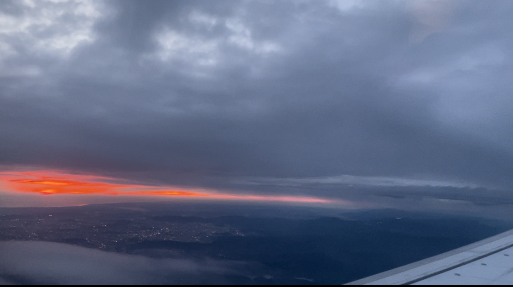

# 【随笔】上云端过南海到大马

这次出门，特地留出了足够时间收拾东西，去机场。从容了许多。当然，还是忘记了带电源转换插头、雨伞这些Nice to have的东西。

从深圳机场走，即便是安检在那里仔仔细细、慢条斯理地检查行李，出海关加上安检的时间总共也没多少。预留了俩小时在机场，最终让我「舒舒服服」地在机场的星巴克臻选店里干了一个小时工作。

这次依旧选了靠窗的位置，闭目养了一会儿神，等空姐开始发餐食才睁开眼。发现强烈的阳光正好从窗外射入，把小桌板照得明晃晃的。原来自己正好坐在右手的舷窗边，而飞机是往南飞的。我不禁开始向往起来，等到日落时分，我岂不是正好可以看到美丽的景色？看了会儿书，不知不觉就到了晚上7点。本想起身拿电脑写点啥来着，却听喇叭里说已经开始降落了。闹了半天，不是9点40，而是19点40多落地吉隆坡啊！

我索性合上书本，把Kindle也放起来，歪着脑袋、靠着舷窗往外看去。飞机正穿过一大片云层，太阳变成一个暗淡无光的白色小盘子，躲在厚厚的云层后面。飞机翅膀抖动着，劈开如白纱一般的云彩，倒是飞得颇有气势。间或云层之间漏出缝隙，显露出一处又一处的深蓝。那是大海吗？还是已经飞过了南中国海，到达了马来西亚的地界呢？算起来，大马对我来说是一个蛮有意义的地方，毕竟几乎完全是因为那次和大宝一起在大马的旅行，才能撞上那只从海里钻出来，咬住我手指头的海龟，然后我们才能有缘就此走到一起，恋爱、结婚、生娃，一不留神，眨吧眨吧眼7年就过去了。

看着飞机在云海中穿梭，天空变化出美妙的颜色，地面开始出现灯光，如同珠宝一般灿烂，有一种和这个世界亲近和链接在一起的感觉。我意识到，自己其实颇有些喜欢这样到处跑，体验不同地方的生活与风土人情。当然，如果还能带着自己心爱的人一起分享自己看到的这美好世界，那就更完美了。

想到这里，天边忽然出现了一抹红色。

呼～

太阳要落山了，我连忙打开手机，想拍下这美丽的景色，好分享给大宝和孩子们看。只可惜，手机拍出的感觉。远不及亲眼看到的1/10，哪怕今天，其实根本算不上有多么壮丽的日落景色。

----

2023.07.14