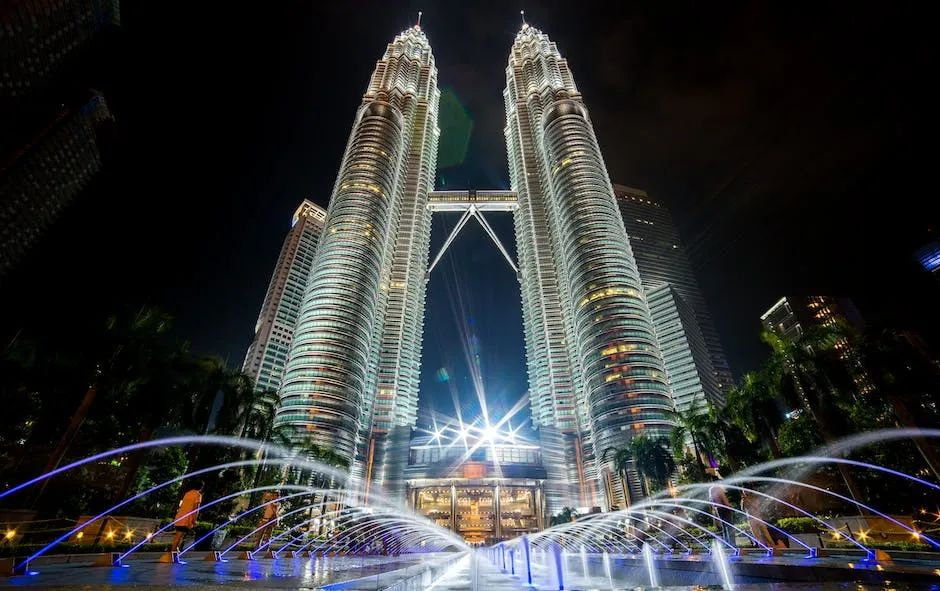
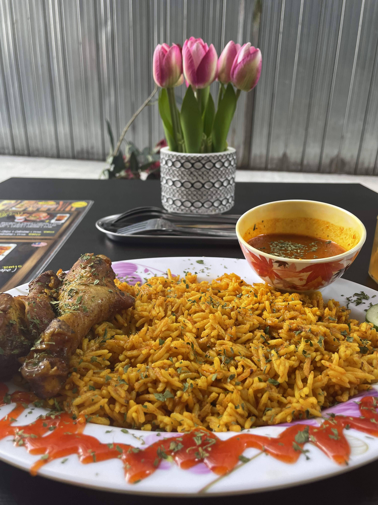
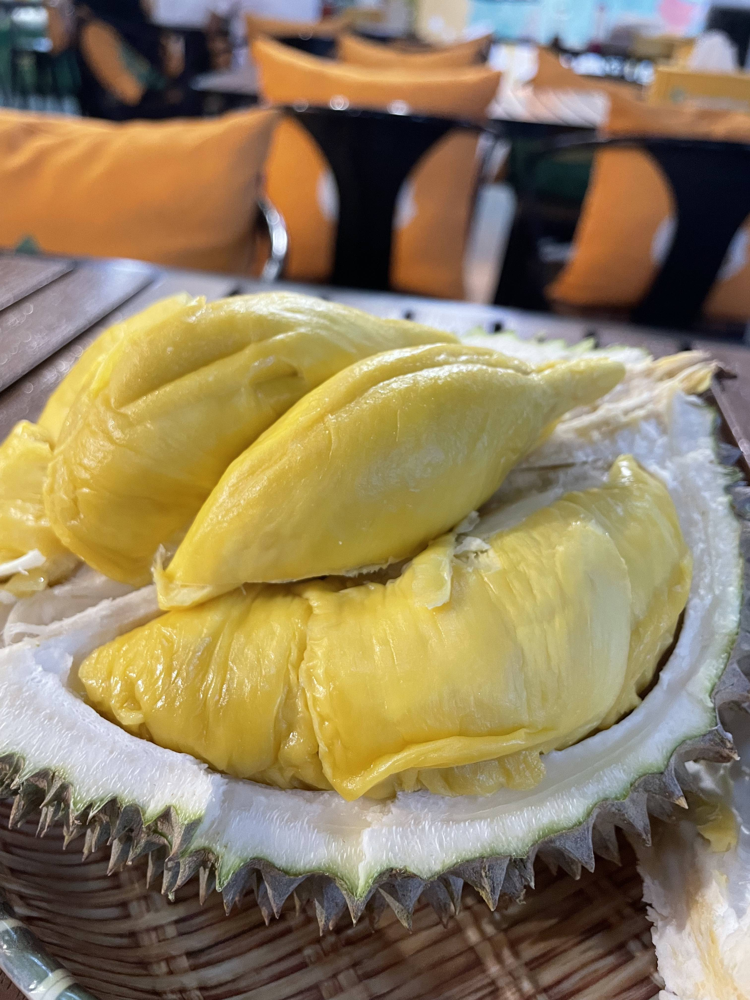

# 【随笔】咖喱味儿的吉隆坡（一）

早上6点多被闹钟叫醒，在床上坐着冥想片刻，一面试图不要走神，一面意识到，有那么一些「感悟」飘进脑海，不如待会写下来？可是，等坐上出租车前往机场时，却发现那些想法早已烟消云散。努力地想要回忆，却一点一滴痕迹都没有留下。人的意识与记忆是如此的不可捉摸，既然如此，不如索性随便记录一下这两天在吉隆坡的日常吧，反正，不管写不写下来，这些日子和这些日子的感受也终将随风而去，不着痕迹。

这次来吉隆坡毕竟是公干，除了去客户项目现场，主要就待在KLCC这个小小的区域。住的是一个非常老旧的酒店，房间倒是宽敞，但感觉至少超过10没有装修了，所有的设施，包括床上用品都旧得不行。唯一的好处，就是方便。从酒店大门出来，走到双子塔下的街心公园，不过几分钟而已。

第一天，就我自己一个人，想着要吃些本地的食物，于是祭出Google Map大法，在附近找到一家被标记为4.7星、名为什么什么 Tiger，人均消费1-20RM的小餐厅。看地图，还以为餐厅是在双子塔旁边的一栋楼里。但是走进大楼找了半天却没发现，只好出来又绕着大楼走了一圈，才发现这家小店原来藏在大楼的后巷，旁边就是装修工地的挡板，看着颇有当地苍蝇小馆的气质。找到它的时候，已经下午3点，没什么人，老板颇为热情地拿出了菜单给我看。但是一问才知道，不能用Alipay，有支付二维码，看起来可以用Grab钱包等一些本地的支付APP，但我尝试了半天，发现自己的Visa卡压根儿不能注册这些支付服务。无奈，我只好起身，跑到隔壁双子塔下，找了MyBank的取款机，取了几百块钱现金出来。其实，就在取款机旁，双子塔的大商场的地下两层，有着各种个样的餐馆，常见的麦当劳、肯德基、汉堡王、星巴克等连锁品牌一个不少，乃至各式中餐馆更是一个接一个。但我颇为惦记那家苍蝇小馆，拿上钞票又折了回去。

他们家主打的套餐15RM，是一个有些咖喱味儿的炒饭，味道挺香的，还摆得漂漂亮亮。吃完埋单时老板和我聊了两句，听说我来自中国人，颇为热情开心地告诉我，他也曾经在中国待过很长时间，像上海啊、杭州啊，等等地方。后来我又去了他们家两次，那个大汉堡套餐我更是喜欢，只要12RM，咬一口香喷喷，想起来还满嘴口水，真是便宜又实惠。只不过，他们家的口味有些偏南亚咖喱风，不是所有人都能习惯，后来，我带了一个北方的同事去他们家午餐，这位兄弟就吃不来。

到了马来西亚，还是惦记榴莲。酒店楼下就有一家新开的榴莲档。可是他们家的猫山王竟然需要100多RM一公斤，这价格实在太坑。但著名的SS2离我住的地方颇有些远，于是我又上网搜啊搜，终于发现，好像在附近1、2公里远的地方，有一家香港人开的榴莲档，叫什么Durain BB的。于是，我便在晚饭左右的时间摸了过去。这里猫山王80多，黑刺要100多，算是便宜一些。我犹豫了好一会儿，最后决定就在这里常常，但是黑刺个头偏大，自己恐怕吃不完，终于还是让老板帮我挑了一个小个儿的猫山王。称过重量，不到1.5公斤，花了100多RM。猫山王一如既往的浓郁香甜，不过我仔细回忆了一下，在深圳曾经买过泰国的猫榴莲，也有一次吃到了接近这个感觉的榴莲香味。那么这里卖的其它榴莲都是什么味道呢？我独自一人吃完这整一个猫山王，又喝了一个椰子。肚子早已溜圆，实在是无福尝试其它品种了。

在我身后是两个专门从香港飞过来吃榴莲的老餮，不知他们在吃什么。而另一桌老老少少一大帮人，吃完起身，已经开始在询问老板何处有吃晚饭的地方。我摸着自己圆滚滚的肚皮，颇有些羡慕他们人多，可以这样一直吃下去。

离开榴莲档，在附近转了一圈，发现这里有许多中文招牌的港式餐厅，想必是一个香港人聚居的地方吧。

<待续>