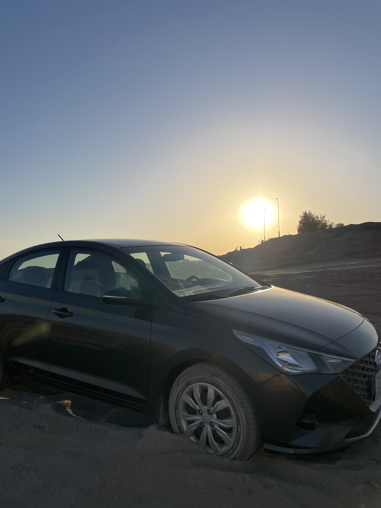
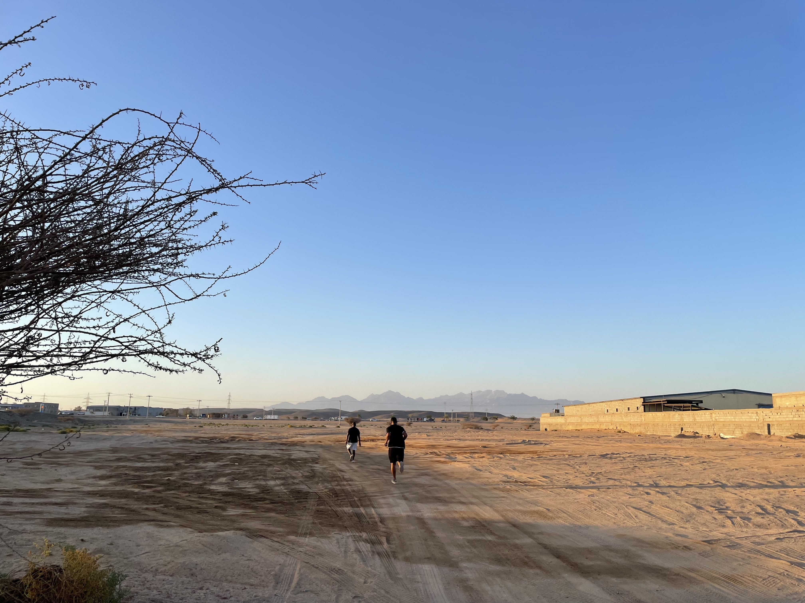

# 【随笔】在红海边陷入沙地

那天下午，准备去一个合作伙伴那里聊聊，他们租住在红海边的一栋别墅。

其实这已经是第二次去了，但这回是我自己一个人开车。上一次Google就给我导了个远路，结果这次一时疏忽，居然又跟着Google导航，开到了沙滩上。更糟糕的是，我知道自己走错路了，但因为上次有绕回去的经验，便颇为大意、自以为轻车熟路地跟着车辙往大路上拐。

忽然之间，车子停在沙地中间，走不动了。我纳闷地下车一看，原来我从两条路（其实也就是更结实的沙地而已）之间穿了过去，陷落在了一段斜坡上松软的沙地当中。也不知道我所跟随着的车辙，是哪一辆高大的四驱车碾出来的。我暗自叫苦，四顾无人，只有自己，一时竟然不知道怎么办才好。

在附近找了些石头、矿泉水瓶子，想垫在轮子下面看能不能前进或者后退走出来。但显然这些都不太管用，眼看着轮子空转起来刨的坑越来越深，我再也不敢乱动了。

下了车，眼看着夕阳西斜，金色的沙滩在金色阳光的照耀下熠熠生辉。不远处就是红海，湛蓝深邃。我却没心情欣赏美景，不知自己应该怎样才来出去。唉，自己还是太没经验，太轻视大自然了。原来在沙地上开车，并不是这么容易的事情。不禁想起刚刚在罗布泊出事的人，好在自己离目的地也就几百米的距离，远处海边，也有几辆车，想必是在海滩游玩的人们。

正想着要不要过去找人帮忙呢，两个小哥小跑着过来。刚刚在路上从他们身边开过来着，似乎是正在海滩边跑步锻炼。

小哥一面告诉我不用担心：「No Problem」，一面就开始张罗着帮我。他们也找了个大石头，又找了一块大木板来，但似乎也不好用。索性就还是一人帮我开车，另一人和我一起又是推、又是拉。就这么折腾了一阵子，终于，把小车子从沙坑里给弄了出来。

接着，小哥还告诉我，遇到这种情况，记得挂一档、关空调，慢慢走才行。然后，我还在想着，不知怎么感谢他们才好，甚至连一起合个影的话都没来得及说出口，他们已经挥了挥手，擦着汗水远去了！

红海边的好哥俩，谢谢你们！