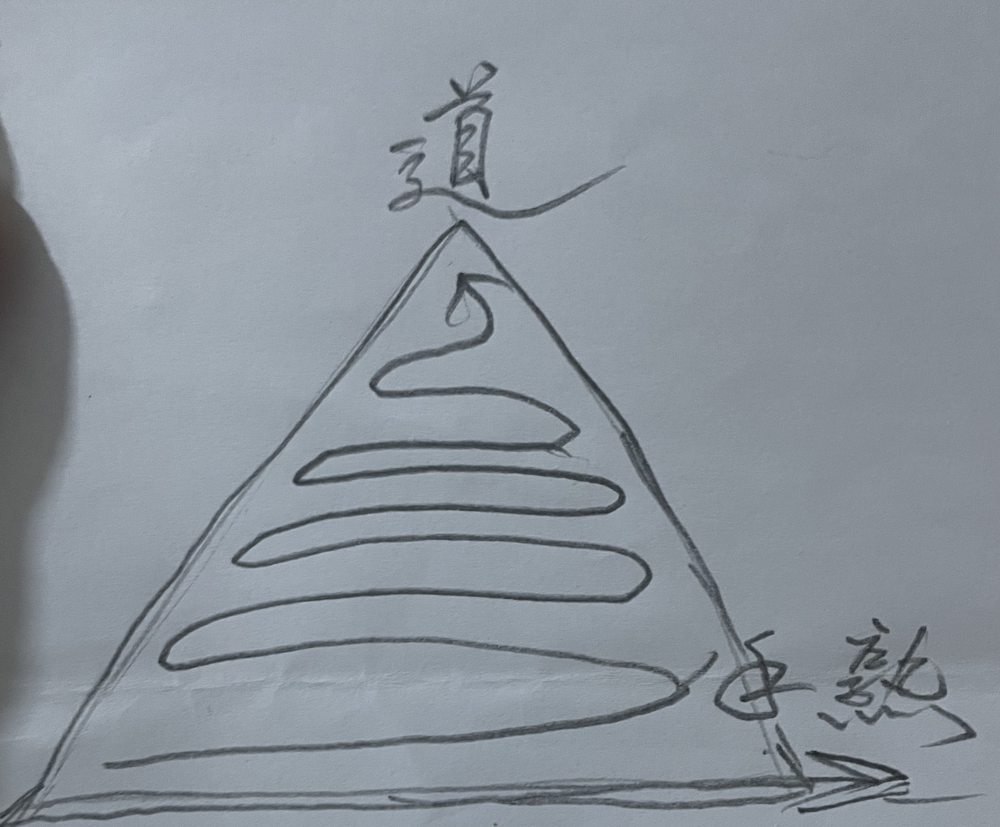

# 【生命⋅修行】唯手熟尔

这段时间，[仔仔细细读了一遍Paul Graham的那篇《How to Do Great Work》](https://mp.weixin.qq.com/s/ng2Y-DIAHLK-YbrG5NxehA)，很是喜欢。以我这四十常惑之人，能一再得到来自各种地方的提点，乃至棒喝，是多么的幸运啊。

原以为，这一万多单词的文章，凭着GPT4的帮助，只需要用飞机上的4个小时就可以完成。结果，8个小时之后才完成一小部分；然后以为接下来每天花上半小时到一小时，再用几天就可以结束全文，不曾想用了将近整整两周，中途还一度产生想要放弃的念头。

正如Paul Graham在文章中所说，做这件事的整个过程中充满了错误估计于判断。开始时，会高估坚持做下去所需要的能量，好在对这篇文章的喜爱和明确整块的4小时飞行时间，让我轻松越过了这个障碍；紧接着，又低估了完成这件事情所需要的工作量，走到中间发现，用完了预计的时间，却离终点还有至少一半之遥；这时，又有一个错误估计，觉得自己无法完成了，想要放弃，好在咬牙让自己坚持了一天，渡过了这又一个可能让我停下来的障碍。等到完成时，回天看那想要放弃的时间点，其实离终点并没有想象中那么遥远。

当然，再回头看这翻译的效果，又觉得不够满意了。语气风格不够一致，时不时就陷落在机翻风里爬不出来。GPT4 本身也不稳定，有时候，我觉得它的翻译效果很惊艳，有时候一股浓浓的机器人风格，有时候又太过精简，会遗漏掉甚至出现错译。需要一再地和它往复推敲、修正，根本不可能放手还同时期待它完成自己想要的效果。果然，目前只能做Co-Pilot。

这次翻译，达成了自己想要精读此文的目的，而自己翻译这篇文章时感受到的手生、手涩，最近已经出现很多次了。我也借此想明白了一个重要的道理：

1. 许多在某些领域看起来很NB的人，也不过是手熟而已，面对他们不用妄自菲薄。
2. 自以为自己很厉害的时候，其实也不过是手熟而已，不必得意忘形。
3. 经过持续练习，自己也可以从手生到手熟。
4. 一样技艺，放久了，一样会从手熟到手生。

欧阳修的《卖油翁》是这么说的：

> 陈康肃公尧咨善射，当世无双，公亦以此自矜。尝射于家圃，有卖油翁释担而立，睨之，久而不去。见其发矢十中八九，但微颔之。
>
> 康肃问曰：”汝亦知射乎？吾射不亦精乎？”翁曰：”无他，但手熟尔。”康肃忿然曰：”尔安敢轻吾射！”翁曰：”以我酌油知之。”乃取一葫芦置于地，以钱覆其口，徐以杓酌油沥之，自钱孔入，而钱不湿。因曰：”我亦无他，唯手熟尔。”康肃笑而遣之。
>
> **此与庄生所谓解牛斫轮者何异？**

对啊，手熟和庄子所提到的解牛之庖丁，斫轮之轮扁有什么区别呢？

我想，在手熟之上，应该还有一层追求吧！正如庖丁所言：「臣之所好：道也！」能否在道上更进一步，才是超越「手熟」之后的领域。正巧，前几天王建硕也写了一篇文章[《为什么「熟能生巧」》](https://mp.weixin.qq.com/s/4cMftcLEyvJh2yVpOpu-EQ),比较接近我内心的感悟。

我自己更喜欢用下面这样的图来表达：

然而，道是什么？

或许还是轮扁所说，那些无法言传身教的东西吧。
