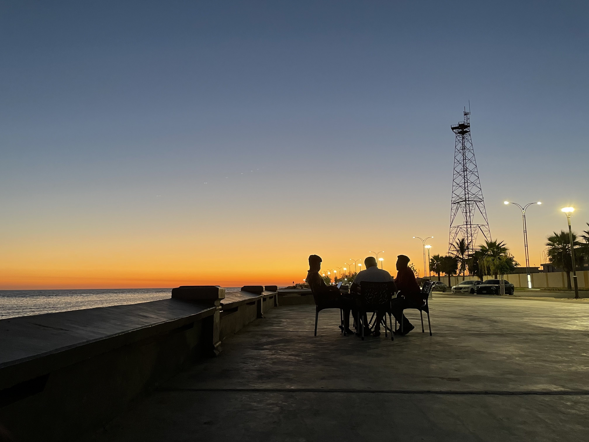
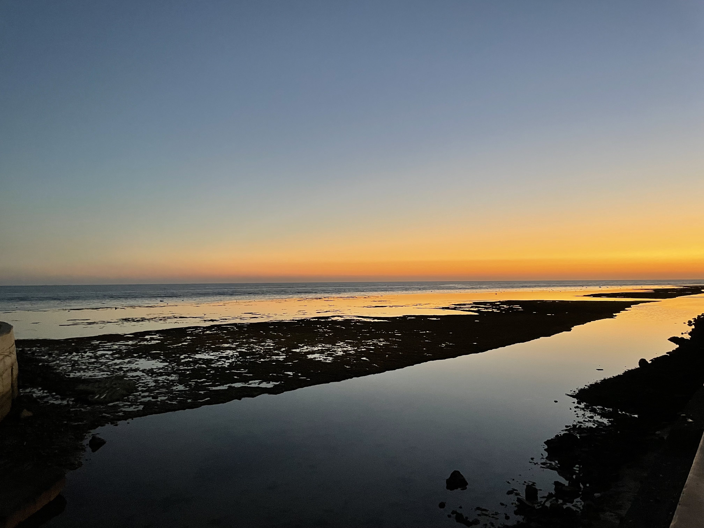
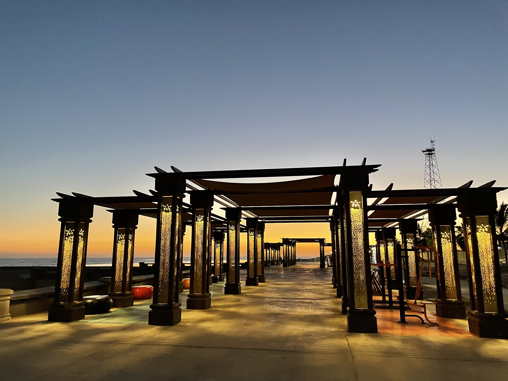

# 【随笔】日暮红海一杯茶

明天就要去往别处，这才发现自己竟然有些爱上了每天晚饭后的这段时光——在日暮时分徒步走到红海边，在漫天的霞光中靠坐在岸边的椅子上，再要上一杯滚汤的阿拉伯红茶，轻轻啜上一口，往后轻轻地靠在椅子背上，向远处的海天尽头望去。

如果来得及时，可以正好看着红彤彤的落日一寸一寸地跌入海平面，最终然后消失不见。只剩下炫彩灿烂的晚霞，以及晶莹玉润、像琉璃一样流光溢彩的海面。就在太阳没入地平线的那一瞬间，城里的几座清真寺同时响起浑厚、庄严的祈祷与唱诵。整座小城陷入一种瞬间被凝固的仪式感，惟有一只橘色花纹的猫咪，在昏暗的暮光中，不以为然地背对着晚霞，伸了一个长长的懒腰。

就算瞪大眼睛盯着天空和大海，依旧很难察觉光线在细微而迅速地变化。但很快，大海与天空的颜色就变得更加深邃。一颗、两颗越来越多的星星忽闪忽闪地出现在天空中，偶尔还会有一两架闪着灯的飞机从天边飞来，又消失在星空之中。

今天、甚至在海里还出现了一艘游艇，这是前几天没有看见过的。夜色越来越深，它打开了灯，来回游弋了一会儿，只一会儿没注意，它便不知不觉地消失在大海的夜幕之中。

这种感觉，竟然颇为幸福和满足。

我放下茶杯，斜靠在椅子背上，抬头看着天空，天上的星星越来越亮。我想，几百年前住在这红海边的人们，是不是就要这样看着美丽的大海和天空一辈子呢？他们会怎么想呢？

不管遥远的古人怎么想，此时此刻的我，已经开始思念在我身后、遥远的东方，距此地万里之遥的家人们了。

----

2023.08.07