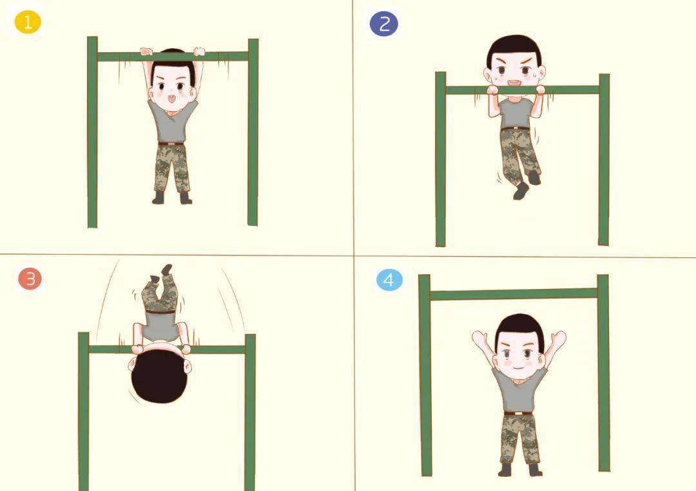

# 【生命•故事】（104）校园角落的单杠

刚上初中的我们，几乎全是瘦竹竿一样的小男孩。然而，那时的我们，不仅仅期望自己成为金庸小说里叱咤风云的大侠，也期望自己成为肌肉发达、史泰龙一样的男子汉。怎么办呢？练吧！

ZB可能是我们几个小伙伴中，练得最好的一个，他身上隐隐约约的肌肉线条，让我们羡慕不已。ZK年纪比我们都大，长得高大，虽然看不出什么肌肉线条，但是力气也大。他住在部队大院里，想必是见过士兵们训练，会不少花样的锻炼方法。在中午休息，上课之前的那段时间，我们就会到校园角落，一株雪松旁边去锻炼。那里有双杠、有单杠。

引体向上是我们能掌握的最基本技巧，高级一点的进阶玩法就是屈身上杠了。方法也很简单，做一个引体向上，保持手臂弯曲，收腹把并拢的双腿往上举，直到高过单杠，再利用重力继续后翻，腹部紧贴着单杠，身体绕着单杠向后旋转半周，变成用手直立支撑着正立在单杠上，然后下来。

网上找到了一个图，大致上就是这么一回事儿。

那天，我们正在那里轮流练习呢，走过来一个穿着长裙女孩子，可能比我们高一年级吧。只见她停了下来，站在在一边，看着我们依次蹦上去，攥住单杠，蹬着腿、费劲吧啦地做一个屈身上杠，然后又费劲地蹦下来，满脸都是不屑。

然后，正在我们都站在一边休息的时候。她竟然也走到了单杠下，轻轻一跳，双手抓住了单杠，然后——干净利索地做了一个屈身上杠。想必她是很瞧不上我们刚刚的表现吧，可是让我们目瞪口呆的，不是她比我们动作更加娴熟，而是——她好像忘记了自己穿的是裙子。她赶紧下了单杠，一言不发地赶紧离开了。

我们面面相觑，直到看着她的背影消失在转角的树丛后，ZK才弱弱地问了一句：

> 她刚是不是脸红了？