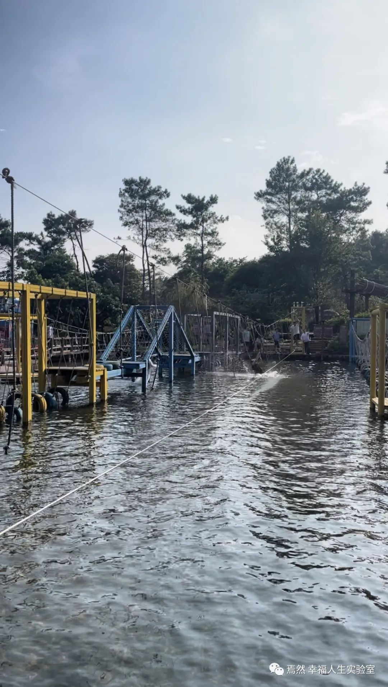

# 【随笔】水上走钢丝

一群人周末杀到了清远，到牛鱼嘴玩了会儿越野车，又去从玻璃滑道上漂流下来，纵然穿着一次性雨衣，还是把裤脚全打湿透了。

我拎着鞋，光着脚，走来到水上拓展项目旁，驻足旁观了一会儿，看着大家纷纷落水把自己弄得透湿，不由得也起了好胜心。

> 这水上钢丝绳儿看起来有点儿难度，不知道自己能不能搞定？反正大不了落水，反正裤子早就湿了也不怕再多沾一些…

我一面这么想着，一面放下了包，摩拳擦掌了一会儿，就毅然决然的地伸手拉住了上面的绳索，一只脚踩上了钢丝绳。

我也没有看着前方太远，只是盯着脚下和眼前的绳子，感觉似乎也不算太难。毕竟手和脚可以一起用力，而且只要脚下的平衡能勉强掌握，手上也不需要太大的力气。

可是走到大约接近一半的时候，绳子开始剧烈的晃动起来。原来是一个淘气的小姑娘，站在水里，使劲的推着钢丝绳。她一副毅然决然要把钢丝绳上的人全都放下水的架势，我可不想让她得逞。更加的慢下来，每一步都加着小心。

每次晃的厉害的时候，我都不得不停下来，两只手紧紧地抓住上面的绳子，脚下不敢移动。然后趁着小姑娘没劲了，停下来的时候。。才继续往前走两步。

等经过了她身边，她似乎也不再有兴致为难我。但我感觉自己的力气已经完了，不仅手上有些吃力，赤脚踩在钢丝绳上，竟然也开始感觉到勒脚了。可惜这时候正好走在正中间，不管是向前还是回头， 都需要走同样远的距离，除非主动跳到水里去。可我又不甘心这看起来失败的结局。

只好咬着牙关，忍着疼痛继续前行，毕竟剩下的路程比想象中还是快了不少，等终于到了岸上，感觉刚刚好力气用尽，忍耐力也用尽。踩在这踏实的地面，终于得以放松下来。内心里，还是禁不住有点小小的得意和自豪。

> 虽然是一个小小的挑战，毕竟成功了！