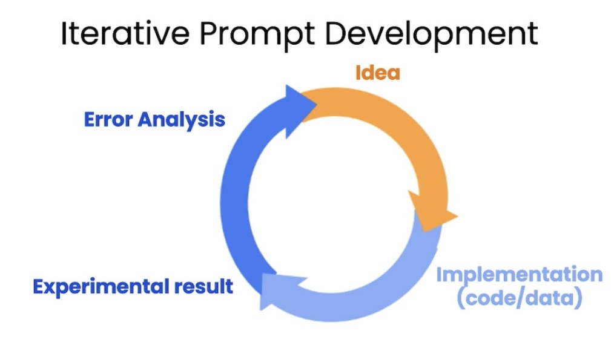

# 学习吴恩达 ChatGPT提示工程师开发者课程（二）

开始学习吴恩达的这个提示工程开发者课程。欢迎跟我一起学习，课程地址在这里：https://www.deeplearning.ai/short-courses/chatgpt-prompt-engineering-for-developers/

## 课程内容简介

### Iterative



这次课程的核心内容，就是这个圈。Prompt的开发，和开发应用、写程序本质上一回事儿，也是这样一个从想法、到实践、到结果检验（错误分析）与反馈的迭代过程。

可以说，这个基本原则可能不用教，大部分人一上手，自动这么干的。吴恩达在这次课程里，只围绕着一个写商品文案的例子在展开这个迭代过程。最开始只是相对简单的指令，然后根据输出结果，不断地在长度、内容、形式的要求上，对Prompt做了各种调整。最终得到一个基本满意的文案结果（虽然，我自己的经验是常常只能得到一个相对凑合的结果，就止步在某个水平上了）。

但这个原则我是非常认可的，课堂上依然提供了Jupyter 的环境供操练。以下是课程核心内容的一些简单总结，供参考：

### 1. **迭代开发**:

- 第一次尝试可能不会得到完美的提示。
- 持续优化和调整提示直到达到期望效果。

### 2. **模型的初次反馈**:

- 初始模型的输出可能不是最佳的。
- 通过多次尝试和调整，模型的性能会逐渐提高。

### 3. **明确的提示**:

- 使指示清晰和具体。
- 可以通过明确指出所需的输出长度，如“使用最多50个单词”，来控制模型的输出。

### 4. **不断的试验和调整**:

- 多次修改和优化提示。
- 逐步接近期望的结果。

### 5. **考虑目标受众**:

- 根据特定受众（如家具零售商）的需求调整输出内容。

### 6. **应用的成熟度**:

- 对于更成熟的应用，需要在多个示例上进行测试。
- 确保模型在各种情况下都能提供良好的性能。

### 7. **机器学习的思考**:

- 大型语言模型的应用开发与传统机器学习的开发过程相似。
- 包括迭代、评估和优化。

总之，开发大型语言模型的应用需要不断地、迭代地优化提示，确保输出满足特定应用的需求。


## 课程文案与内容

### Transcript

When I've been building applications with large language models, I don't think I've ever come to the prompt that I ended up using in the final application on my first attempt. And this isn't what matters. As long as you have a good process to iteratively make your prompt better, then you'll be able to come to something that works well for the task you want to achieve. You may have heard me say that when I train a machine learning model, it almost never works the first time. In fact, I'm very surprised that the first model I trained works. I think we're prompting, the odds of it working the first time is maybe a little bit higher, but as he's saying, doesn't matter if the first prompt works, what matters most is the process for getting to prompts that works for your application. So with that, let's jump into the code and let me show you some frameworks to think about how to iteratively develop a prompt. All right. So, if you've taken a machine learning class with me before, you may have seen me use a diagram saying that with machine learning development, you often have an idea and then implement it. So, write the code, get the data, train your model, and that gives you an experimental result. And you can then look at that output, maybe do error analysis, figure out where it's working or not working, and then maybe even change your idea of exactly what problem you want to solve or how to approach it. And then change implementation and run another experiment and so on, and iterate over and over to get to an effective machine learning model. If you're not familiar with machine learning, haven't seen this diagram before, don't worry about it. Not that important for the rest of this presentation. But when you are writing prompts to develop an application using an LLM, the process can be quite similar, where you have an idea for what you want to do, the task you want to complete, and you can then take a first attempt at writing a prompt that hopefully is clear and specific, and maybe, if appropriate, gives the system time to think. And then you can run it and see what result you get. And if it doesn't work well enough the first time, then the iterative process of figuring out why the instructions, for example, were not clear enough, or why it didn't give the algorithm enough time to think, allows you to refine the idea, refine the prompt, and so on, and to go around this loop multiple times until you end up with a prompt that works for your application. This too is why I personally have not paid as much attention to the internet articles that say 30 perfect prompts, because I think, there probably isn't a perfect prompt for everything under the sun. It's more important that you have a process for developing a good prompt for your specific application. So, let's look at an example together in code. I have here the starter code that you saw in the previous videos, have import OpenAI, import OS. Here we get the OpenAI API key, and this is the same helper function that you saw as last time. And I'm going to use as the running example in this video, the task of summarizing a fact sheet for a chair. So, let me just paste that in here. And feel free to pause the video and read this more carefully in the notebook on the left if you want. But here's a fact sheet for a chair with a description saying it's part of a beautiful family of mid-century inspired, and so on. It talks about the construction, has the dimensions, options for the chair, materials, and so on. It comes from Italy. So, let's say you want to take this fact sheet and help a marketing team write a description for an online retail website. Let me just quickly run these three, and then we'll come up with a prompt as follows, and I'll just... and I'll just paste this in. So my prompt here says, your task is to help a marketing team create the description for a retail website with a product based on a techno fact sheet, write a product description, and so on. Right? So this is my first attempt to explain the task to the large language model. So let me hit shift-enter, and this takes a few seconds to run, and we get this result. It looks like it's done a nice job writing a description, introducing a stunning mid-century inspired office chair, perfect addition, and so on. But when I look at this, I go, boy, this is really long. It's done a nice job doing exactly what I asked it to, which is start from the technical fact sheet and write a product description. But when I look at this, I go, this is kind of long. Maybe we want it to be a little bit shorter. So, I have had an idea, I wrote a prompt, got a result. I'm not that happy with it because it's too long. So, I will then clarify my prompt and say, use at most 50 words to try to give better guidance on the desired length of this. And let's run it again. Okay. This actually looks like a much nicer short description of the product, introducing a mid-century inspired office chair, and so on. Five of you just, yeah, both stylish and practical. Not bad. And let me double check the length that this is. So, I'm going to take the response, split it according to where the space is, and then, you know, print out the length. So it's 52 words. It's actually not bad. Large language models are okay, but not that great at following instructions about a very precise word count. But this is actually not bad. Sometimes it will print out something with 60 or 65 and so on words, but it's kind of within reason. Some of the things you could try to do would be, to say use at most three sentences. Let me run that again. But these are different ways to tell the large language model, what's the length of the output that you want. So this is 1, 2, 3, I count three sentences, looks like I did a pretty good job. And then I've also seen people sometimes do things like, I don't know, use at most 280 characters. Large language models, because of the way they interpret text, using something called a tokenizer, which I won't talk about. But they tend to be so-so at counting characters. But let's see, 281 characters. It's actually surprisingly close. Usually a large language model is, doesn't get it quite this close. But these are different ways that you can play with to try to control the length of the output that you get. But let me just switch it back to use at most 50 words. And there's that result that we had just now. As we continue to refine this text for our websites, we might decide that, boy, this website isn't selling direct to consumers, is actually intended to sell furniture to furniture retailers that would be more interested in the technical details of the chair and the materials of the chair. In that case, you can take this prompt and say, I want to modify this prompt to get it to be more precise about the technical details. So let me keep on modifying this prompt. And I'm going to say, this description is intended for furniture retailers, so should be technical and focus on materials, products and constructed from, well, let's run that. And let's see. Not bad, says, you know, coated aluminum base and pneumatic chair, high-quality materials. So by changing the prompt, you can get it to focus more on specific characters, on specific characteristics you wanted to. And when I look at this, I might decide at the end of the description, I also wanted to include the product ID. So the two offerings of this chair, SWC 110, SWC 100. So, maybe I can further improve this prompt. And to get it to give me the product IDs, I can add this instruction at the end of the description, include every 7-character product ID in the technical specification, and let's run it, and see what happens. And so, it says, introduce you to our Miss Agents 5 office chair, shell colors, talks about plastic coating, aluminum base, practical, some options, talks about the two product IDs. So, this looks pretty good. And what you've just seen is a short example of the iterative prompt development that many developers will go through. And I think, a guideline is, in the last video, you saw Isa share a number of best practices, and so, what I usually do is keep best practices like that in mind, be clear and specific, and if necessary, give the model time to think. With those in mind, it's worthwhile to often take a first attempt at writing a prompt, see what happens, and then go from there to iteratively refine the prompt to get closer and closer to the result that you need. And so, a lot of the successful prompts that you may see used in various programs was arrived at at an iterative process like this. Just for fun, let me show you an example of a even more complex prompt that might give you a sense of what chatGPT can do, which is, I've just added a few extra instructions here. After the description, include a table that gives the product dimensions, and then, you know, format everything as HTML. So, let's run that. And in practice, you end up with a prompt like this, really only after multiple iterations. I don't think I know anyone that would write this exact prompt the first time they were trying to get the system to process a fact sheet. And so, this actually outputs a bunch of HTML. Let's display the HTML to see if this is even valid HTML and see if this works. And I don't actually know it's going to work, but let's see. Oh, cool. All right. Looks like it rendered. So, it has this really nice looking description of a chair, construction, materials, product dimensions. Oh, it looks like I left out the use at most 50 words instruction, so this is a little bit long, but if you want that, you know, you can even feel free to pause the video, tell it to be more succinct and regenerate this and see what results you get. So, I hope you take away from this video that prompt development is an iterative process. Try something, see how it does not yet, fulfill exactly what you want, and then think about how to clarify your instructions, or in some cases, think about how to give it more space to think to get it closer to delivering the results that you want. And I think, the key to being an effective prompt engineer isn't so much about knowing the perfect prompt, it's about having a good process to develop prompts that are effective for your application. And in this video, I illustrated developing a prompt using just one example. For more sophisticated applications, sometimes you will have multiple examples, say a list of 10 or even 50 or 100 fact sheets, and iteratively develop a prompt and evaluate it against a large set of cases. But for the early development of most applications, I see many people developing it sort of the way I am, with just one example, but then for more mature applications, sometimes it could be useful to evaluate prompts against a larger set of examples, such as to test different prompts on dozens of fact sheets to see how is average or worst case performances on multiple fact sheets. But usually, you end up doing that only when an application is more mature, and you have to have those metrics to drive that incremental last few steps of prompt improvement. So with that, please do play with the Jupyter Code notebook examples and try out different variations and see what results you get. And when you're done, let's go on to the next video, where we'll talk about one very common use of large language models in software applications, which is to summarize text. So when you're ready, let's go on to the next video. 

当我使用大型语言模型构建应用程序时，我不认为我在第一次尝试时就能找到我最终在应用程序中使用的提示。而这并不重要。只要你有一个不断完善你的提示的好过程，那么你就能为你想要实现的任务找到合适的方法。你可能听过我说，当我训练一个机器学习模型时，它几乎从不在第一次就起作用。事实上，我对第一个我训练的模型能起作用感到很惊讶。我认为对于提示，它第一次起作用的几率可能稍高一些，但正如他所说，不重要的是第一次提示是否起作用，最重要的是获得适合你应用程序的提示的过程。所以，让我们跳进代码，让我向你展示一些框架，让你思考如何迭代地开发一个提示。

好的，如果你以前跟我上过机器学习课，你可能看过我使用一个图表，说在机器学习开发中，你经常有一个想法，然后实现它。所以，写代码、获取数据、训练模型，这会给你一个实验结果。然后你可以查看该输出，也许进行错误分析，弄清楚它哪里起作用、哪里不起作用，然后也许甚至改变你要解决的问题的想法，或者如何处理它。然后改变实现并运行另一个实验，如此反复，直到得到一个有效的机器学习模型。如果你不熟悉机器学习，之前没有看过这个图表，不用担心，这对接下来的演示不那么重要。但是，当你使用LLM编写提示以开发应用程序时，过程可以非常相似，其中你对要做的事情有一个想法，你可以完成的任务，然后你可以首先尝试编写一个提示，希望它是清晰和具体的，也许，如果合适的话，给系统一些思考的时间。然后你可以运行它，看看你得到的结果是什么。如果它第一次不够好，那么通过弄清楚为什么指示不够清晰，或者为什么它没有给算法足够的思考时间，来细化想法、细化提示等，就可以进行迭代，继续这个循环，直到得到一个适合你应用程序的提示。所以，对于如何编写有用的提示，我个人没有特别关注那些互联网文章，比如说30个完美的提示，因为我认为，很可能没有一个适合太阳底下的所有事情的完美提示。更重要的是，你有一个为你的特定应用程序开发一个好的提示的过程。

所以，让我们一起看一个代码示例。我在这里有一个起始代码，你在上一个视频中看到的，我们导入了OpenAI，导入了OS。这里我们获取OpenAI的API密钥，这是你上次看到的同一个辅助函数。我将使用这个视频中的一个运行示例，即总结一个椅子的事实表。所以，让我把它粘贴在这里。如果你想的话，可以暂停视频，在左边的笔记本上仔细阅读。但这是一个椅子的事实表，描述说它是一个美丽的中世纪启示家族的一部分，等等。它谈到了建筑，有尺寸，椅子的选择，材料等等。它来自意大利。所以，假设你想从这个事实表中

摘要，并帮助市场营销团队为在线零售网站写一个描述。

所以，我希望这个视频能带给你的是，提示开发是一个迭代的过程。尝试一下，看看它是如何还不完全满足你的要求的，然后考虑如何澄清你的指示，或者在某些情况下，考虑如何给它更多的空间去思考，使其更接近你想要的结果。我认为，成为一个有效的提示工程师的关键不是知道完美的提示，而是有一个开发适合你的应用程序的提示的好过程。在这个视频中，我展示了使用一个示例开发一个提示。对于更复杂的应用，有时你会有多个示例，比如一个包含10个或甚至50个或100个事实表的列表，并迭代地开发一个提示，并根据一大组情况评估它。但对于大多数应用程序的早期开发，我看到许多人都是这样开发的，只是一个示例。但对于更成熟的应用，有时评估提示对于更大的示例集合可能是有用的，例如测试不同的提示在几十个事实表上的平均或最坏情况下的表现。但通常，只有当一个应用程序更为成熟时，你才需要有这些指标来推动提示改进的最后几步。

所以，请随意玩玩Jupyter代码笔记本示例，尝试不同的变化，看看你得到的结果是什么。当你完成后，让我们继续下一个视频，我们将讨论大型语言模型在软件应用中的一个非常常见的用途，即总结文本。所以，当你准备好的时候，让我们继续下一个视频。

[NEXT LESSON](https://learn.deeplearning.ai/chatgpt-prompt-eng/lesson/4/summarizing)

### 课程内容

#### Iterative Prompt Develelopment

In this lesson, you'll iteratively analyze and refine your prompts to generate marketing copy from a product fact sheet.

#### Setup

In [1]:

```
import openai
import os

from dotenv import load_dotenv, find_dotenv
_ = load_dotenv(find_dotenv()) # read local .env file

openai.api_key  = os.getenv('OPENAI_API_KEY')
```

In [2]:

```
def get_completion(prompt, model="gpt-3.5-turbo"):
    messages = [{"role": "user", "content": prompt}]
    response = openai.ChatCompletion.create(
        model=model,
        messages=messages,
        temperature=0, # this is the degree of randomness of the model's output
    )
    return response.choices[0].message["content"]
```

#### Generate a marketing product description from a product fact sheet

In [5]:

```
fact_sheet_chair = """
OVERVIEW
- Part of a beautiful family of mid-century inspired office furniture, 
including filing cabinets, desks, bookcases, meeting tables, and more.
- Several options of shell color and base finishes.
- Available with plastic back and front upholstery (SWC-100) 
or full upholstery (SWC-110) in 10 fabric and 6 leather options.
- Base finish options are: stainless steel, matte black, 
gloss white, or chrome.
- Chair is available with or without armrests.
- Suitable for home or business settings.
- Qualified for contract use.

CONSTRUCTION
- 5-wheel plastic coated aluminum base.
- Pneumatic chair adjust for easy raise/lower action.

DIMENSIONS
- WIDTH 53 CM | 20.87”
- DEPTH 51 CM | 20.08”
- HEIGHT 80 CM | 31.50”
- SEAT HEIGHT 44 CM | 17.32”
- SEAT DEPTH 41 CM | 16.14”

OPTIONS
- Soft or hard-floor caster options.
- Two choices of seat foam densities: 
 medium (1.8 lb/ft3) or high (2.8 lb/ft3)
- Armless or 8 position PU armrests 

MATERIALS
SHELL BASE GLIDER
- Cast Aluminum with modified nylon PA6/PA66 coating.
- Shell thickness: 10 mm.
SEAT
- HD36 foam

COUNTRY OF ORIGIN
- Italy
"""
```

In [4]:

```
prompt = f"""
Your task is to help a marketing team create a 
description for a retail website of a product based 
on a technical fact sheet.

Write a product description based on the information 
provided in the technical specifications delimited by 
triple backticks.

Technical specifications: ```{fact_sheet_chair}```
"""
response = get_completion(prompt)
print(response)

Introducing our stunning mid-century inspired office chair, the perfect addition to any home or business setting. This chair is part of a beautiful family of office furniture, including filing cabinets, desks, bookcases, meeting tables, and more, all designed with a timeless mid-century aesthetic.

One of the standout features of this chair is the variety of customization options available. You can choose from several shell colors and base finishes to perfectly match your existing decor. The chair is available with either plastic back and front upholstery or full upholstery in a range of 10 fabric and 6 leather options, allowing you to create a look that is uniquely yours.

The chair is also available with or without armrests, giving you the flexibility to choose the option that best suits your needs. The base finish options include stainless steel, matte black, gloss white, or chrome, ensuring that you can find the perfect match for your space.

In terms of construction, this chair is built to last. It features a 5-wheel plastic coated aluminum base, providing stability and mobility. The pneumatic chair adjust allows for easy raise and lower action, ensuring optimal comfort throughout the day.

When it comes to dimensions, this chair is designed with both style and comfort in mind. With a width of 53 cm (20.87"), depth of 51 cm (20.08"), and height of 80 cm (31.50"), it offers ample space without overwhelming your space. The seat height is 44 cm (17.32") and the seat depth is 41 cm (16.14"), providing a comfortable seating experience for users of all heights.

We understand that every space is unique, which is why we offer a range of options to further customize your chair. You can choose between soft or hard-floor caster options, ensuring that your chair glides smoothly across any surface. Additionally, you have the choice between two seat foam densities: medium (1.8 lb/ft3) or high (2.8 lb/ft3), allowing you to select the level of support that suits your preferences. The chair is also available with armless design or 8 position PU armrests, providing additional comfort and versatility.

When it comes to materials, this chair is crafted with the utmost attention to quality. The shell base glider is made from cast aluminum with a modified nylon PA6/PA66 coating, ensuring durability and longevity. The shell thickness is 10 mm, providing a sturdy and reliable structure. The seat is made from HD36 foam, offering a comfortable and supportive seating experience.

Finally, this chair is proudly made in Italy, known for its exceptional craftsmanship and design. With its combination of style, functionality, and customization options, this mid-century inspired office chair is the perfect choice for those seeking a timeless and elegant addition to their workspace.

Please note that this chair is qualified for contract use, making it suitable for a wide range of professional settings. Upgrade your office or home with this exceptional piece of furniture and experience the perfect blend of style and comfort.
```

#### Issue 1: The text is too long

- Limit the number of words/sentences/characters.

In [8]:

```
prompt = f"""
Your task is to help a marketing team create a 
description for a retail website of a product based 
on a technical fact sheet.

Write a product description based on the information 
provided in the technical specifications delimited by 
triple backticks.

Use at most 50 words.

Technical specifications: ```{fact_sheet_chair}```
"""
response = get_completion(prompt)
print(response)

Introducing our mid-century inspired office chair, part of a stunning furniture collection. With various color and finish options, choose between plastic or full upholstery in fabric or leather. The chair features a durable aluminum base with 5 wheels and pneumatic height adjustment. Perfect for home or business use. Made in Italy.
```

In [7]:

```
len(response)
333
```

#### Issue 2. Text focuses on the wrong details

- Ask it to focus on the aspects that are relevant to the intended audience.

In [9]:

```
prompt = f"""
Your task is to help a marketing team create a 
description for a retail website of a product based 
on a technical fact sheet.

Write a product description based on the information 
provided in the technical specifications delimited by 
triple backticks.

The description is intended for furniture retailers, 
so should be technical in nature and focus on the 
materials the product is constructed from.

Use at most 50 words. 

Technical specifications: ```{fact_sheet_chair}```
"""
response = get_completion(prompt)
print(response)
Introducing our mid-century inspired office chair, part of a beautiful furniture collection. With various shell colors and base finishes, it offers versatility for any setting. Choose between plastic or full upholstery in a range of fabric and leather options. The chair features a durable aluminum base with 5-wheel design and pneumatic chair adjustment. Made in Italy.
```

In [10]:

```
prompt = f"""
Your task is to help a marketing team create a 
description for a retail website of a product based 
on a technical fact sheet.

Write a product description based on the information 
provided in the technical specifications delimited by 
triple backticks.

The description is intended for furniture retailers, 
so should be technical in nature and focus on the 
materials the product is constructed from.

At the end of the description, include every 7-character 
Product ID in the technical specification.

Use at most 50 words.

Technical specifications: ```{fact_sheet_chair}```
"""
response = get_completion(prompt)
print(response)
Introducing our mid-century inspired office chair, part of a beautiful family of furniture. With various shell colors and base finishes, this chair offers versatility and style. Choose between plastic or full upholstery in a range of fabric and leather options. The chair features a 5-wheel plastic coated aluminum base and pneumatic chair adjustment for easy raise/lower action. Available with or without armrests, this chair is suitable for both home and business settings. Made with high-quality materials, including a cast aluminum shell with modified nylon coating and HD36 foam seat, this chair is built to last. Made in Italy.

Product IDs: SWC-100, SWC-110
```

#### Issue 3. Description needs a table of dimensions

- Ask it to extract information and organize it in a table.

In [11]:

```
prompt = f"""
Your task is to help a marketing team create a 
description for a retail website of a product based 
on a technical fact sheet.

Write a product description based on the information 
provided in the technical specifications delimited by 
triple backticks.

The description is intended for furniture retailers, 
so should be technical in nature and focus on the 
materials the product is constructed from.

At the end of the description, include every 7-character 
Product ID in the technical specification.

After the description, include a table that gives the 
product's dimensions. The table should have two columns.
In the first column include the name of the dimension. 
In the second column include the measurements in inches only.

Give the table the title 'Product Dimensions'.

Format everything as HTML that can be used in a website. 
Place the description in a <div> element.

Technical specifications: ```{fact_sheet_chair}```
"""

response = get_completion(prompt)
print(response)
<div>
  <h2>Product Description</h2>
  <p>
    Introducing our latest addition to our mid-century inspired office furniture collection - the SWC Chair. This chair is part of a beautiful family of furniture that includes filing cabinets, desks, bookcases, meeting tables, and more. With its sleek design and customizable options, the SWC Chair is the perfect choice for any home or business setting.
  </p>
  <p>
    The SWC Chair offers several options for customization. You can choose from a variety of shell colors and base finishes to match your existing decor. The chair is available with plastic back and front upholstery or full upholstery in a range of fabric and leather options. The base finish options include stainless steel, matte black, gloss white, or chrome. You can also choose whether to have armrests or not, depending on your preference.
  </p>
  <p>
    The construction of the SWC Chair is top-notch. It features a 5-wheel plastic coated aluminum base, ensuring stability and durability. The chair also has a pneumatic adjuster, allowing for easy raise and lower action. This makes it convenient for users to find their desired height and maintain proper posture throughout the day.
  </p>
  <p>
    The SWC Chair is designed with comfort in mind. The seat is made with HD36 foam, providing a plush and supportive cushioning experience. You can also choose between soft or hard-floor caster options, depending on the type of flooring in your space. Additionally, there are two choices of seat foam densities available: medium (1.8 lb/ft3) or high (2.8 lb/ft3). This allows you to customize the level of firmness to suit your preferences.
  </p>
  <p>
    The SWC Chair is not only stylish and comfortable, but it is also built to last. The shell base glider is made of cast aluminum with a modified nylon PA6/PA66 coating, ensuring strength and durability. The shell thickness is 10 mm, providing stability and support. With its high-quality materials and construction, the SWC Chair is qualified for contract use, making it suitable for commercial settings as well.
  </p>
  <p>
    Made in Italy, the SWC Chair is a testament to Italian craftsmanship and design. It combines style, functionality, and durability to create a chair that is both aesthetically pleasing and practical.
  </p>
  <h2>Product Dimensions</h2>
  <table>
    <tr>
      <th>Dimension</th>
      <th>Measurement (inches)</th>
    </tr>
    <tr>
      <td>Width</td>
      <td>20.87"</td>
    </tr>
    <tr>
      <td>Depth</td>
      <td>20.08"</td>
    </tr>
    <tr>
      <td>Height</td>
      <td>31.50"</td>
    </tr>
    <tr>
      <td>Seat Height</td>
      <td>17.32"</td>
    </tr>
    <tr>
      <td>Seat Depth</td>
      <td>16.14"</td>
    </tr>
  </table>
</div>

Product IDs: SWC-100, SWC-110
```

#### Load Python libraries to view HTML

In [12]:

```
from IPython.display import display, HTML
```

In [13]:

```
display(HTML(response))
```

#### Product Description

Introducing our latest addition to our mid-century inspired office furniture collection - the SWC Chair. This chair is part of a beautiful family of furniture that includes filing cabinets, desks, bookcases, meeting tables, and more. With its sleek design and customizable options, the SWC Chair is the perfect choice for any home or business setting.

The SWC Chair offers several options for customization. You can choose from a variety of shell colors and base finishes to match your existing decor. The chair is available with plastic back and front upholstery or full upholstery in a range of fabric and leather options. The base finish options include stainless steel, matte black, gloss white, or chrome. You can also choose whether to have armrests or not, depending on your preference.

The construction of the SWC Chair is top-notch. It features a 5-wheel plastic coated aluminum base, ensuring stability and durability. The chair also has a pneumatic adjuster, allowing for easy raise and lower action. This makes it convenient for users to find their desired height and maintain proper posture throughout the day.

The SWC Chair is designed with comfort in mind. The seat is made with HD36 foam, providing a plush and supportive cushioning experience. You can also choose between soft or hard-floor caster options, depending on the type of flooring in your space. Additionally, there are two choices of seat foam densities available: medium (1.8 lb/ft3) or high (2.8 lb/ft3). This allows you to customize the level of firmness to suit your preferences.

The SWC Chair is not only stylish and comfortable, but it is also built to last. The shell base glider is made of cast aluminum with a modified nylon PA6/PA66 coating, ensuring strength and durability. The shell thickness is 10 mm, providing stability and support. With its high-quality materials and construction, the SWC Chair is qualified for contract use, making it suitable for commercial settings as well.

Made in Italy, the SWC Chair is a testament to Italian craftsmanship and design. It combines style, functionality, and durability to create a chair that is both aesthetically pleasing and practical.

#### Product Dimensions

|   Dimension | Measurement (inches) |
| ----------: | -------------------: |
|       Width |               20.87" |
|       Depth |               20.08" |
|      Height |               31.50" |
| Seat Height |               17.32" |
|  Seat Depth |               16.14" |

Product IDs: SWC-100, SWC-110

#### Try experimenting on your own!

In [ ]:

<待续>