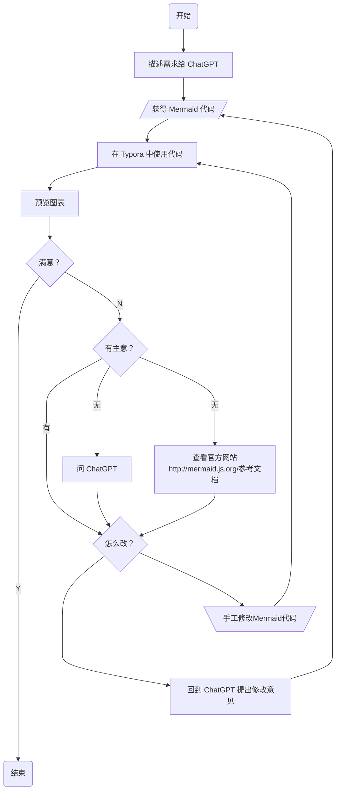
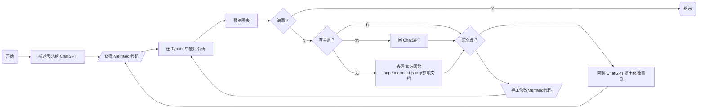
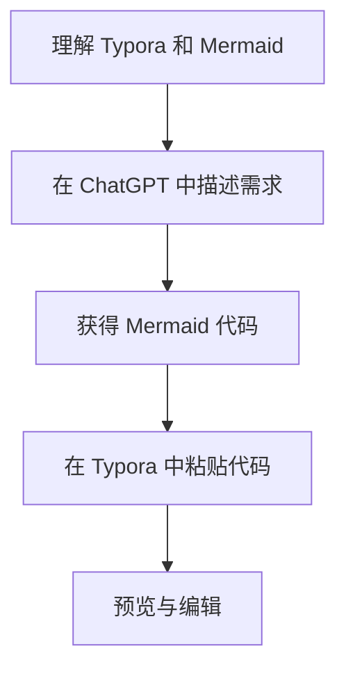
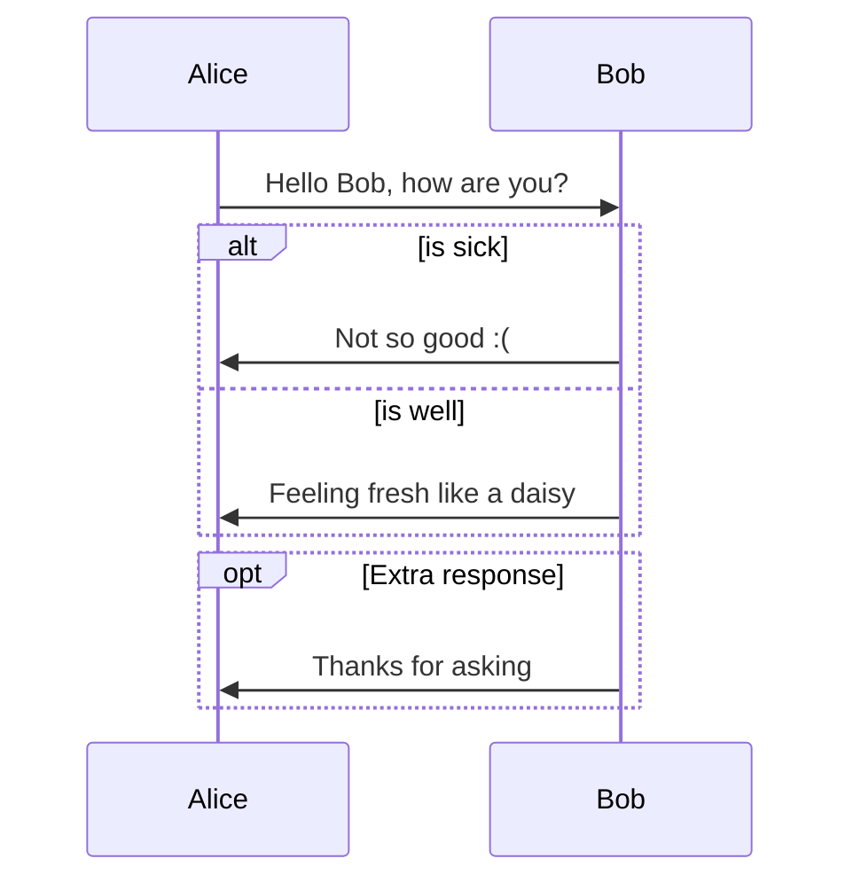
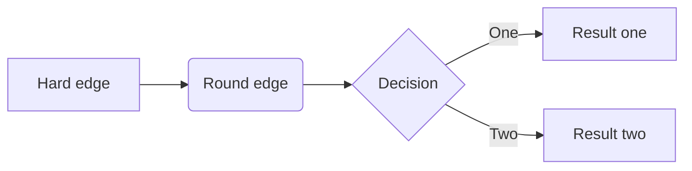
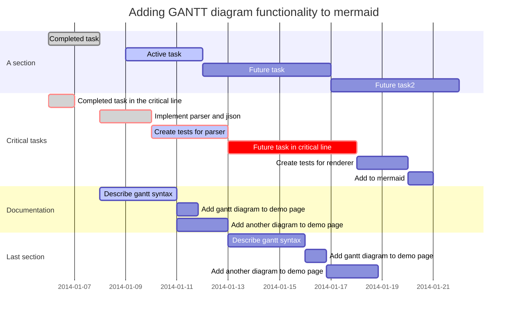
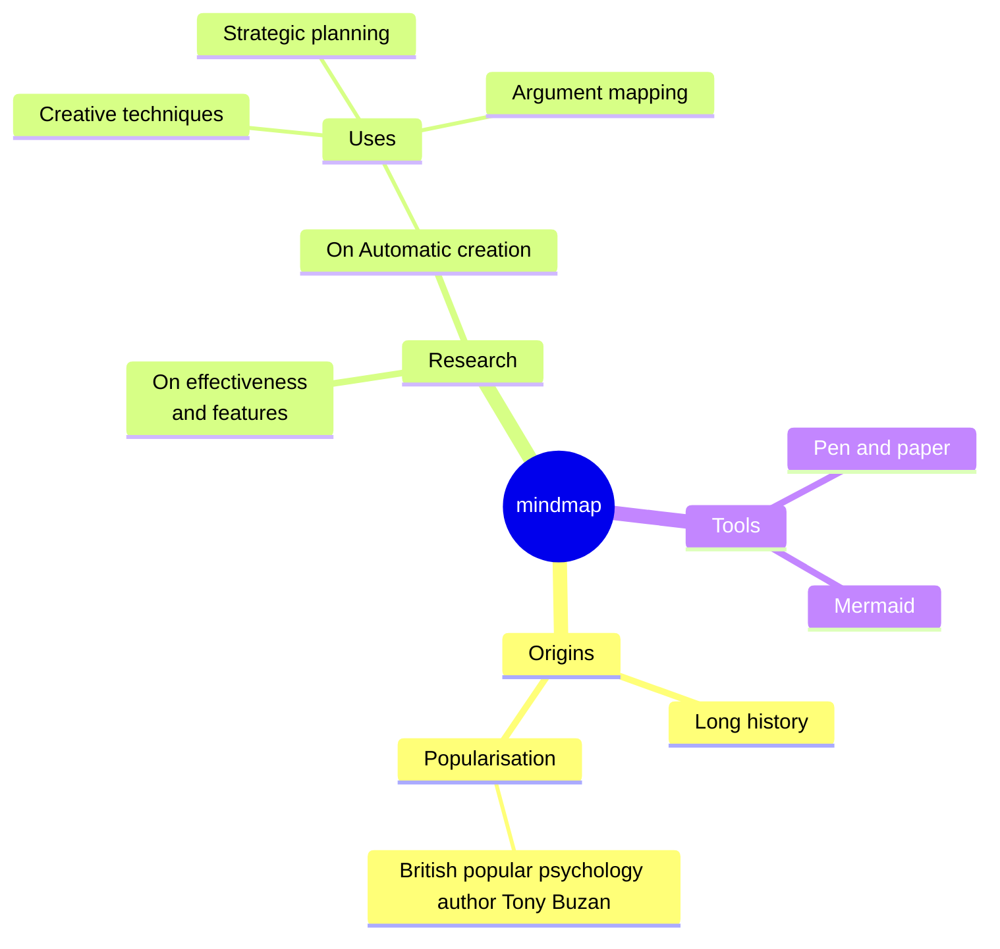

# 【教程】原来Typora还有用Markdown画图的功能

前两天，在网上寻找尝试AI 生成PPT时，意外发现，Typora竟然还有使用Markdown画图的功能。主要是写程序和做项目管理里时常常会用到的序列图、流程图（可以从上到下，也可以从左到右），还有甘特图。

Js-sequence 的语法最是简单直接，但图最好看的还是Mermaid。

这Mermaid语法虽然相对更复杂，但是既然也是标准的语言，而且ChatGPT显然是懂它的。那么当我以后需要绘制这些图表时，其实完全可以请ChatGPT帮我咯。于是乎，我请ChatGPT 帮我写了怎么结合Typora 和GPT 用Mermaid画图的指南，并且举了个栗子：

### **结合 ChatGPT 和 Typora 创建图表**

#### **什么是 Typora？**

Typora 是一个优雅且功能强大的 Markdown 编辑器，它支持直接渲染 Mermaid 代码，使得在编辑文档的同时可以直接预览图表效果。

#### **什么是 Mermaid？**

Mermaid 是一个开源的 JavaScript 图表库，它允许用户通过简单的文本描述生成各种图表。与许多其他图表库不同，Mermaid 使用的是文本编码，使得图表的创建和修改都变得非常直观。

#### **Mermaid 可以画哪些图？**

Mermaid 支持多种图表类型，包括但不限于：

- 流程图
- 序列图
- 甘特图
- 饼图
- 类图
- 状态图

#### **Mermaid 完整代码参考：**

为了更好地使用 Mermaid，建议访问其[官方文档](https://mermaid-js.github.io/mermaid/)，了解更多的语法和示例。

#### **创建图表的步骤：**

1. **描述需求给 ChatGPT**: 简要描述您希望创建的图表内容和类型。
2. **获得 Mermaid 代码**: ChatGPT 会根据您的描述提供适当的 Mermaid 代码。
3. **在 Typora 中使用代码**: 启动 Typora，创建一个新的 Markdown 文档，并在其中粘贴从 ChatGPT 获得的 Mermaid 代码。
4. **预览图表**: 在 Typora 中，您可以直接预览 Mermaid 图表的渲染效果。
5. **不满意？进行修改**:
   - **回到 ChatGPT**：如果您对图表不完全满意，可以继续与 ChatGPT 交流，获取修改建议或新的 Mermaid 代码。
   - **直接修改**：或者，您可以直接在 Typora 中编辑 Mermaid 代码，根据您的需要进行调整，然后再次预览。

#### **流程图示例**:

~~~markdown

~~~


上面这个图小复杂吧？有时竖着不太好看，也可以改成横的：



但其实，最初ChatGPT给我画的图是下面这样的，我一面问，一面看文档，一面改，才最终成了上面这个稍微复杂的样子。

````markdown

````


以下来自Typora的帮助手册，可以大致看看Typora都支持些什么样的图。

----

# Draw Diagrams With Markdown

Typora supports some Markdown extension for diagrams, you could enable this feature from preference panel. 

When exporting as HTML, PDF, epub, docx, those rendered diagrams will also be included, but diagrams features are not supported when exporting markdown into other file formats in current version. Besides, you should also notice that diagrams is not supported by standard Markdown, CommonMark or GFM. Therefore, we still recommend you to insert an image of these diagrams instead of write them in Markdown directly.

# Sequence

It is powered by [js-sequence](https://bramp.github.io/js-sequence-diagrams/), which would turn following code block into rendered diagrams:

~~~gfm
```sequence
Alice->Bob: Hello Bob, how are you?
Note right of Bob: Bob thinks
Bob-->Alice: I am good thanks!
```
~~~

```sequence
Alice->Bob: Hello Bob, how are you?
Note right of Bob: Bob thinks
Bob-->Alice: I am good thanks!
```

Please refer [here](https://bramp.github.io/js-sequence-diagrams/#syntax) for syntax explanation.

# Flowchart

It is powered by [flowchart.js](http://flowchart.js.org/), which would turn following code block into rendered diagrams:

~~~gfm
```flow
st=>start: Start
op=>operation: Your Operation
cond=>condition: Yes or No?
e=>end

st->op->cond
cond(yes)->e
cond(no)->op
```
~~~

```flow
st=>start: Start
op=>operation: Your Operation
cond=>condition: Yes or No?
e=>end

st->op->cond
cond(yes)->e
cond(no)->op
```

# Mermaid

Typora also has integration with [mermaid](https://knsv.github.io/mermaid/#mermaid), which supports sequence, flowchart and gantt.

## Sequence

see [this doc](https://mermaid.js.org/syntax/sequenceDiagram.html)

~~~gfm

~~~


## Flowchart

see [this doc](https://mermaid.js.org/syntax/flowchart.html)

~~~gfm

~~~


## Gantt

see [this doc](https://mermaid.js.org/syntax/gantt.html)

~~~gfm

~~~


## More Diagrams

see <https://support.typora.io/Draw-Diagrams-With-Markdown/>

上面这个文档里，竟然还有思维导图的例子：



