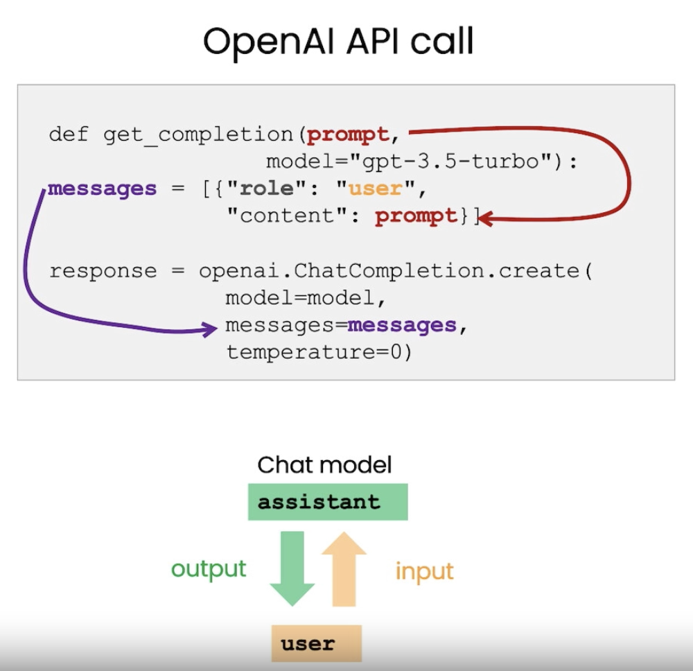
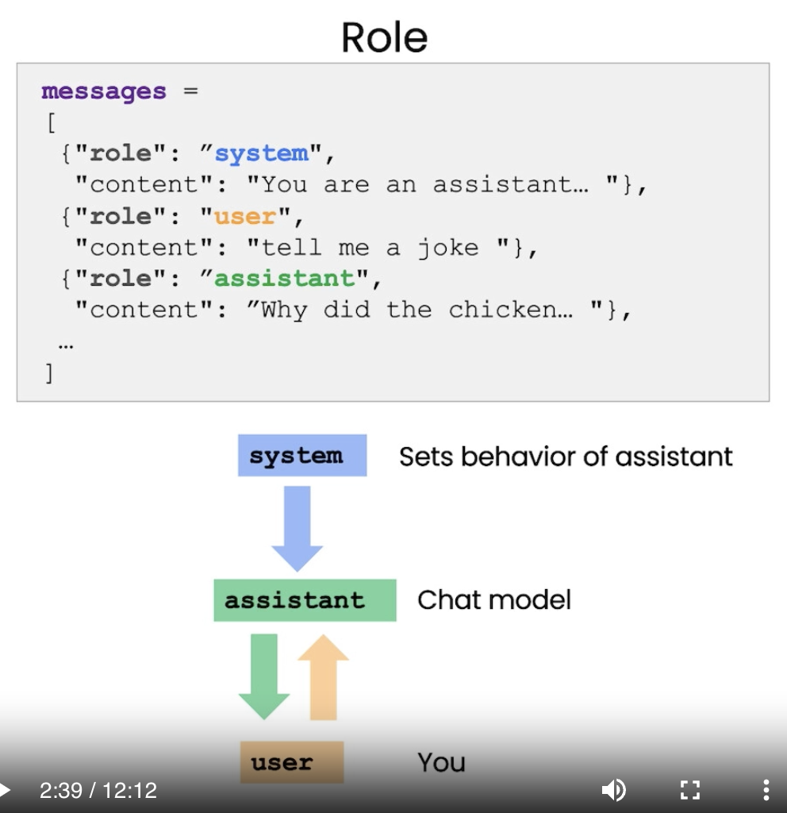

# 【教程】学习吴恩达 ChatGPT提示工程师开发者课程（八）

继续学习吴恩达的这个提示工程开发者课程。欢迎跟我一起学习，课程地址在这里：https://www.deeplearning.ai/short-courses/chatgpt-prompt-engineering-for-developers/

已经学过了七个部分：

1. Introduction
2. Guidelines
3. Iterative
4. Summarizing
5. Inferring
6. Transforming
7. Expanding

现在继续学习第8部分：**Chatbot**

## 课程内容简介

### Chatbot

在这一课里，以构造聊天机器人的简单逻辑为例，讲了三件事：

1. 在API里，Prompt是可以有不同角色输入的。这样，可以给一些系统级的提示给到模型，而不必让用户感知。
2. 可以把多次的对话结果，继续当作输入信息。这样，模型可以根据上下文回答。
3. 结合后台信息（餐馆的菜单），业务逻辑（System级别的Prompt），多次的对话输入，以及结构化的输出（比如Json），可以构造一个有点单功能的聊天机器人。





借用ChatGPT简单总结一下要点：

**模型格式与设置**：首先，教授详细描述了如何设置OpenAI的Python包，并介绍了"get_completion"这个辅助函数。

**消息与角色**：课程解释了如何使用不同类型的消息（系统消息、用户消息和助手消息）来控制聊天机器人的行为。

**上下文管理**：强调了每次与模型的互动都是独立的，因此提供所有相关的上下文信息是非常重要的。

**实例应用—OrderBot**：通过一个名为"OrderBot"的例子，教授展示了如何自动化地收集用户指令和助手回应，以便在一个比萨餐厅中接订单。

**温度参数**：讨论了如何使用模型的"温度"参数来控制输出的可预测性。

**任务指导与系统消息**：系统消息可以用于"悄悄"指导模型的行为，而用户并不需要知道这个指导信息。

**实用小贴士**：对于需要可预测输出的应用，推荐使用较低的温度设置。


## 课程文案与内容

### Transcript

> One of the exciting things about a large language model is you could use it to build a custom chatbot with only a modest amount of effort. ChatGPT, the web interface, is a way for you to have a conversational interface, a conversation via a large language model. But one of the cool things is you can also use a large language model to build your custom chatbot to maybe play the role of an AI customer service agent or an AI order taker for a restaurant. And in this video, you'll learn how to do that by yourself. I'm going to describe the components of the OpenAI chat completions format in more detail and then you're going to build a chatbot yourself. So let's get into it. So first we'll set up the OpenAI Python package as usual. So chat models like ChatGPT are actually trained to take a series of messages as input and return a model generated message as output. And so although the chat format is designed to make multi-turn conversations like this easy, we've kind of seen through the previous videos that it's also just as useful for single-turn tasks without any conversation. And so next we're going to define two helper functions. So this is the one that we've been using throughout all the videos and it's the "get_completion" function. But if you kind of look at it, we give a prompt but then inside the function what we're actually doing is putting this prompt into what looks like some kind of user message. And this is because the ChatGPT model is a chat model which means it's trained to take a series of messages as input and then return a model generated message as output. So the user message is the input and then the assistant message is the output. So in this video we're going to actually use a different helper function and instead of kind of putting a single prompt as input and getting a single completion, we're going to pass in a list of messages and these messages can be kind of from a variety of different roles. So I'll describe those. So here's an example of a list of messages and so the first message is a system message which kind of gives an overall instruction and then after this message we have turns between the user and the assistant and this will kind of continue to go on. And if you've ever used ChatGPT, the web interface, then your messages are the user messages and then ChatGPT's messages are the assistant messages. So the system message helps to kind of set the behavior and persona of the assistant and it acts as kind of a high-level instruction for the conversation. So you can kind of think of it as whispering in the assistant's ear and kind of guiding its responses without the user being aware of the system message. So as the user, if you've ever used ChatGPT, you probably don't know what's in ChatGPT's system message. The benefit of the system message is that it provides you, the developer, with a way to kind of frame the conversation without making the request itself part of the conversation. So you can kind of guide the assistant and kind of whisper in its ear and guide its responses without making the user aware. So now let's try to use these messages in a conversation. So we'll use our new helper function to get the completion from the messages. And we're also using a higher temperature. So the system message says, "You are an assistant that speaks like Shakespeare". So this is us kind of describing to the assistant how it should behave. And then the first user message is, "Tell me a joke". The next is, "Why did the chicken cross the road?" And then the final user message is, "I don't know." So if we run this, the response is "To get to the other side". Let's try again. "To get to the other side, fair sir or madam". It is an old and classic that never fails. So there's our Shakespearean response. And let's actually try one more thing. Because I want to make it even clearer that this is the assistant message. So here, let's just go and print the entire message response. So just to make this even clearer. This response is an assistant message. So the role is assistant and then the content is the message itself. So that's what's happening in this helper function. We're just kind of passing out the content of the message. So now let's do another example. So here our messages are, the system message is "You are a friendly chatbot", and the first user message is, "Hi, my name is Isa". And we want to get the first user message. So let's execute this for the first assistant message. And so the first message is, "Hello Isa! It's nice to meet you. How can I assist you today?" Now let's try another example. So here our messages are system message, "You are a friendly chatbot" and the first user message is, "Yes, can you remind me what is my "name? And let's get the response. And as you can see, the model doesn't actually know my name. So each conversation with a language model is a standalone interaction, which means that you must provide all relevant messages for the model to draw from in the current conversation. If you want the model to draw from, or quote unquote remember earlier parts of a conversation, you must provide the earlier exchanges in the input to the model. And so we'll refer to this as context. So let's try this. So now we've kind of given the context that the model needs, which is my name, in the previous messages, and we'll ask the same question, so we'll ask what my name is. And the model is able to respond because it has all of the context it needs in this kind of list of messages that we input to it. So now you're going to build your own chatbot. This chatbot is going to be called "OrderBot", and we're going to automate the collection of user prompts and assistant responses in order to build this "OrderBot". And it's going to take orders at a pizza restaurant, so first we're going to define this helper function, and what this is doing is it's going to kind of collect our user messages so we can avoid typing them in by hand in the same, in the way that we did above, and this is going to kind of collect prompts from a user interface that we'll build below, and then append it to a list called "context", and then it will call the model with that context every time. And the model response is then also added to the context, so the kind of model message is added to the context, the user message is added to the context, so on, so it just kind of grows longer and longer. This way the model has the information it needs to determine what to do next. And so now we'll set up and run this kind of UI to display the Autobot. And so here's the context, and it contains the system message that contains the menu. And note that every time we call the language model, we're going to use the same context, and the context is building up over time. And then let's execute this. Okay, I'm going to say, "Hi, I would like to order a pizza". And the assistant says, "Great, what pizza would you like to order? We have pepperoni, cheese, and eggplant pizza." Hmm. "How much are they?", Great, okay, we have the prices. I think I'm feeling a medium eggplant pizza. So as you can imagine, we could continue this conversation. And let's kind of look at what we put in the system message. So, "You are Autobot, an automated service to collect orders for a pizza restaurant. You first greet the customer, then collect the order, and then ask if it's a pick-up or delivery. You wait to collect the entire order, then summarize it and check for a final time if the customer wants to add anything else. If it's a delivery, you can ask for an address. Finally, you collect the payment. Make sure to clarify all options, extras and sizes to uniquely identify the item from the menu. You respond in a short, very conversational, friendly style. The menu includes.", and then, here we have the menu. So, let's go back to our conversation, and let's see if the assistant kind of has been following the instructions. Okay, great, the assistant asks if we want any toppings, which we kind of specified in the system message. So, I think we want no extra toppings. Sure thing. "Is there anything else you would like to order?" Let's get some water. Actually,fries. Small or large? This is great because we kind of asked the assistant in the system message to kind of clarify extras and sides. And so, you get the idea, and please feel free to play with this yourself. You can pause the video and just go ahead and run this in your own notebook on the left. And so, now we can ask the model to create a JSON summary that we could send to the order system based on the conversation. So, we're now appending another system message, which is an instruction, and we're saying, "Create a JSON summary of the previous food order. Itemize the price for each item. The fields should be 1) pizza, include side, 2) list of toppings, 3) list of drinks, and 4) list of sides", and finally, the total price. And you could also use a user message here. This does not have to be a system message. So, let's execute this. And notice, in this case, we're using a lower temperature because for these kinds of tasks, we want the output to be fairly predictable. For a conversational agent, you might want to use a higher temperature. However, in this case, I would maybe use a lower temperature as well because for a customer's assistant chatbot, you might want the output to be a bit more predictable as well. And so, here we have the summary of our order. And so, we could submit this to the order system if we wanted to. So there we have it, you've built your very own order chatbot. Feel free to kind of customise it yourself and play around with the system message to change the behaviour of the chatbot and kind of get it to act as different personas with different knowledge. 
>
> 大型语言模型有什么令人兴奋的地方呢？你只需要付出一点点努力，就可以用它来构建一个定制的聊天机器人。ChatGPT的Web界面是一种通过大型语言模型进行对话的方式。但更酷的是，你还可以用它来构建你自己的定制聊天机器人，比如充当AI客服助手或者餐厅的AI接单员。在这个视频中，你将学习如何自己动手做这件事。
>
> 首先，我们会更详细地描述OpenAI聊天完成格式的各个组件，然后你就会自己构建一个聊天机器人。让我们开始吧。首先，我们会像往常一样设置OpenAI Python包。
>
> 像ChatGPT这样的聊天模型其实是经过训练的，可以接受一系列消息作为输入，并返回一个模型生成的消息作为输出。虽然聊天格式旨在简化这样的多回合对话，但我们通过前面的视频也看到，它对于没有任何对话的单回合任务也同样有用。
>
> 接下来，我们将定义两个辅助函数。这是我们在所有视频中一直使用的一个，就是'get_completion'函数。但如果你仔细看，我们给出了一个提示，然后在函数内部，我们实际上是把这个提示放入了某种类型的用户消息中。这是因为ChatGPT模型是一个聊天模型，这意味着它是经过训练的，可以接受一系列消息作为输入，然后返回一个模型生成的消息作为输出。所以，用户消息是输入，助手消息是输出。
>
> 在这个视频中，我们实际上会使用一个不同的辅助函数，而不是输入一个单一的提示并获取一个单一的完成。我们将传入一个消息列表，这些消息可以来自多种不同的角色。我会描述这些角色。
>
> 这里有一个消息列表的例子，第一条消息是一个系统消息，它提供了整体的指导，然后在这条消息之后，我们有用户和助手之间的轮流对话，这将不断地继续下去。如果你曾经使用过ChatGPT的Web界面，那么你的消息就是用户消息，而ChatGPT的消息就是助手消息。系统消息有助于设置助手的行为和角色，它充当了对话的高级指导。你可以把它想象成在助手的耳边低语，引导其回应，而用户并不知道系统消息的内容。
>
> 系统消息的好处是，它为你提供了一种方式，可以在不让请求本身成为对话一部分的情况下，来引导对话。所以你可以在助手的耳边低语，引导其回应，而不让用户知道。
>
> 现在让我们尝试使用这些消息进行对话。我们将使用我们的新辅助函数来从消息中获取完成。
>
> 我们还在使用更高的温度。系统消息说，'你是一个说莎士比亚式英语的助手'。这是我们描述助手应该如何表现的方式。然后，第一条用户消息是，'给我讲个笑话'。接下来是，'为什么鸡要过马路？'，然后最后一条用户消息是，'我不知道'。
>
> 如果我们运行这个，回应是'为了到达另一边'。我们再试一次。
>
> '为了到达另一边，公爵或者郡主，这是一个古老而经典的笑话，永远不会失败'。所以，这就是我们的莎士比亚式回应。
>
> 实际上，让我们再试一件事情。因为我想让这个助手消息更加明确。所以这里，我们只是打印整个消息回应，以使这一点更加明确。这个回应是一个助手消息。所以角色是助手，然后内容就是消息本身。这就是在这个辅助函数中发生的事情。我们只是把消息的内容传了出去。
>
> 现在让我们再做一个例子。所以这里我们的消息是，系统消息是'你是一个友好的聊天机器人'，第一条用户消息是，'嗨，我叫Isa'。我们想要获得第一条助手消息。所以，让我们执行这个，以获得第一条助手消息。
>
> 第一条消息是，'你好，Isa！很高兴见到你。今天我能为你做些什么？'
>
> 现在让我们再试一个例子。这里我们的消息是，系统消息是'你是一个友好的聊天机器人'，第一条用户消息是，'是的，你能提醒我我的名字是什么吗？'，让我们获得回应。
>
> 正如你所看到的，模型实际上不知道我的名字。所以，与语言模型的每次对话都是一个独立的互动，这意味着你必须为模型提供当前对话中需要提取的所有相关消息。
>
> 如果你希望模型能从中提取，或者用引号引起来，记住对话的早期部分，你必须在输入到模型的内容中提供早期的交流。所以我们把这称为上下文。让我们试试。
>
> 现在我们已经提供了模型需要的上下文，也就是我的名字，在之前的消息中，我们会再次提出同样的问题，所以我们会问我的名字是什么。模型能够回应，因为它有所有需要的上下文，就在我们输入给它的这个消息列表中。
>
> 现在你要建立你自己的聊天机器人。这个聊天机器人将被称为'OrderBot'，我们将自动化地收集用户提示和助手回应，以便构建这个'OrderBot'。它将在一个比萨餐厅接订单，所以首先我们将定义这个辅助函数，这个函数将做的是，它将收集我们的用户消息，这样我们就可以避免用手输入它们，就像我们在上面所做的那样，这将从下面我们将建立的用户界面中收集提示，并将其附加到一个名为'上下文'的列表中，然后每次都会用那个上下文调用模型。模型的回应然后也被添加到上下文中，所以模型的消息被添加到上下文中，用户的消息被添加到上下文中，等等，它就会越来越长。
>
> 这样一来，模型就有了它需要的信息，以决定下一步要做什么。现在我们将设置并运行这个UI，以显示Autobot。这里有上下文，它包含了包含菜单的系统消息。
>
> 请注意，每次我们调用语言模型时，我们都会使用相同的上下文，而且上下文会随着时间的推移而积累。
>
> 然后让我们执行这个。
>
> 好的，我要说，'嗨，我想点一份比萨饼'。助手说，'好的，你想点哪种比萨饼？我们有意大利辣香肠、芝士和茄子比萨饼'。'它们多少钱？'，好的，我们有价格。我想要一个中号的茄子比萨饼。所以，正如你所想象的，我们可以继续这个对话。让我们看看我们在系统消息中放了什么。
>
> 所以，'你是Autobot，一个用于为比萨餐厅收集订单的自动化服务。你首先要问候客户，然后收集订单，然后询问是自取还是送货。你等待收集整个订单，然后总结它，并最后一次检查客户是否想添加其他东西。如果是送货，你可以要求提供地址。最后，你收集付款。确保澄清所有选项、额外和尺寸，以唯一地识别菜单上的项目。你以简短、非常对话式、友好的风格回应。菜单包括……'，然后，这里我们有菜单。
>
> 所以，让我们回到我们的对话，并看看助手是否一直遵循着指示。
>
> 好的，助手询问我们是否想要任何额外的配料，这是我们在系统消息中指定的。所以，我想我们不想要任何额外的配料。
>
> '当然可以。还有其他东西你想要点吗？'，让我们来点水。实际上，是薯条。
>
> 小份还是大份？这很好，因为我们在系统消息中要求助手澄清额外和配料。
>
> 所以，你明白了，而且请随意自己玩玩。你可以暂停视频，然后继续在你自己的笔记本电脑上运行这个。
>
> 现在，我们可以要求模型创建一个我们可以发送到订单系统的JSON摘要。所以，我们现在附加了另一个系统消息，这是一条指令，我们说，'创建前面食品订单的JSON摘要。为每一项商品列出价格。字段应该是1）比萨饼，包括配料，2）配料清单，3）饮料清单，和4）配料清单'，最后是总价。你也可以在这里使用用户消息。这不一定要是一个系统消息。
>
> 所以，让我们执行这个。
>
> 注意，在这种情况下，我们使用的是更低的温度，因为对于这类任务，我们希望输出相当可预测。对于一个对话代理，你可能想要使用一个更高的温度。然而，在这种情况下，我也许会使用一个更低的温度，因为对于一个客户助手聊天机器人，你可能希望输出更加可预测。
>
> 这里，我们有我们订单的摘要。所以，如果我们想要的话，我们可以把这个提交给订单系统。
>
> 那么，你已经建立了你自己的订单聊天机器人。随意自定义它，并通过系统消息控制它的行为，让它充当不同的角色，具有不同的知识。


### Chatbot

In this notebook, you will explore how you can utilize the chat format to have extended conversations with chatbots personalized or specialized for specific tasks or behaviors.

#### Setup

In [ ]:

```
import os
import openai
from dotenv import load_dotenv, find_dotenv
_ = load_dotenv(find_dotenv()) # read local .env file

openai.api_key  = os.getenv('OPENAI_API_KEY')
```

In [ ]:

```
def get_completion(prompt, model="gpt-3.5-turbo"):
    messages = [{"role": "user", "content": prompt}]
    response = openai.ChatCompletion.create(
        model=model,
        messages=messages,
        temperature=0, # this is the degree of randomness of the model's output
    )
    return response.choices[0].message["content"]

def get_completion_from_messages(messages, model="gpt-3.5-turbo", temperature=0):
    response = openai.ChatCompletion.create(
        model=model,
        messages=messages,
        temperature=temperature, # this is the degree of randomness of the model's output
    )
#     print(str(response.choices[0].message))
    return response.choices[0].message["content"]
```

In [ ]:

```
messages =  [  
{'role':'system', 'content':'You are an assistant that speaks like Shakespeare.'},    
{'role':'user', 'content':'tell me a joke'},   
{'role':'assistant', 'content':'Why did the chicken cross the road'},   
{'role':'user', 'content':'I don\'t know'}  ]
```

In [ ]:

```
response = get_completion_from_messages(messages, temperature=1)
print(response)
```

In [ ]:

```
messages =  [  
{'role':'system', 'content':'You are friendly chatbot.'},    
{'role':'user', 'content':'Hi, my name is Isa'}  ]
response = get_completion_from_messages(messages, temperature=1)
print(response)
```

In [ ]:

```
messages =  [  
{'role':'system', 'content':'You are friendly chatbot.'},    
{'role':'user', 'content':'Yes,  can you remind me, What is my name?'}  ]
response = get_completion_from_messages(messages, temperature=1)
print(response)
```

In [ ]:

```
messages =  [  
{'role':'system', 'content':'You are friendly chatbot.'},
{'role':'user', 'content':'Hi, my name is Isa'},
{'role':'assistant', 'content': "Hi Isa! It's nice to meet you. \
Is there anything I can help you with today?"},
{'role':'user', 'content':'Yes, you can remind me, What is my name?'}  ]
response = get_completion_from_messages(messages, temperature=1)
print(response)
```

### OrderBot

We can automate the collection of user prompts and assistant responses to build a OrderBot. The OrderBot will take orders at a pizza restaurant.

In [ ]:

```
def collect_messages(_):
    prompt = inp.value_input
    inp.value = ''
    context.append({'role':'user', 'content':f"{prompt}"})
    response = get_completion_from_messages(context) 
    context.append({'role':'assistant', 'content':f"{response}"})
    panels.append(
        pn.Row('User:', pn.pane.Markdown(prompt, width=600)))
    panels.append(
        pn.Row('Assistant:', pn.pane.Markdown(response, width=600, style={'background-color': '#F6F6F6'})))
 
    return pn.Column(*panels)

```

In [ ]:

```
import panel as pn  # GUI
pn.extension()

panels = [] # collect display 

context = [ {'role':'system', 'content':"""
You are OrderBot, an automated service to collect orders for a pizza restaurant. \
You first greet the customer, then collects the order, \
and then asks if it's a pickup or delivery. \
You wait to collect the entire order, then summarize it and check for a final \
time if the customer wants to add anything else. \
If it's a delivery, you ask for an address. \
Finally you collect the payment.\
Make sure to clarify all options, extras and sizes to uniquely \
identify the item from the menu.\
You respond in a short, very conversational friendly style. \
The menu includes \
pepperoni pizza  12.95, 10.00, 7.00 \
cheese pizza   10.95, 9.25, 6.50 \
eggplant pizza   11.95, 9.75, 6.75 \
fries 4.50, 3.50 \
greek salad 7.25 \
Toppings: \
extra cheese 2.00, \
mushrooms 1.50 \
sausage 3.00 \
canadian bacon 3.50 \
AI sauce 1.50 \
peppers 1.00 \
Drinks: \
coke 3.00, 2.00, 1.00 \
sprite 3.00, 2.00, 1.00 \
bottled water 5.00 \
"""} ]  # accumulate messages


inp = pn.widgets.TextInput(value="Hi", placeholder='Enter text here…')
button_conversation = pn.widgets.Button(name="Chat!")

interactive_conversation = pn.bind(collect_messages, button_conversation)

dashboard = pn.Column(
    inp,
    pn.Row(button_conversation),
    pn.panel(interactive_conversation, loading_indicator=True, height=300),
)

dashboard
```

In [ ]:

```
messages =  context.copy()
messages.append(
{'role':'system', 'content':'create a json summary of the previous food order. Itemize the price for each item\
 The fields should be 1) pizza, include size 2) list of toppings 3) list of drinks, include size   4) list of sides include size  5)total price '},    
)
 #The fields should be 1) pizza, price 2) list of toppings 3) list of drinks, include size include price  4) list of sides include size include price, 5)total price '},    

response = get_completion_from_messages(messages, temperature=0)
print(response)
```

#### Try experimenting on your own!

You can modify the menu or instructions to create your own orderbot!

In [ ]:

```

```