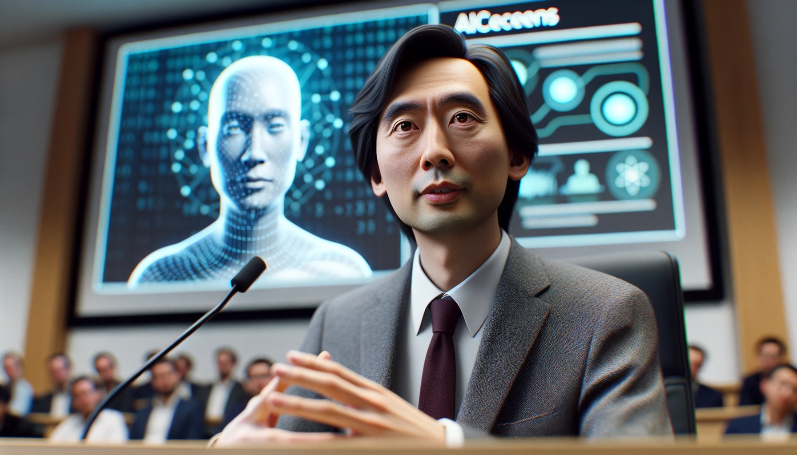
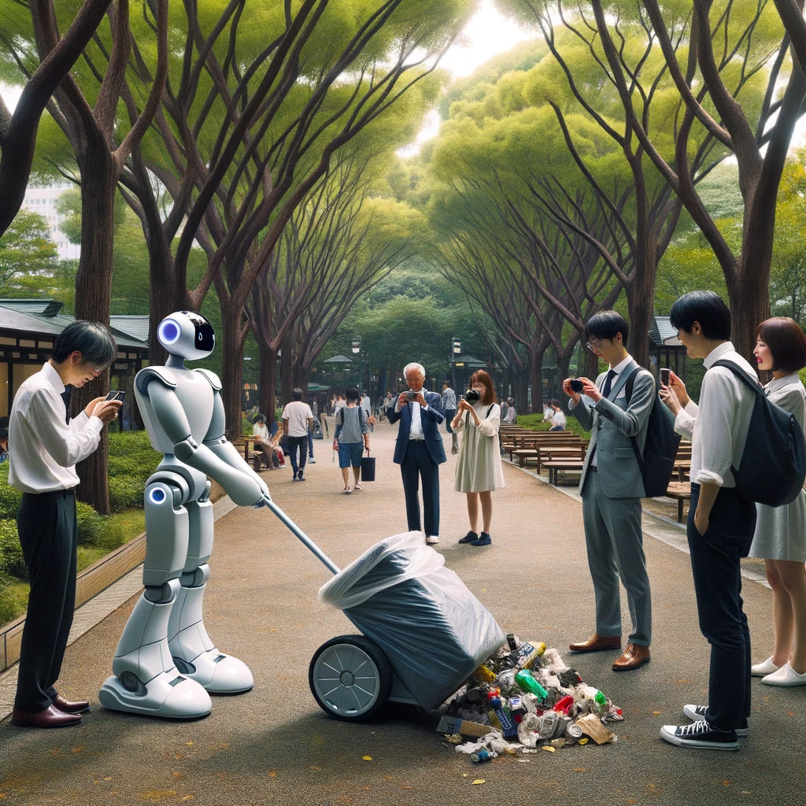
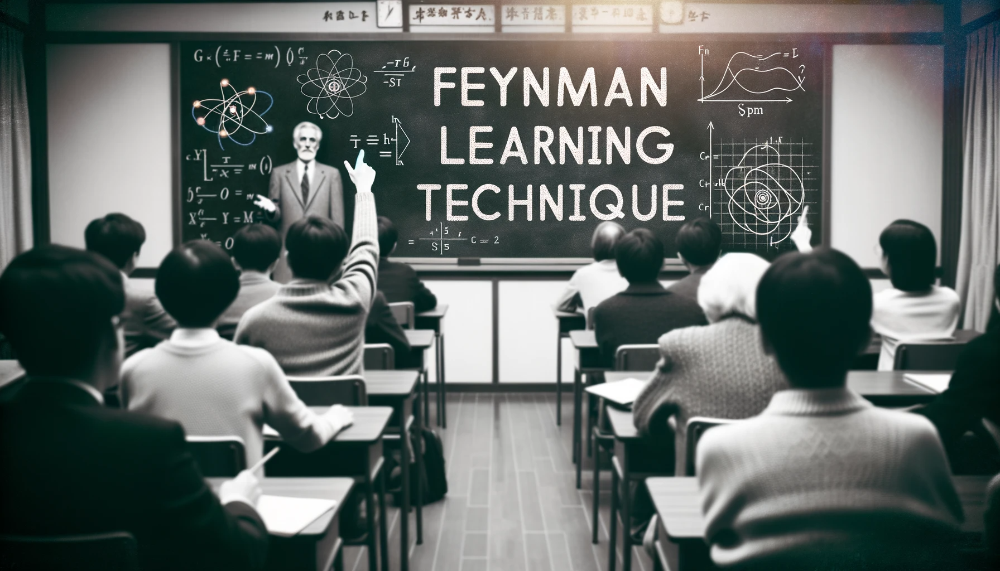

# 【生命⋅修行】回看这半年多我在AI世界的进展

ChatGPT 最近的这三个功能升级：看图、聊天、画画，着实惊艳到了我。不过半年多的时间，这多模态的大模型，就从新闻中让人「哇」一下的消息，变成了触手可及的应用。

正如吴恩达在斯坦福演讲里说的那样，在AI领域有很多事情可以做。

但有一类事情，比如类似于当年智能手机刚出现时，控制闪光灯当手电的那些APP，眨眼之间就会被消灭——因为实在太简单，底层系统随便一升级，就没这些APP什么事儿了。

所以，那些Prompt工程，尤其是与绘画软件相关的那些；还有之前想在智能音箱上弄一个应用实现语音对话功能的想法，瞬间就没有那么大意义了。绘画，直接在ChatGPT内部就可以完成了；语音对话，用蓝牙接上ChatGPT原生应用就好了。而我个人，也只不过在直接使用ChatGPT这个工具上多了一些经验而已。

从1月底、2月初到现在这半年多，8、9个月的时间里，我尝试过为公司规划相关的产品和应用，考虑过加入相关的创业公司，琢磨过自己可以去构建的项目，静下心来学习了一点相关课程，也浮躁地犹豫和担心过自己会不会太慢了，是不是错过了什么。当然，更多地只是在日常工作和学习中使用ChatGPT，让她帮我翻译，让她帮我梳理文本，向她学习那些我完全不懂的领域知识。

结论是：AI自己进展挺大，我自己在AI世界里，倒好像没什么进展！

**但有一点很重要**，那就是对于AI将大规模替代「普通人」（按和菜头的说法，[注定被替代的，就是人类草台班子中充斥的那些二把刀](https://mp.weixin.qq.com/s/0r0CiQVkoZkM3m-Y4z190w)）这个趋势，我越来越笃定了。虽然，这个过程的发生，应该还会需要二十年或三十年的时间（这也是从王建硕那里听来的二手观点，当然我颇为认同这个观点）。

如何在这巨变的世界中，坚持那些不变的东西呢？我也时常困惑，现在能想到的，只能是拼命地学习，学习与AI相处，学习使用AI，学习在AI世界里生存与生活。

当然了，真正地学习，至少要参考费曼学习法，教学相长才是咯！

