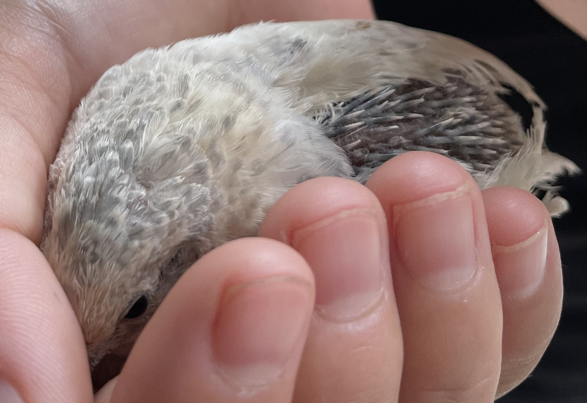
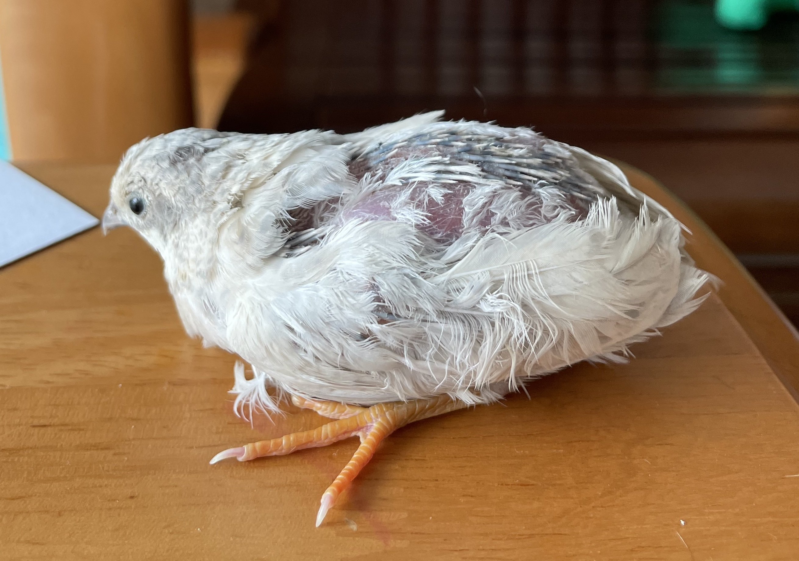

# 【随笔】收留了一只小鸟

那天早上从外面回来，大宝带着大鱼跑在前面，忽然就不见了。过了一会儿，她带着大鱼从树丛中的草坪钻了出来，神秘兮兮地伸出手来，给我看她手里捧着的东西。那是一只毛绒绒的小鸟，背上的毛都没长齐，露出嫩红色的皮肤。眼神有一些呆呆的，躲在大宝的手里，头都不肯抬，一副不大想动的样子。

> 它不会飞吗？这是刮风从窝里掉出来了？

大宝说：

> 对啊，我们把它带回去养几天。

我说：

> 可是，我们家有Cup，它再温顺，抓鸟可是天性啊。别一带回家，就一口被Cup吞了。你有看见它的窝在哪里吗？

我想起来小时候抓到的那只小麻雀，当时送给母亲同事家的小朋友带回家玩。谁知道，刚进家门就被他们家养的猫咪抓走吞掉了。我想，或者我们把它送回自己的窝里去，可能更好吧。

大宝说：

> 没看到。可能得养几天，到它能飞了才放出来。不让它现在这样，在野外估计根本活不下去。

于是乎，我们就把它带回了家。放在茶几上，它也一动不动地呆着，大宝说，它刚刚在草坪里一直叫啊，蹦啊，估计是累坏了。我们把它捧到Cup猫旁边，一边按着Cup猫的脑袋，一边介绍：

> 这是你新来的小伙伴，要在我们家住几天。它很小，你不许咬它，不许抓它，听见了没有？

Cup猫一脸茫然，不知道这是什么东西。只觉得被我们摁着不舒服，转身趴到茶几另一边，一副没睡醒的样子。

……

过了一会儿，小鸟儿可能缓过来点力气，忽然努力扑扇着翅膀想要飞起来，却只是跳到了茶几下面，它继续扑腾。Cup却眼睛刷地亮了，一骨碌爬了起来，好奇地盯着这只小鸟，随时准备扑上去。我赶紧冲过去，一把将Cup按住，后来不放心，索性又把它抱起来。看着大宝一边在屋子里追小鸟，我一边继续警告Cup猫：

> 忍住哦，它是你的小伙伴，不许抓它咬它听见没？它可经不住你咬它！

很快，大宝就抓住了淘气的小家伙，想了想，我们还是把它挪到了卧室，用抹布给它做了一个小窝，关进了卧室，再用垃圾篓扣住。依旧不放心，再把卧室门关上，确保Cup猫被关在外面，免得它被天性左右，随时觊觎这个新来的毛绒绒的小家伙。

……

小白鸟躲在抹布窝里睡了一觉，醒来精神了许多，把我给它的小米粒全都吃完了。我又给了一些小米和水，它毫不含糊地再次吃完，然后一脚把水踩翻。好吧，不管怎么说，肯吃东西它就饿不死咯。

接下来，就看它需要多久能学会飞行了。嗯，至少得等到它翅膀先硬了吧！