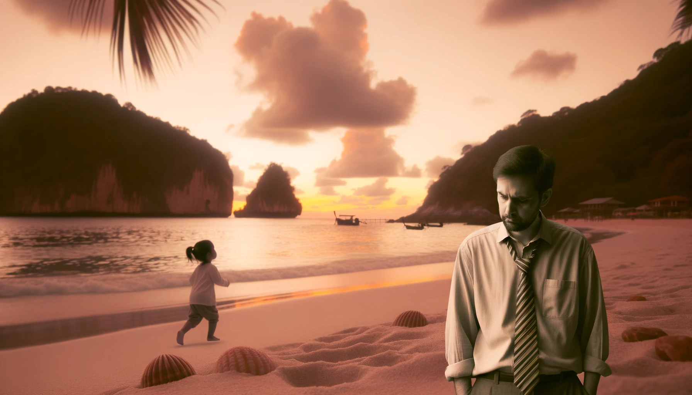
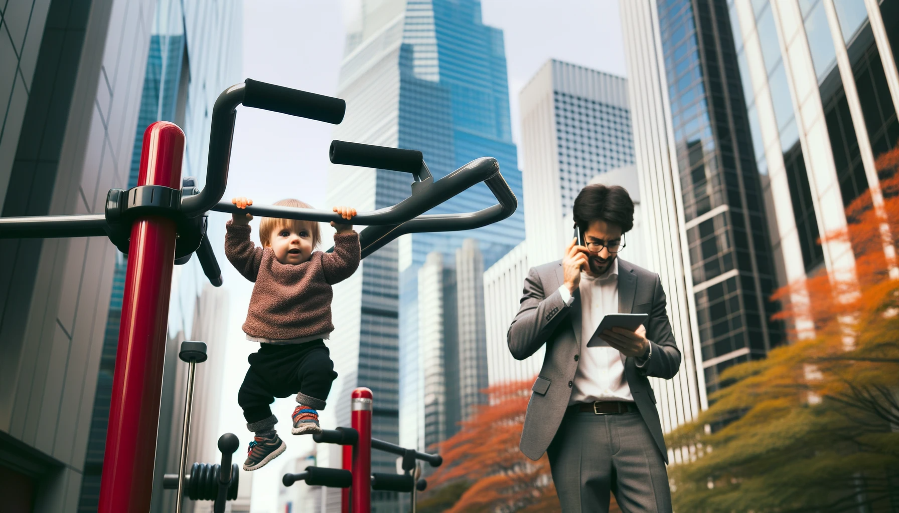
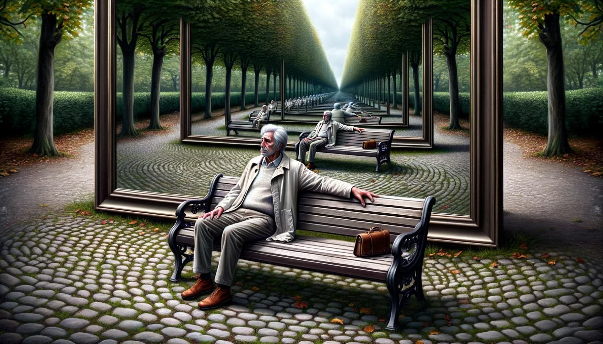

# 【生命⋅修行】我竟然会这样

早上和大宝聊天说起上海那个小女孩的新闻时，我忍不住感慨：

> 怎么会有这样的爸爸？在海边的沙滩竟然离开4岁多的女儿整整12分钟！

然后，没多久，在带着大鱼在健身器材边玩时。我一把将他抱起来，让他双手抓住双杠的一根杠子——这是我经常带他玩的活动，他会抓在那里，悬垂几秒钟，最多能把自己挂10秒。我也会帮他数着，然后等他没力气了松手落下时，我会一把接住他。

但这一次，发生了一个我完全无法想象的意外：

当大鱼如往常一样抓住双杠之后，大宝和我说起一旁练太极的一位大叔。这是她第二次和我说这个大叔练得好了。我转过身，面向她，打算和她聊聊这个话题——我竟然完全忘记了，自己刚刚把大鱼挂到了双杠上。于是，几秒钟后，大鱼咚地一声，摔了下来。把在那里锻炼的人全都吓了一跳。我赶紧安慰大鱼，说没事、没事、没摔到。但大鱼不干了，哇哇大哭，再也不敢让爸爸抱。

说实话，我也惊呆了。我竟然会出现这样脑子短路的情况，瞬间就忘了自己几秒种以前才干的事情，而且需要继续非常「专注」地去盯着，才能安全完成的事情。

我竟然还以为，自己有资格感慨那个「粗心」爸爸犯的错误，还以为自己是个细心、有耐心、也有能力保护孩子的父亲，还以为自己是那个不会犯错误的人。

呜呼！其实，自己和「别人」一样，一模一样啊！

