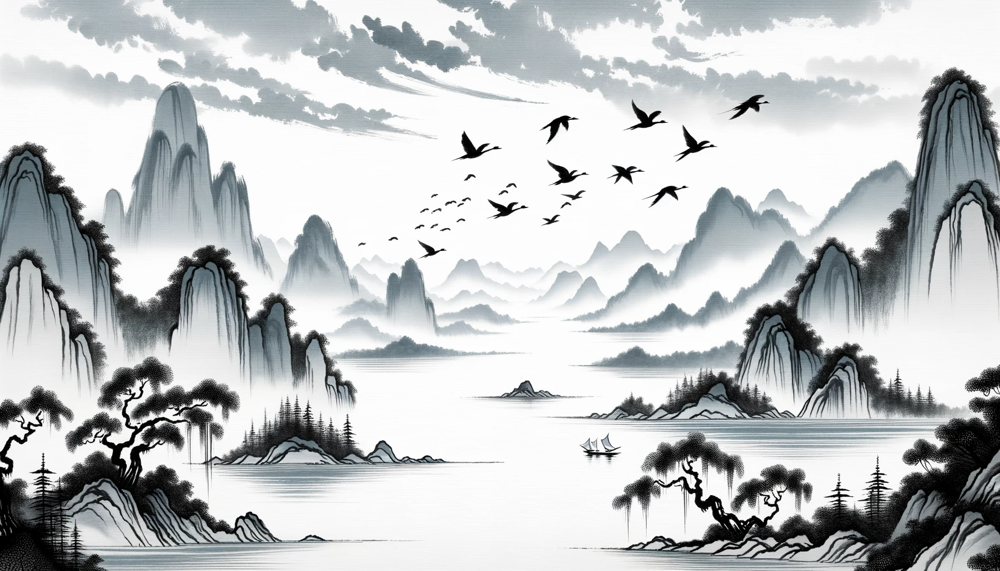
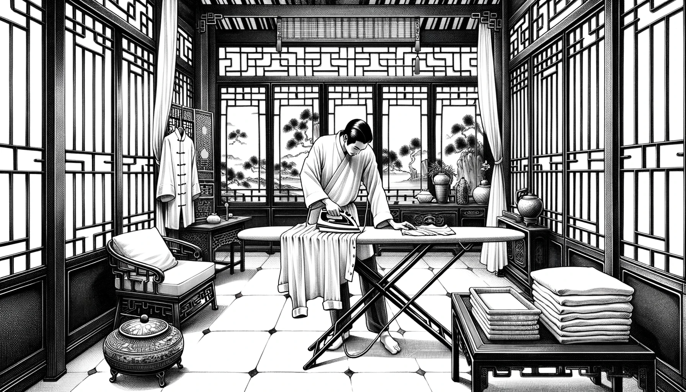
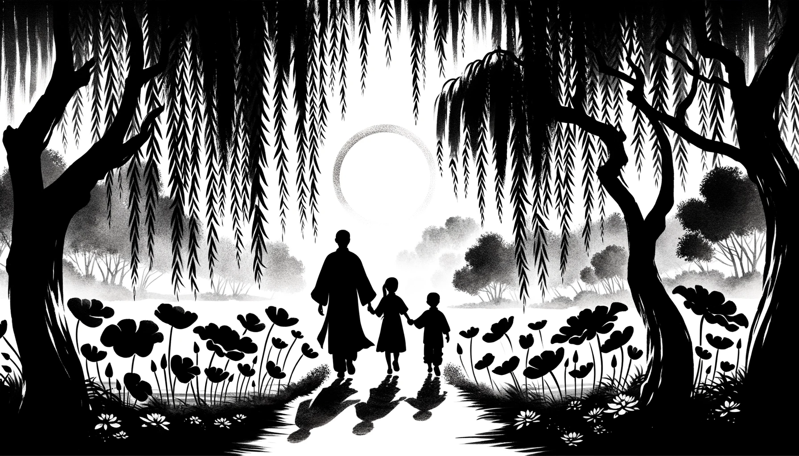

# 【随笔】收拾行李

明天要去接待一个南半球来的客户，据说级别还蛮高。想了想还是决定带上行李箱——因为实在是不想穿着正装在飞机上、路上折腾5、6个小时。

唯一一件干净的衬衣刚洗过，有些皱了。于是我找出熨衣板和电熨斗，动手把衬衣熨了一遍。又翻出西裤和西服，一起收拾收拾，好把它们塞进行李箱里。自己给自己熨衣服的次数并不多，于是总觉得自己笨手笨脚的，一边熨着，一边许多与此有关的念头止不住地在脑海飞过。

冯唐说他退休后，一股脑儿地把上十套西服送给了小区保安。我离开菊厂时，也曾以为自己再也不用穿正装，那时还意气风发地想——万一还有需要穿正装的场合，就去定做中式正装好了。正装给我的感觉，永远像是一副盔甲，能让自己提起精气神，进入「战斗」状态。也硬邦邦地，难以放松、也根本谈不上舒适。那时候想着，或许一套定做的，与众不同的「战斗服」能给自己更好的「感觉」吧。

还想起，上周第一次穿着笔挺的长袖衬衣，出现在阿宝和大鱼面前时，他俩惊讶的表情。阿宝惊喜地过来想让我把他抱起来。大鱼则害羞地不敢靠近我，小心翼翼、捂着嘴走到我身边，看阿宝被我抱起，才害羞地靠过来让我抱他。那可爱的神情，把大宝和我可都笑坏了。

还想起，书上看过的一个故事，好像是哪位企业家来着，说他第一次外派到某地，公司给安排了菲律宾阿姨收拾屋子，于是每件衣服洗完后都被烫好了折起来。连牛仔裤都被烫出裤缝来！

大宝看着我一件一件的收拾衣物，问我：

> 我们将来会过什么样的生活呢？

我知道，她舍不得离开我，她想到我要离开她们，长期出差就不开心。其实，我也一样。我们俩都习惯了在一起的日子。我说：

> 我不知道！是真的不知道。

就好像7、8年前，我哪来能想到，我会过着现在这样的生活呢？若是更久远一点的以前，就更是无法想象自己现在的状态了。无论是现实境遇，还是精神状态，是真的都想不到啊！

**人生如逆旅，我亦是行人。**

