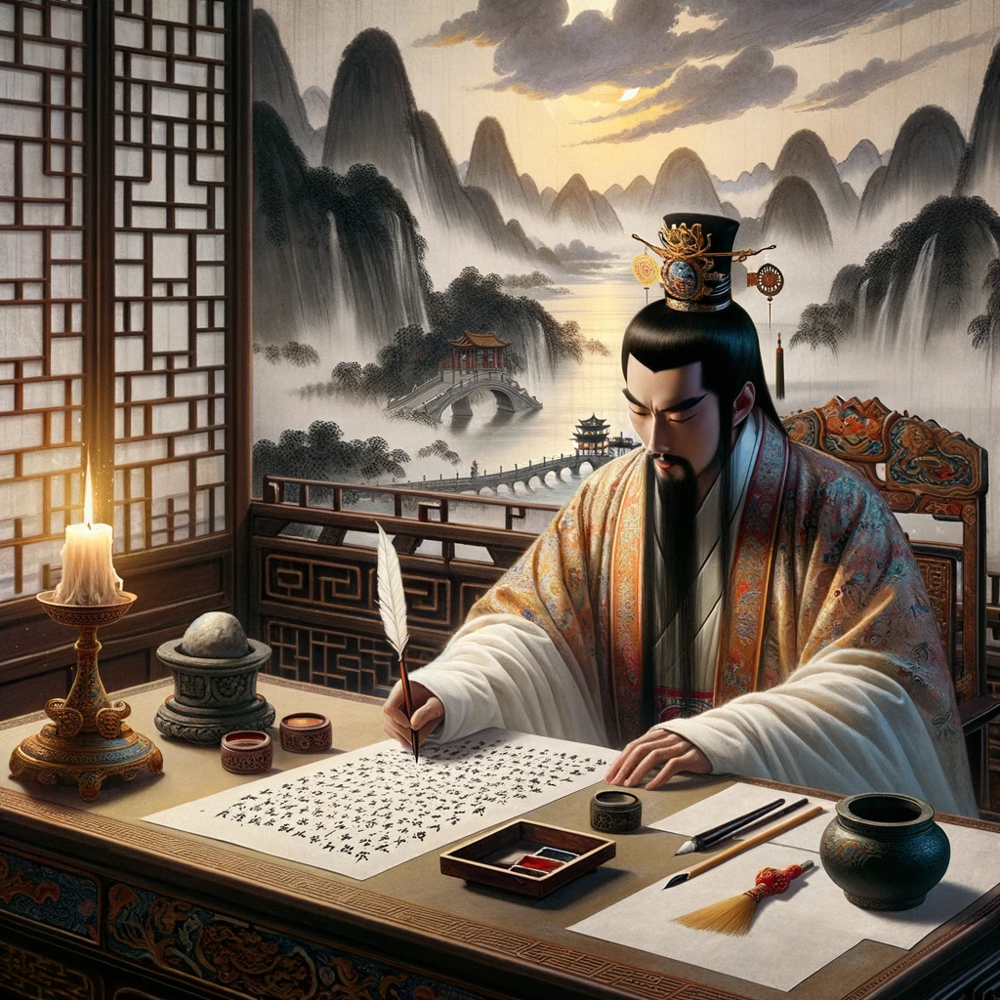
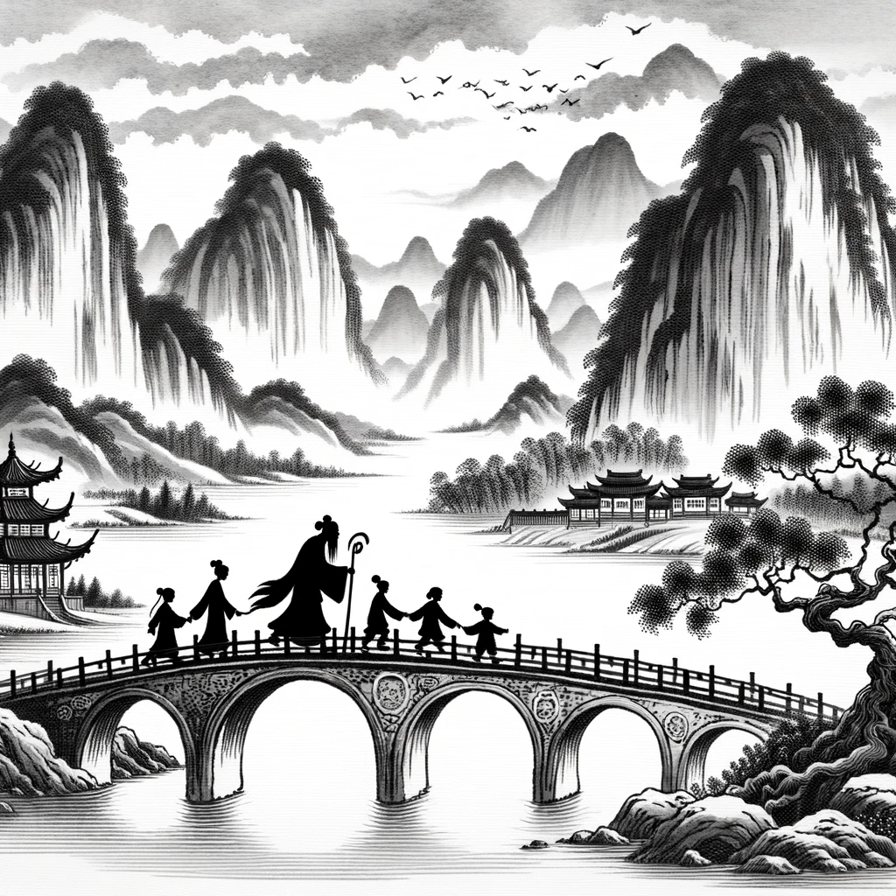

# 【生命⋅修行】读汉文帝遗诏

前几天读《资治通鉴》，千古明帝汉文帝也终于走到了生命的尽头。他在位23年，还没戎马一生的刘邦长寿，大约46岁就去世了，与此时的我同岁。13年前，在重读《银河英雄传说》，看到杨威利在我当时的年岁上功成名就，却意外遇刺身亡时，我也同样唏嘘感叹过。

不过这一次，让我深深叹服的，还是汉文帝遗诏的内容：

> **朕闻之：盖天下万物之萌生，靡不有死；死者，天地之理，万物之自然，奚可甚哀！当今之世，咸嘉生而恶死，厚葬以破业，重服以伤生，吾甚不取。且朕既不德，无以佐百姓；今崩，又使重服久临以罹寒暑之数，哀人父子，伤长老之志，损其饮食，绝鬼神之祭祀，以重吾不德，谓天下何！朕获保宗庙，以眇眇之身托于天下君王之上，二十有余年矣。赖天之灵，社稷之福，方内安宁，靡有兵革。朕既不敏，常惧过行以羞先帝之遗德，惟年之久长，惧于不终。今乃幸以天年得复供养于高庙，其奚哀念之有！其令天下吏民：令到，出临三日，皆释服；毋禁取妇、嫁女、祠祀、饮酒、食肉；自当给丧事服临者，皆无跣；绖带毋过三寸；毋布车及兵器；毋发民哭临宫殿中；殿中当临者，皆以旦夕各十五举音，礼毕罢；非旦夕临时，禁毋得擅哭临；已下棺，服大功十五日，小功十四者，纤七日，释服。他不在令中者，皆以此令比类从事。布告天下，使明知朕意。霸陵山川因其故，毋有所改。归夫人以下至少使。**

虽然早知道汉初以黄老之道为治国根本，但没想到汉文帝在这遗诏中，表现出了这么高深的修为：

> **盖天下万物之萌生，靡不有死；死者，天地之理，万物之自然，奚可甚哀！**

死，不过是天地万物自然之理，有什么可以悲哀的呢！在生命的尽头，竟然能够如此坦荡地面对自己的死亡，这种气度，只在《庄子》中那些故事的主角身上看到过。

文帝不只是在遗诏里这么说一句，表面自己的生死观而已。他表面自己生死观的重点，其实是在为自己生后事的那些「小小」安排铺路：

1. 别为我的死折腾官员与老百姓——服丧三天就好。
2. 别为我的死耽误老百姓开心——婚丧嫁娶、饮酒作乐该干嘛干嘛。
3. 别为我的死浪费物资——弄点白布，是那个意思就行。
4. 别为我的死折腾地球——顺着山势，别修大坟头了。
5. 总而言之，布告天下，让大家知道我的意思，关于我的死，简单点就好。
6. 另外，宫中女子还没封名份的，就别耽误人家青春了，都回家去吧。

他死前最后一个安排，依旧在践行着自己的价值观——顺天应人，无为而治。真的了不起！他的帝位，本可以说是老天爷送到他面前的。然而，他却是一点没有辜负这个位置赋予他的权利与责任，二十余年守在这重要的位置上，一点一点，终于让汉朝成为了国富民强的央央大国，为「汉」民族生生繁衍，打下了牢牢的基础。真可以说，是古今中外「哲人王」的典范！

人生修行的最终大考，就是面对自己的死亡，也不知道当属于自己的时刻来临时，自己究竟能做到什么程度。然而，生与死不过是硬币的两面而已。

**「生者」，亦是天地之理，万物之自然！**

每一年、每一月、每一周、每一天、每一刻，每一秒，又哪有一刹那，不是考验自己是否全然活着的大考呢？

 walking together on a traditional Chinese bridge with willow.png)