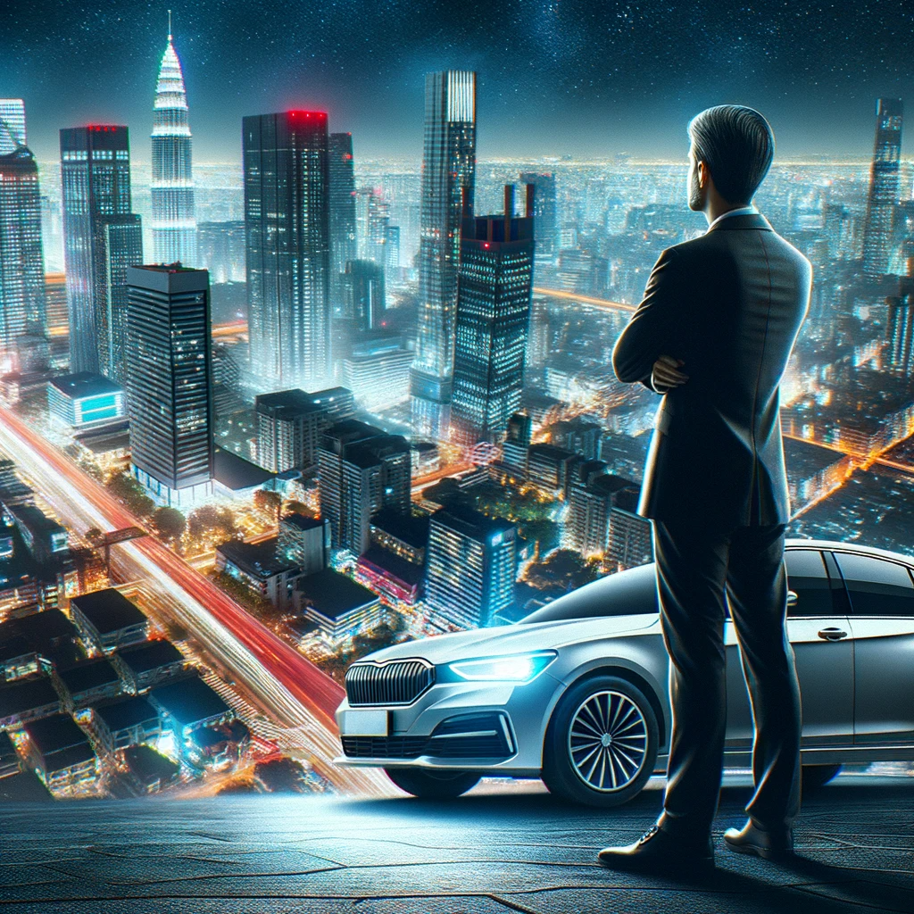
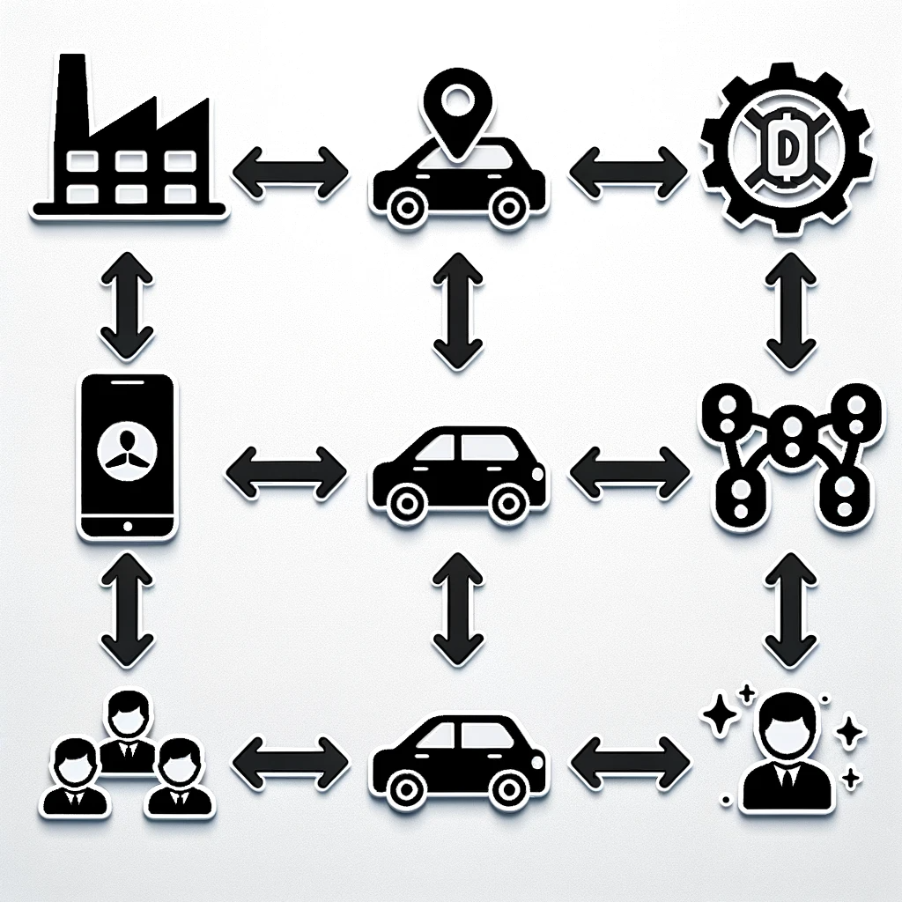

# 【随笔】深夜网约车司机的生意经

11点30落地深圳，没想到午夜的宝安机场竟然如集市一般繁忙。本来自己坐的这班飞机人就不少，刚下廊桥又迎头撞上一大群应该是从四川来的叔叔阿姨，大哥大姐，汇入这一群操着川音，背着兔头的人流，一瞬间竟然摩肩接踵起来。于是，从卫星厅到T3航站楼的捷运，愣是坐出了高峰期地铁的效果。前面一位大哥背着的巨大背包顶得我喘不过气来，逼得我只好努力回想太极的步法与手法，先侧马步站稳，再把他的背包往垂直于他支撑中心的侧面轻轻推过去，以便把力卸掉。于是乎，这一路怎么站都不舒服的人从我变成了他。

等网约车的停车点依旧车水马龙，我约的司机在接到我电话后，用了近二十分钟才开过来。我才略有微词，他却更大的火气。于是，我赶紧切换话题，问他现在那些平台接单。他说：

> 搞那么多平台怎么可能，这跟打工一样，你总是换公司，换来换去的，怎么可能有好的发展，好的收入嘛。那些平台精得狠，你在多个平台接，哪一家都跑不好，积分不高，就赚不到钱。

我顿时觉得这个大叔很有头脑，便又问他：

> 现在怎么网约车也全都变成电车了？

他说：

> 这是深圳市政府要求的啊！不光是网约车，你看出租车、大巴早就换了，现在连泥头车不是电车都不让上路了。

接着，他又抱怨了一番电车换电池又多么坑，说他自己几年前买的一辆吉利车，不过三年电池就不行了，跑不出20公里，换电池需要15、6万。想当年他买车时，政府补贴了十几二十万，自己还出了15、6万呢。实在不想换，只好扔在家里搁着。

我又问他，现在开的这辆比亚迪E9是不是自己买的。他说：

> 现在谁还买车啊，政府要求，运营车辆8年、60万公里强制报废。话说回来，电动车也根本跑不到60万公里就费了。我就租车，啥时候不想干了，不租就行了。

于是，我又问他，租车多少钱。他告诉我一个月6000，每天租金200块钱。一天如果只能跑2、300的话，大头都给到租车公司了。我问他：

> 你这辆E9 多少钱，看着很不错啊？

他说：

> E9 就是比亚迪「汉」的运营版，说白了也就是「汉」的偷工减料版。但是，运营车辆卖得贵，就这样也得二十四、五万呢！

我默默算了会儿帐，说：

> 那租车公司一年收7万2，也得三年多才能回本呢。

他说：

> 那怎么会，他们一次买上百辆，又有关系。16、7万就可能拿到！

喔，那就是两年多回本。我忽然想到，这笔钱租车公司也未见得需要全出，有银行会提供各种金融方案，对于租车公司来说，每辆车的生命周期内，现金流肯定都是正的。难怪现在遍地的新能源车跑网约车，什么比亚迪、广汽、小鹏啊，对，还有吉利……

我这才意识到，原来Uber起步时的商业模式也只是中间状态。他颠覆了原有

> 车厂 =》地方性垄断的出租车公司 + 司机 =》乘客

的业态，变成

> 车厂 =》 司机（自带车）+ 共享平台  =》乘客 

之后，竟然还在继续细分和发展，现在已然变成

> 车厂 =》 共享平台 + 租车公司 + 司机（不带车） =》乘客 

终究，生态上的核心环节，还是被细分的、专业的大玩家占据，那些一度成为主流的业余选手，最终还是被挤出了主赛道！

----

Uber如此，AirBnB也是如此，短视频时代的网红经济更是如此演化了一番。

那么，眼见着AI的大潮会再次将所有的行业、产业链以类似的方式重洗一遍，对于我这样的个体来说，能抓住、应该去抓住的是什么样子的机会呢？

真是值得好好思索一下。

不过，我这些想法，还是一些简单的「类比」和推断。马斯克不是说过，不要「简单类比」，而是要基于「第一性原理」来深入思考嘛？

那么，应该从何着手开始思考呢？

