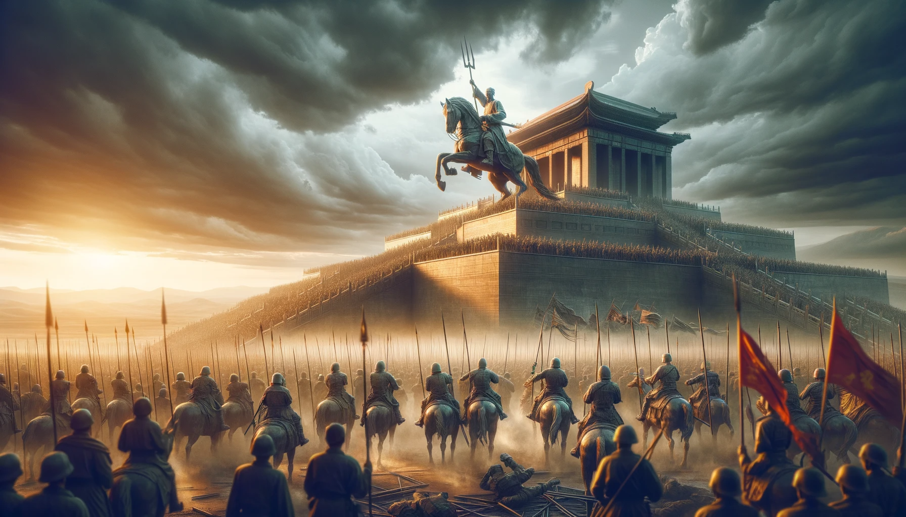

#  【生命⋅修行】战略笃定性

前两天听冯唐讲《资治通鉴》，在讲七王之乱时，提到周亚夫的战略笃定性。周亚夫的战略很简单，拖住叛军，绝叛军粮道，不需多久叛军必败。他是这么向景帝汇报的，景帝也同意了他这么做。

于是乎，周亚夫绝了叛军粮道之后，开始坚壁清野。梁王则几乎承受了叛军的全部压力，被打得很惨。他一直向周亚夫求援，周亚夫不搭理。那可是太后最疼的小儿子，和景帝关系好到，景帝曾说过要死后传位给这个弟弟而不是自己的儿子。于是乎，梁王又去找太后和景帝求救，景帝连忙下令让周亚夫出兵救援。可是，对不起，那是周亚夫。他「将在外，军令有所不受」，就是不出兵。

接下来，吴楚的叛军开始缺粮，疯狂反扑，周亚夫就守在营中，岿然不动。甚至自己手下那些新兵蛋子精神崩溃，某天晚上炸营了，他都照例酣睡，等着士兵们自己把这混乱平息了。终于，熬垮了叛军，就用了大约三个月，胜利平叛。

冯唐夸周亚夫是有战略笃定性的典范，当然，同时还有那个反面教材——晁错那毫无战略笃定性的几个馊主意作为反衬。

反观自己，我意识到自己好像还真没啥战略笃定性：过去一、二十年在几个大方向上，我是有判断的：比如互联网，比如数据分析，比如价值投资，比如区块链。但是我却没有坚持投入足够的精力和注意力，总是随波逐流地被眼前的各种事情牵扯了去。

即便是现在，我依然有自己的战略观点：

1. 身体最重要——睡觉、运动、吃饭节奏不能乱
2. AI 是极其重要的大方向和大趋势
3. 价值投资依然很重要

但是，同样的。这个星期已经过去了4天，吴恩达的课程我都才学了1分钟不到！然后于此同时，还有一天过了11点半才睡觉。

呜呼！得好好检讨和反省一下自己，要怎样才能保持自己的战略笃定性呢？知行合一，既然行得不彻底，定是知得不透彻！这这两天空下来，好好再想得更清楚一点吧：

**自己想要的究竟是什么？为此我每天必须要做的是什么？**

