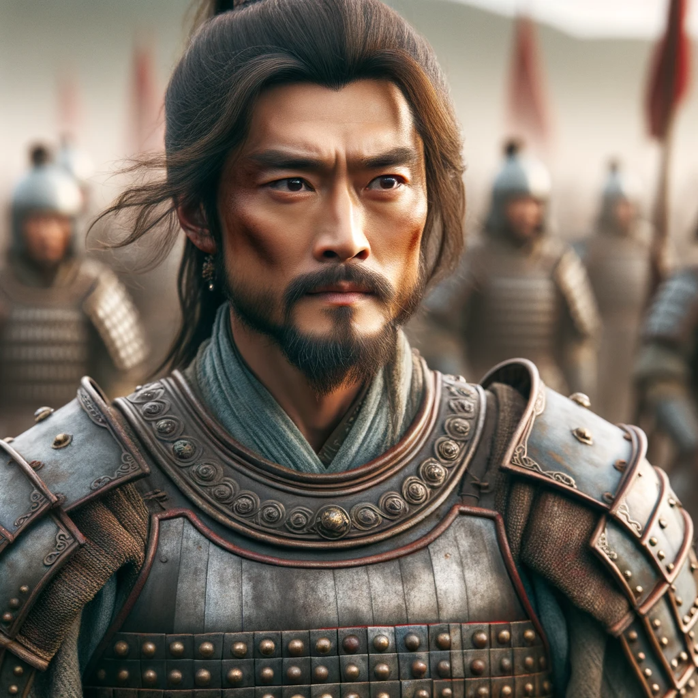
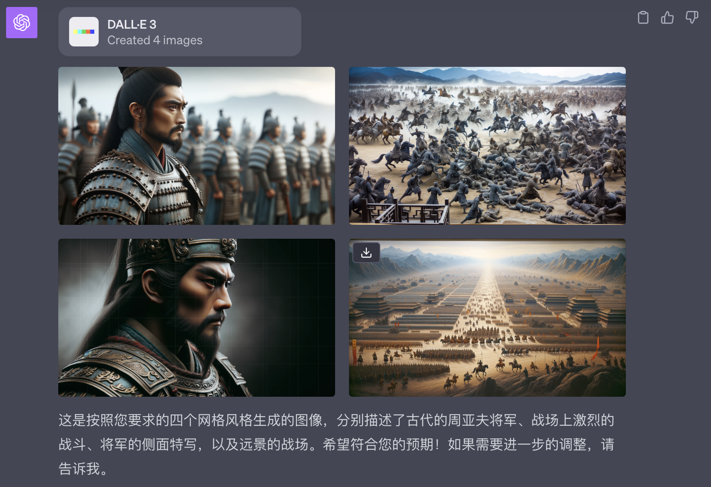
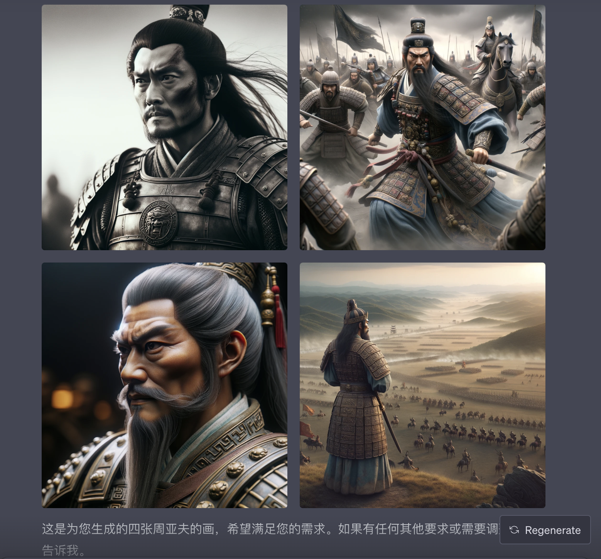
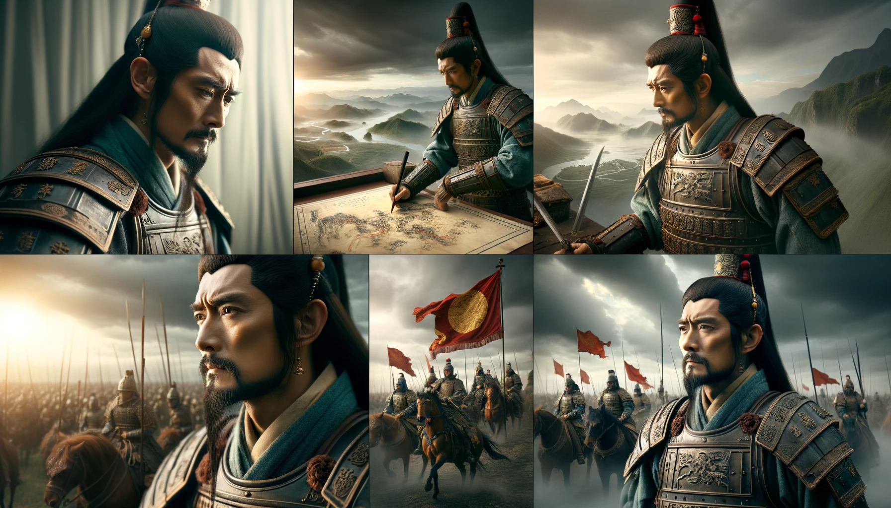
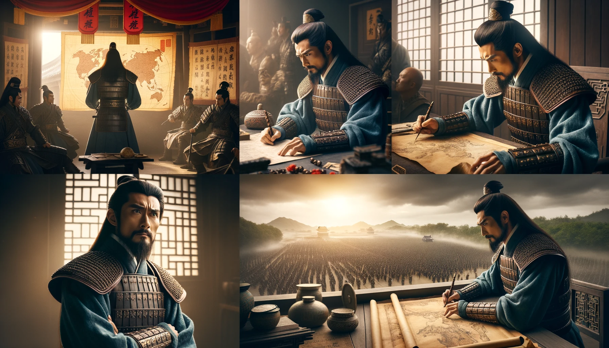
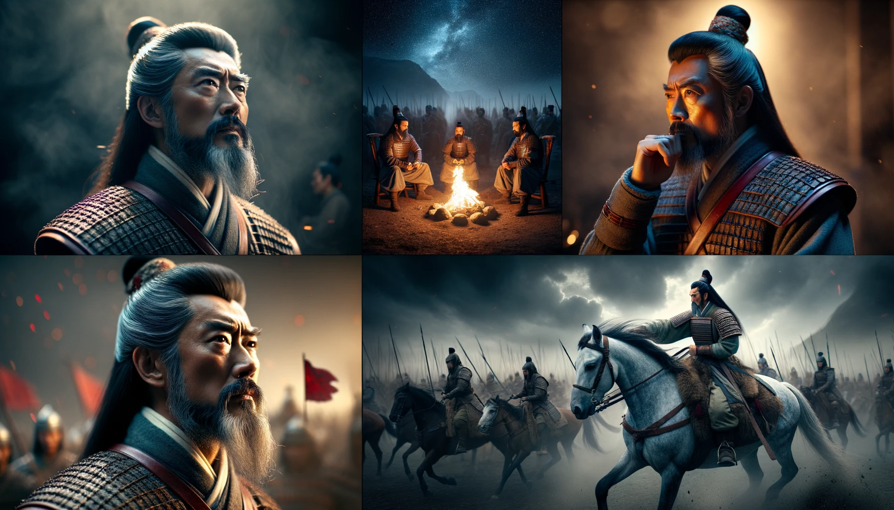
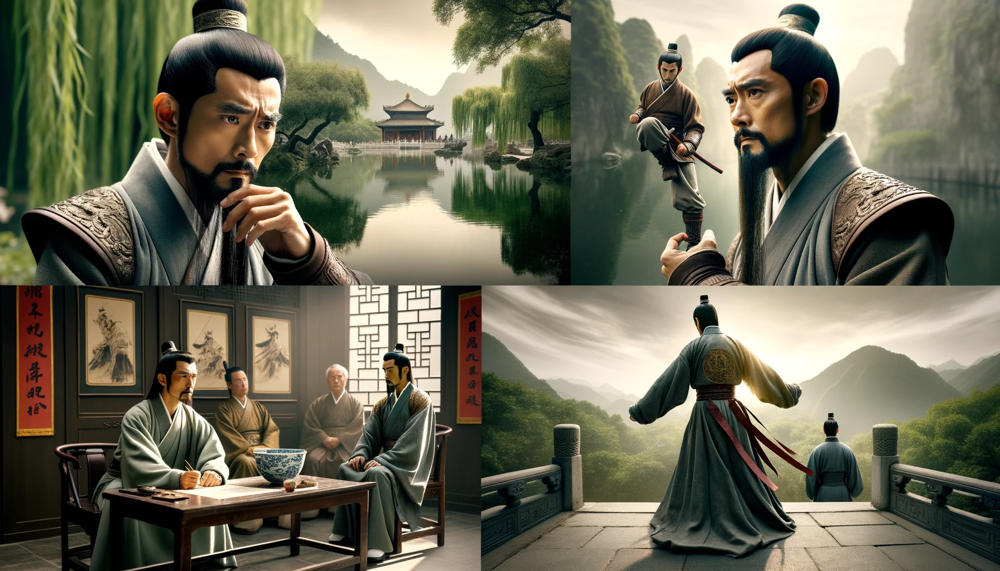

# 【随笔】用一个人物生成系列配图

昨天为文章配了一幅这样的图之后，觉得很是喜欢。漂亮、真实效果，但又一眼就能看出的CG感。这幅图的Prompt是这样的：

> photo of a determined ancient Chinese general, like Zhou Yafu, in full armor on a battlefield, his eyes fixed on the horizon, conveying a sense of unwavering strategy.

于是，我就想，能不能以这个「周亚夫」为主角，生成一系列图片呢？正好看到了一篇文章，讲《[实现 DALL-E 3 角色一致性](https://mp.weixin.qq.com/s/s7fl1XMJIL8PWPzFzxHCEg)》，说是在DALL•E 3里，这几乎是无法做到的。

> 任何基于之前图像的修改都很可能导致新图像的巨大差异。

只能在一张图里画，然后再剪裁。于是，我试了试这样提要求：

> 生成一张图，但是是四个网格的。 左上是正面“photo of a determined ancient Chinese general, like Zhou Yafu, in full armor on a battlefield, his eyes fixed on the horizon, conveying a sense of unwavering strategy.” ，右上是中景，正在战斗的。左下还是特写，侧面。右下是远景

显然，蔡姬否没听明白，她还是给我弄了四张图出来。除了第一张和第三张有点像，其它图完全有点不想关了。

我告诉她：

> 我需要同一个周亚夫的四张画

结果，依然给了我四个「周亚夫」

我想了想，决定告诉她更多细节试试看：

> 这几个人都不一样，据说用这种提示词“Photo montage of an elderly gentleman with a beard. Top-left showcases him playing chess in a suit. Top-right has him gardening in overalls. Bottom-left captures him fishing in a hat and vest. Bottom-right shows him playing the piano in a cozy room.”，只生成一张照片，可以保持角色的一致性。你用这种办法帮我生成一张四方格的图，每个方格同样是周亚夫，但是不同动作的图片。

没想到，这次起作用了。虽然不是给我生成的四方格，但效果真心不错：

这次的Prompt是这样的：

> Photo montage of an ancient Chinese general like Zhou Yafu. Top-left showcases him strategizing on a war map in full armor. Top-right has him leading his troops into battle with a flag in hand. Bottom-left captures him in a contemplative stance looking at the horizon. Bottom-right shows him in a one-on-one combat with an enemy.

这样看起来，还真有点连环画的意思了。可惜，想要几张图必须一次性想好，否则，下次DALL•E给你画的，就不知道又是哪个周亚夫了，哈哈！比如：

