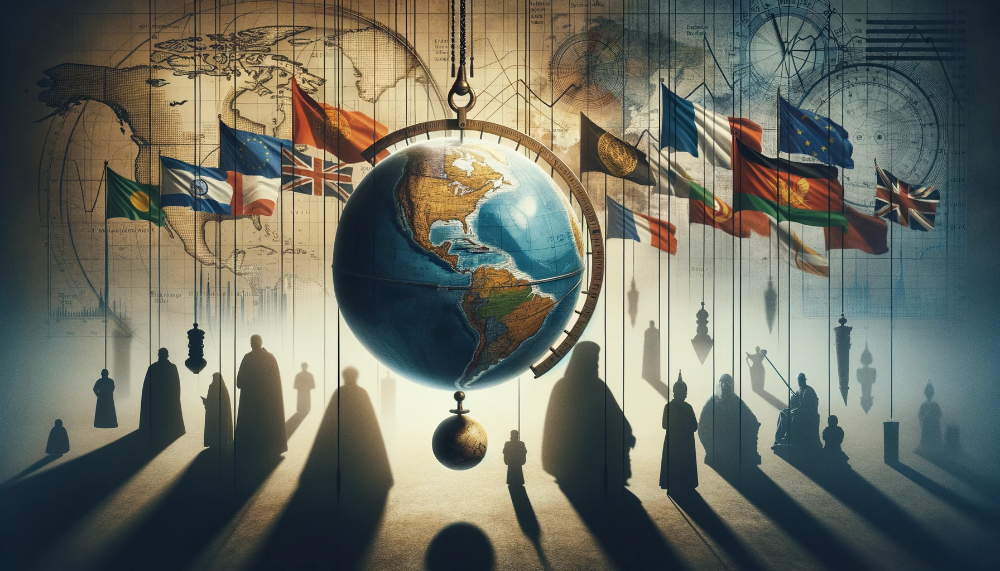
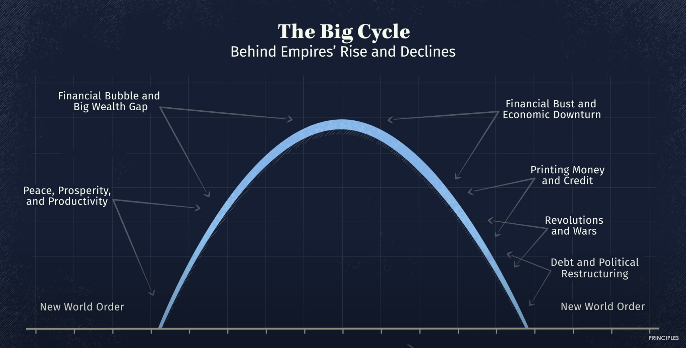
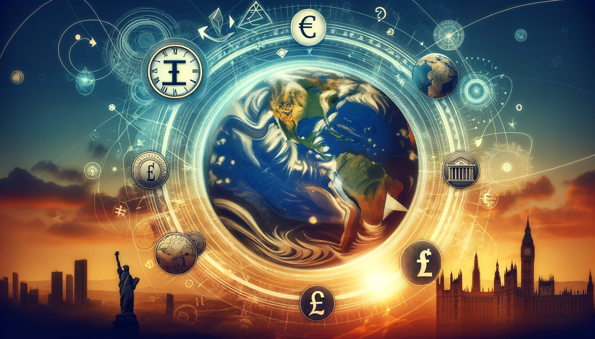

# 【随笔】看动画视频《原则：应对变化中的世界秩序》上

前几天就看见瑞·达利欧的公众号在推荐这个[动画视频《原则：应对变化中的世界秩序原则：应对变化中的世界秩序》](https://mp.weixin.qq.com/s/GrgxigKwSTrQ4SPtjwOjqA)。今天终于在睡觉前打开电脑，在[原则的官网www.principles.com上](https://www.principles.com/)找到了个[Youtube上的英文版链接](https://www.youtube.com/watch?v=xguam0TKMw8)，看了前20分钟。按达利欧的说法：

> 在动画的前18分钟，你将了解随着时间驱动国家崛起和衰落背后的“大周期”，以及我们现在所处的周期位置。如果你再给我20分钟看完整个动画，我会向你展示这个大周期在过去500年的历史中是如何运作的。

在这前18分钟里，视频讲了什么呢？

第一，我们将面对的未来与我们一生过去所经历过的时代将截然不同，但与更早的 许多时代是相似的。

第二，对过去500年的历史研究表明，世界秩序的变化多次随着帝国的兴衰而发生。

第三，政治民粹主义、两极分化和外部冲突是国内和世界秩序变化的迹象。

第四，研究最强大的10个帝国及其货币，乃至最重要的四个：荷兰、英国、美国和中国的兴衰。现在就正在美国衰、中国兴的关键节点上。

第五，观察在发展、成熟、衰退三个阶段中，八个力量指标的发展变化，有助于我们预见一个国家未来所处的阶段以及接下来可能发生的事情。

看来，这个视频值得好好学习，就像他之前那篇世界经济运行规律一样。其中有对于在这个时代如何安生立命的重要智慧。嗯，最好再把他的书也找来细细读一遍。

当然，《资治通鉴》更要坚持看下去。幸好咱是中国人，不然哪有这么现成的，总结了两千年多年前，跨度一千三百多年的人类历史经验教训呢。

PS，以下是Merlin 帮我做的更详细一些的视频内容总结。强烈建议去公众号看原版视频，总共40多分钟。实在不行，像我这样，先看前一半也行啊。

----

The changing world order

- The times ahead will be radically different from those that we've experienced in our lifetimes, though similar to many times before.
- Study of the last 500 years of history shows that the changing world order has happened many times with the ups and downs of empires.
- The study taught valuable lessons to anticipate the future by studying the past.

President Nixon suspended the convertibility of the dollar into gold.

- He did it to defend the dollar against speculators.
- This move had happened before, in 1933, during the Great Depression.

Political populism, polarization, and external conflict are signs of changing domestic and world orders.

- Political populism and polarization lead to wealth redistribution and defense of existing wealth.
- External conflict arises between rising and leading great powers, such as China and the United States.
- Throughout history, these events have led to shifts in domestic and world orders.
- Orders govern interactions within and between countries, typically changing after wars.
- Examples include the US internal order established in 1789, the Russian revolution in 1917, and the current Chinese internal order since 1949.
- The current world order, known as the American world order, formed after World War II and included global governance and monetary systems.
- The Bretton Woods Agreement in 1944 established the US dollar as the leading reserve currency.

The rise and decline of the world's most powerful empires

- Studying the 10 most powerful empires and their currencies
- Patterns of rise and decline in different eras and dynasties
- The four most important empires: Dutch, British, US, and Chinese
- The cycles of overlapping empires and the transitions between them
- Measuring an empire's power using eight metrics

Cause and effect relationships progress through stages from birth to strength and maturity to weakness and decline.

- Age can be a good indicator of future longevity, but health indicators are a better way to assess it.
- By watching the indicators of power change, one can anticipate the stage a country is in and what is likely to come next.

