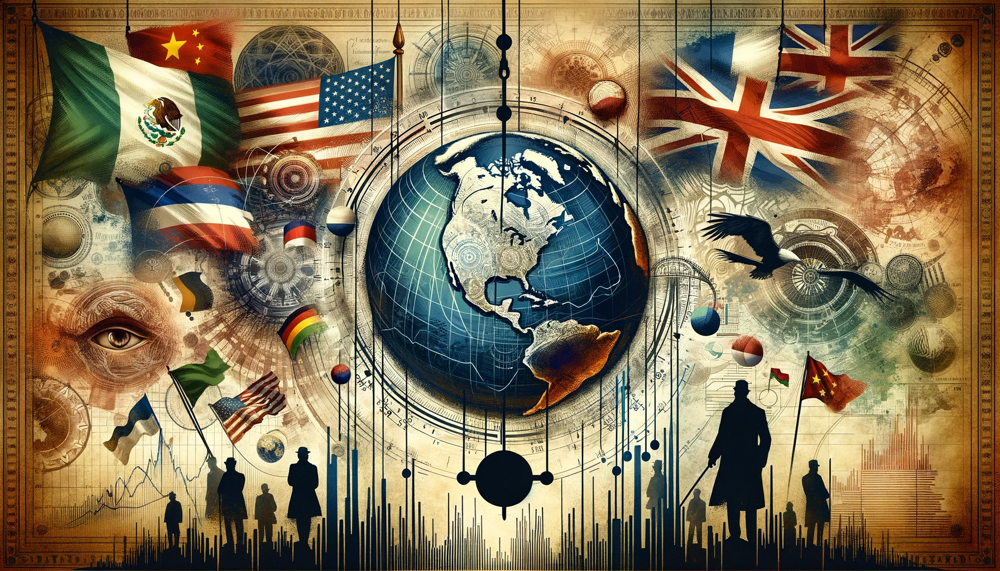
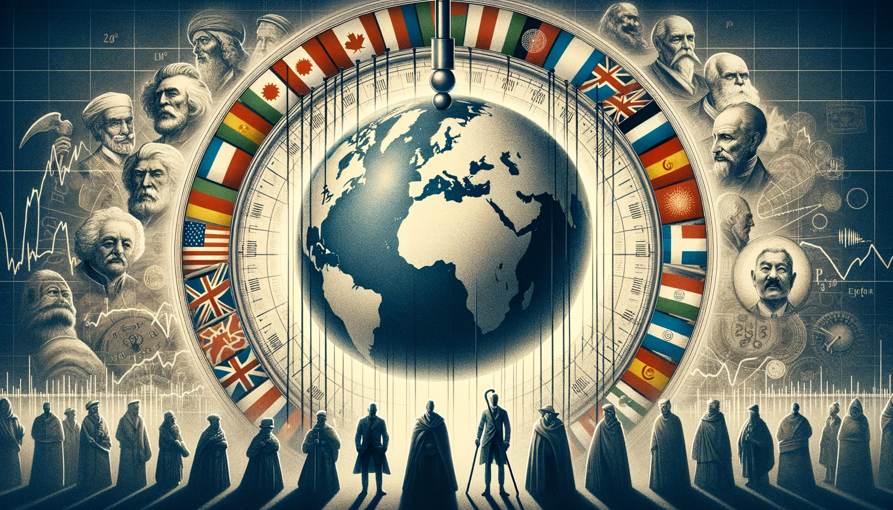

# 【随笔】看动画视频《原则：应对变化中的世界秩序》下

接下来的20分钟，达利欧以荷兰、英国、美国、中国为例，拆开了讲了在帝国的兴起、顶峰、以及衰落阶段内部、和外部分别都发生了什么。

简单来说，**在帝国的兴起阶段**：

帝国的缔造者获得了权利，创建了新的秩序，将大部分力量团结到一个方向上，教育水平、基础设施、生产力水平互相促进着增长，最终缔造了一段时间的和平、繁荣与高效的生产力。而这，也需要连续几代明智的继任者，或者一个有效的系统，保证这些正确的政策能够持续下去。

**然后随着发展到了顶峰**：

负面力量也开始积聚：财务泡沫，贫富差距，高企的成本，高昂的军费。最终帝国的支出远远超过收入，随着泡沫破灭，经济下滑……

**帝国步入衰落阶段**：

这个时候，当权者通常会选择印钞来解决短期问题。一开始是慢慢印，后来越来越夸张。最终不得不面对国内外的各种冲突，选择革命或者战争，进行债务、财富乃至政治结构的重组。

**于是，新的世界秩序、新的帝国就开始了新的循环……**

其实，无论是国家、还是家庭，乃至个人，都有着这样类似的经济循环。当然于此同时，还有出生、成长、衰落、死亡这个巨大的，注定的命运曲线。此时此刻，美国走在它顶峰的悬崖边，中国又何尝不是在一个小的「顶峰」边缘呢？

我记得曾经和一个领导兼朋友聊过经济问题，他问我：增长和分配这两个方案，如果只能选一个，你选哪个？我选「分配」，而他则认为「增长」才是一切的根本。当时我觉得，他说得对。现在我再看这个问题，却觉得：一定要把握时机，解决掉分配不公、贫富差距的隐患，才有可能走向下一次增长。

当然，时机很重要，就好像最近听《资治通鉴》，讲到七王之乱，晁错就属于典型地在错误的时机推行重新分配权力与财富的政策。好在当时大汉王朝外患不严重，付出的代价总算局限在几个月的兵祸以及晁错全族的生命罢了。

但对于国家而言，什么时候是好时机，我不知道。

对于小家和个人而言，如何延缓从顶峰的跌落，归根结底就是得想办法维持住生产大于消费的健康指标。无怪乎古往今来的大儒，比如曾国藩、梁启超都强调「俭」的重要性——这可是既能降低消费，又能提高生产率的双效灵丹啊！

再次强烈建议，请移步达利欧的[公众号去看完整视频](https://mp.weixin.qq.com/s/GrgxigKwSTrQ4SPtjwOjqA)，《原则》的官网（https://www.principles.com/）上有这个视频的英文版（https://www.youtube.com/watch?v=xguam0TKMw8），另外还有2017年达利欧的TED演讲，以及 How the Economic Machine Works 以及 Principles for Success 都很不错！

----

以下依旧是Merlin 帮我做的后半部分的详细视频内容总结。

Cause and effect relationships progress through stages from birth to strength and maturity to weakness and decline.

- The typical cycle of rise, top, and decline is experienced by successful new orders that are started by powerful revolutionary leaders.
- During the rise phase, leaders consolidate power, establish systems and institutions, and pick successors or create systems that do that.
- After winning the fight, there is typically a period of peace and growing prosperity in which leaders design an excellent system to raise the country's wealth and power.
- A strong education system is essential for a country to be great.

Knowledge and skills are important, but so is a strong character, civility, and work ethic.

- These qualities are typically taught in the family, schools, and religious institutions.
- They provide a healthy respect for rules, order within society, and low corruption.
- They enable people to unite behind a common purpose and work well together.
- As people develop these qualities, they shift from producing basic products to innovating and inventing new technologies.
- For example, the Dutch became so inventive that they came up with a quarter of all major inventions in the world.
- The most important invention was the invention of ships that could travel around the world and the invention of capitalism to finance those voyages.
- By being open to the best thinking in the world, the Dutch enhanced their thinking and became more productive and competitive in world markets.
- This led to their growing economic output and rising share of world trade.
- Similarly, countries today must protect their trade routes and develop great military strength to safeguard their foreign interests.
- This virtuous cycle of strong military and economic growth can lead to investments in education, infrastructure, and research and development.
- Successful empires have used a capitalist approach to develop productive entrepreneurs.
- Even China, which is run by the Chinese Communist Party, has adopted a form of this capitalist approach.

Empire's reserve currency leads to increased borrowing and financial bubble.

- Empire's reserve currency allows for greater borrowing than other countries.
- This privilege leads to a financial bubble and the decline of empires.

Wealth gaps and borrowing contribute to the decline of empires

- The rich reinforce their power, leading to wealth gaps
- The system is seen as unfair and resentment grows
- Rising living standards prevent conflicts from arising
- Borrowing excessively weakens the country's financial health
- Increasing costs lead to unprofitability, causing the decline of empires

Financial excesses and debt cycles lead to political extremism and conflict.

- Repeating cycles of debt, finance, booms, and busts have occurred since the nineties.
- Wealth redistribution and maintaining wealth in the hands of the rich are key political ideologies.
- Increased taxes on the rich lead to outflows of wealth to safer places.
- Outflows of wealth reduce tax revenue and hollow out the empire.
- Government measures to curb the flight of wealth cause panic and undermine productivity.
- The shrinking economic pie leads to more conflict over resource allocation.
- Populist leaders emerge and promise to bring order during times of turmoil.
- Democracy is challenged as conflict escalates and a strong populist leader becomes likely.
- Internal conflict can lead to revolution or civil war for wealth redistribution.
- Revolution can be peaceful or violent, resulting in changes to the existing order.

Violent Chinese revolution leads to weak empire and international conflict

- The internal conflict weakens the empire and makes it vulnerable to external rivals
- The risk of great international conflict increases if the rival has built up a comparable military
- Defending oneself and the empire requires great military spending, which worsens domestic economic conditions
- Without a viable system for peacefully resolving disputes, conflicts are typically resolved through tests of power
- The leading empire faces the difficult choice of fighting or retreating when faced with bolder challenges
- Poor economic conditions lead to more fighting for wealth and power, inevitably leading to war
- Wars are costly but produce tectonic shifts that realign new orders to the new realities of wealth and power
- The decline of the empire's reserve currency and debt marks the end of its big cycle
- The decline in currency and debt happened to the Dutch after their defeat in the Fourth Anglo-Dutch War
- The decline in currency and debt also happened to the British after World War II

The key to longevity is to focus on vital signs and take necessary steps to increase it

- Vital signs, such as fitness levels and smoking habits, can help estimate a person's longevity
- The same concept can be applied to empires, though it won't be precise
- A nation's success depends on its ability to make hard decisions
- Individuals and nations need to earn more than they spend and treat each other well
- Measuring these two factors is crucial for progress
- The goal is to navigate these challenging times with wise decisions
- Further information can be found in the book Principles for Dealing with the Changing World Order