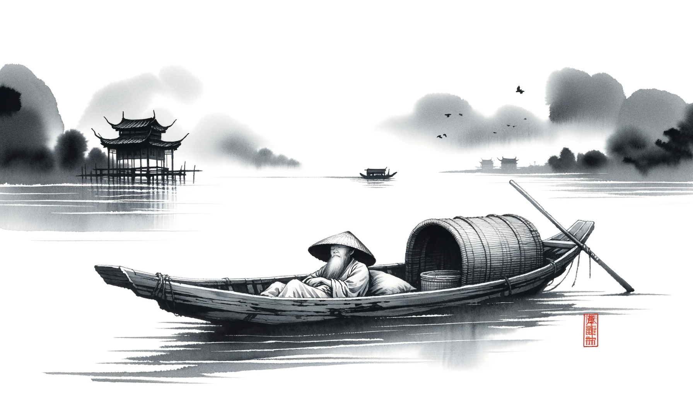
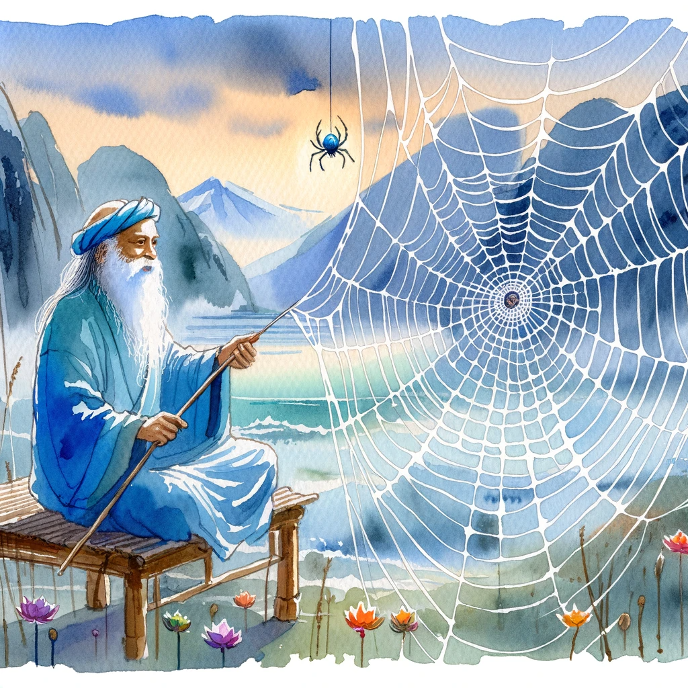
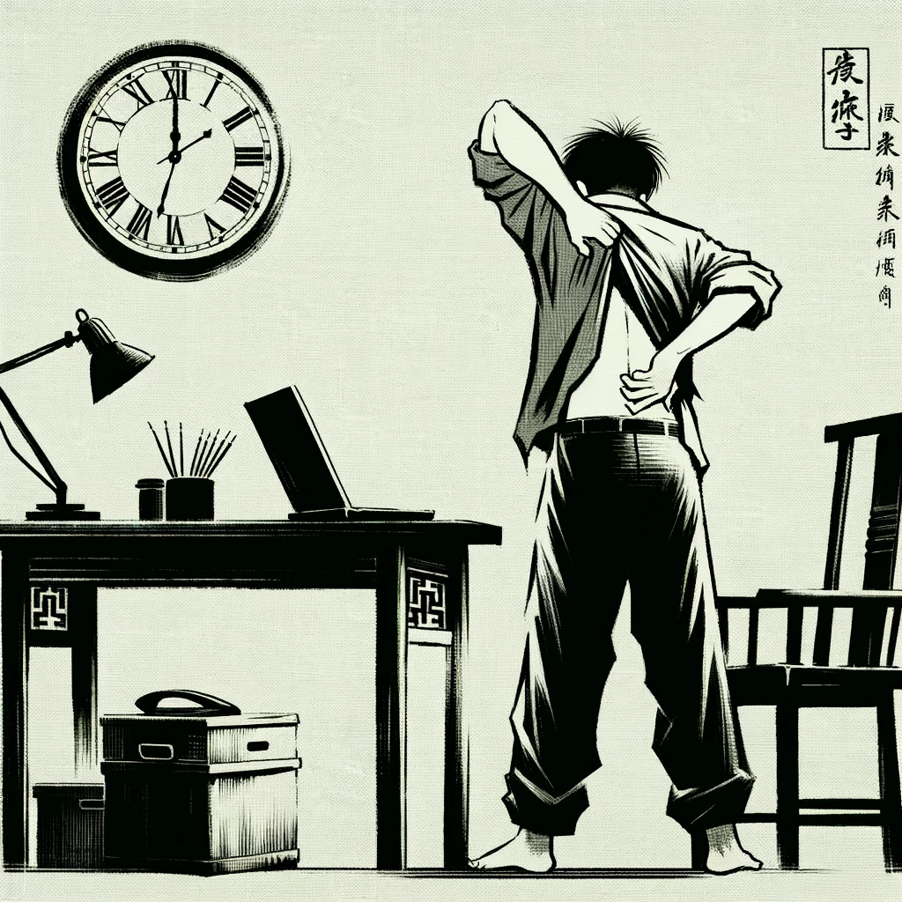
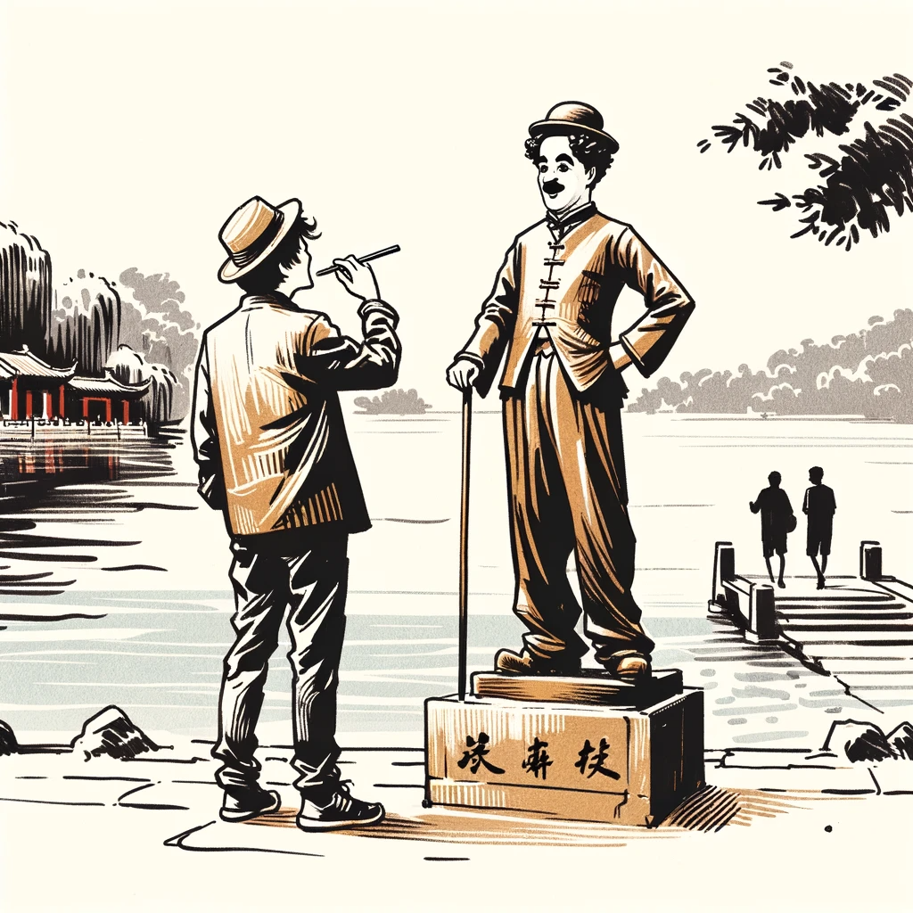
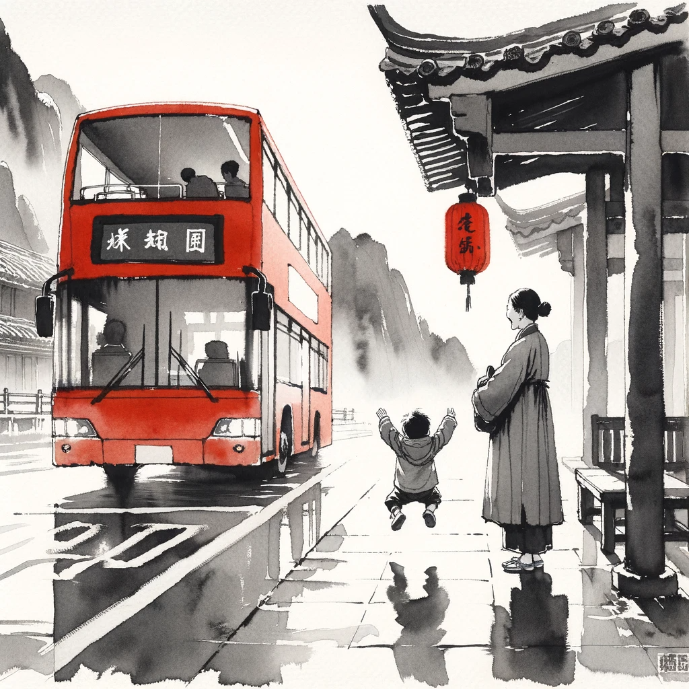
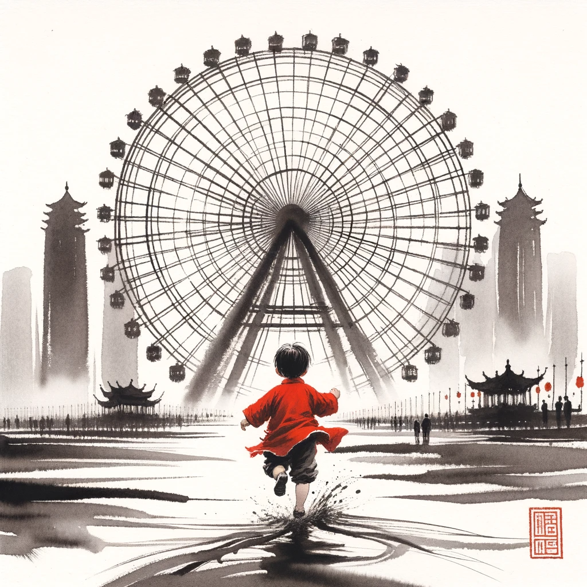

# 【生命⋅修行】什么是简单的生活

早上看到一段萨古鲁的视频，谈及什么是简单的生活。他说：

> 简单生活是指，你不被纠缠住。这非常重要，你得到了提升，但不被纠缠。你可以做出任何安排，但这个安排应该是你可以掌控的，不是吗？
>
> 你不要按着别人的样子去安排生活，安排了你却不知道如何掌控。你为什么要做你不需要的安排呢？如果你做了你不需要的安排，这些安排就会变成束缚。
>
> 所以，如果你……什么安排对你是最好的，你就做那种安排，这就是简单的生活。简单的生活不是说你是个简单的傻瓜好吗？你的安排是要能够支持你，你想要去哪里，就可以去哪里，想要做什么就能过做什么。
>
> 蜘蛛织网是为了困住其它东西。如果你是这样的蜘蛛，织网只是困住了自己。你就是一只愚蠢的蜘蛛，不是吗？
>
> 大部分人正是如此。

正好到了昨天晚上，工作结束时已经是夜里10点36分，一阵疲惫感猛然袭来。是的，正是那种自己的节奏与安排渐渐失控的感觉。可能，主要是工作的时间越来越长，睡得越来越晚吧。工作是为了什么呢？除了挣钱，其实最核心的原因本来只是在正确的「工作」/ 「士气」循环中，自己会越来越爽。然而，凡事都有度，一不留神就过尤不及了。

卓别林的诗中就一句话：

> As I began to love myself I quit stealing my own time, and I stopped designing huge projects for the future. Today, I only do what brings me joy and happiness, things I love to do and that make my heart cheer, and I do them in my own way and in my own rhythm. Today I call it **SIMPLICITY**.
>
> 当我开始爱自己，我不想再偷走自己的时间，我停下来不再去为将来构想庞大的计划。今天，我只做那些能带给我快乐与幸福的事情，那些我热爱并且能让我心为之欢呼的事情，并且只用我自己的方式、自己的节奏去做这些事情。今天我管这叫做**简单**。

**简单生活**——**只用自己的方式、自己的节奏，做那些能带给我快乐与幸福的事情，做那些我热爱并且能过让我心为止欢呼的事情。**

----

原则，真的很简单。做到却需要真地真地好好去了解自己。了解自己的需求，了解自己的节奏，了解究竟是什么自己的热爱，什么能让自己内心为之欢呼，什么能给自己带来快乐与幸福。

前两天，大宝给我视频时，说她最近今天忽然觉得自己其实可以很快乐。这是因为她每天要带着大鱼出门，而大鱼的爱好是坐车，坐各种个样的车。于是，大鱼的快乐很简单，就是送完姐姐上学后，坐公交车出门，换公交次或者地铁，到某个地方玩一下，回家正好还能赶上睡午觉。说给别人听，别人完全无法理解，这有什么好玩的。大鱼却乐此不疲，大宝静下心来陪着大鱼之后，发现真的乐趣无穷。

以前我们哪里注意过，公交车有什么区别。可是大鱼不一样，他要坐双层大巴，单层大巴，Mini小巴。红色的大巴，黄色的大巴，绿色的大巴，白色的大巴。原来大巴还有这么多种类，他每一种都要兴致勃勃地尝试。坐在大巴车上，路上的风景也让他目不暇给。各种个样的汽车，各种隧道，立交桥，路边花坛，各不相同的公交站牌，路边标语。用他的眼睛看过去，这个城市简直太有趣、太美、太好玩了。

地铁也是，不同的地铁站有不同的风格。每一条线路的地铁也不同，除了数字不同，颜色也不同——我以前从未注意过这点。

一座一线大城市，每年要花多少钱在这些公共市政建设上？修路、修公园、建设公共交通系统，把到处整得漂漂亮亮。可真正有心去欣赏和享受这美好的人，又有几人呢？

丰子恺说：

> 这个世界不是有钱人的世界，也不是无钱人的世界，它是有心人的世界。

大鱼和大宝是这样的有心人，我也要做这样的有心人。

