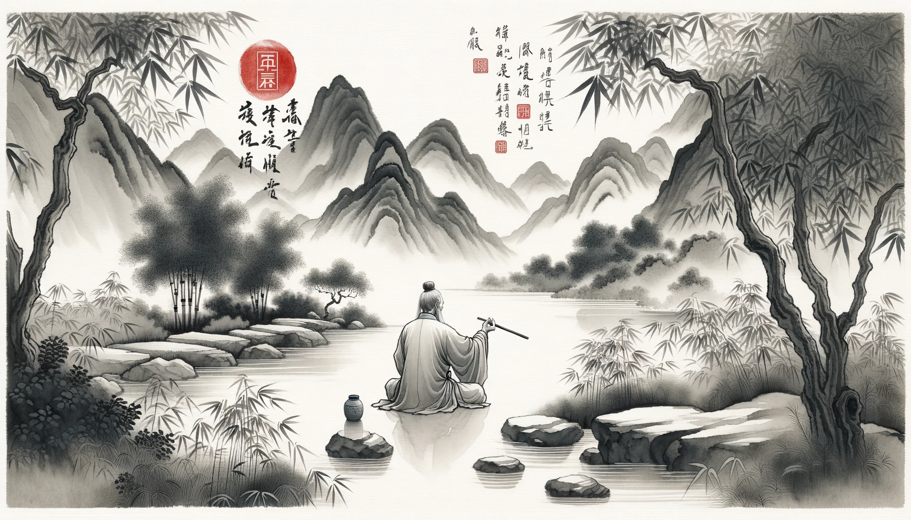
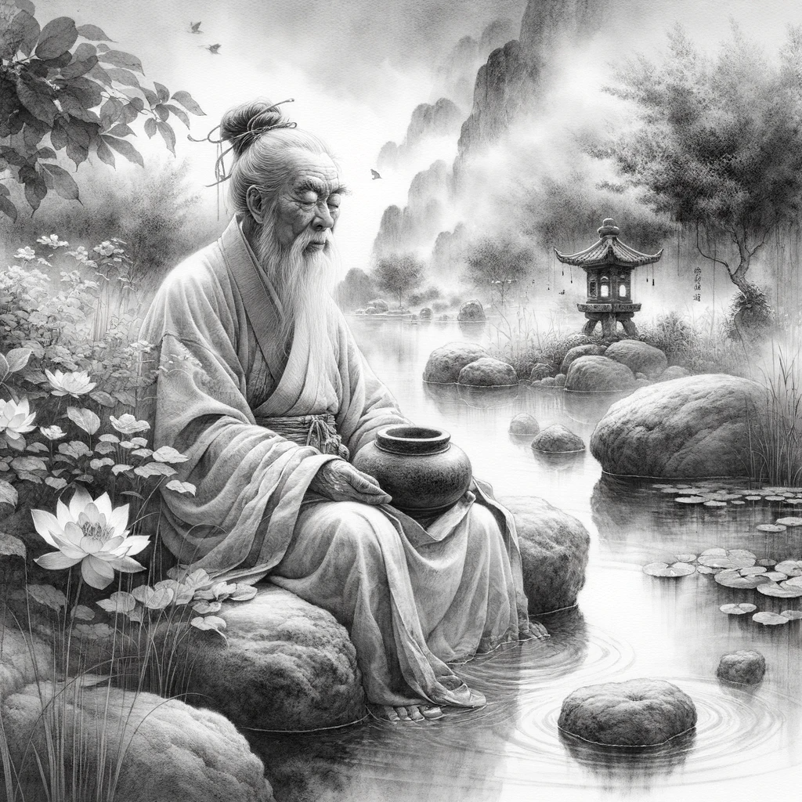
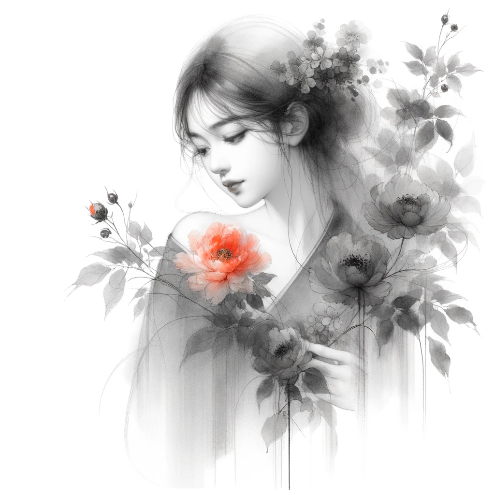

# 【生命⋅修行】关于养生的两个绝招

读《曾国藩嘉言钞（冯唐品读）》时看到这么一段：

> 凡沉疴在身，而人力可以自为主持者，约有二端：一曰以志帅气，一曰以静制动。人之疲惫不振，由于气弱，而志之强者，气亦为之稍变。如贪早睡，则强起以兴之。无聊赖，则端坐以凝之。此以志帅气之说也。久病虚怯，则时时有一畏死之见，憧扰于胸中，即魂梦亦不甚安恬。须将生前之名，身后之事与一切妄念铲除净尽，自然有一种恬淡意味，而寂定之余，真阳自生。此以静制动之法也。

梁启超在这段之后大加赞赏，说这讲得太好了！于是，医学院科班出生的冯唐对此颇为鄙夷：

> 一个外行谈治病，一个外行击节赞叹，这算啥呢？

其实，曾国藩关于养生，还说过这么一句话，听起来也同样是非常有道理：

> 养身之道，以君逸臣劳为要。省思虑，除烦恼，二者皆所以清心，君逸之谓也。行步常勤，筋骨常动，臣劳之谓也。

**心要静，体要勤**

我想，这一点冯唐应该会很赞同吧，他也是主张人要动起来，把步跑起来的。就是不知道冯唐能活多少岁，反正他起这个笔名的原因之一，就是古时候那个易老的冯唐活了很大岁数。曾国藩、梁启超虽然一生成就颇丰，却61，57便早早去世了。想必，他们是国事太劳心了吧。倒是梁启超几个没夭折的小儿小女，梁思宁、梁思礼都活过了90岁。

这几天偶尔会感觉心脏部位不太舒服，刚刚去翻看了一下上个体检的报告，心电图没啥问题，倒是肝部有个小囊肿，据说也是常见的小毛笔、不打紧。由于近视眼的原因，自己的眼底和视网膜检测结果被打上了两个黄色感叹号，但医生认为——这也是正常——近视眼常见的问题。

想想，对我而言，还是应该好好践行南怀瑾传授的那两个养生绝招才是：

1. **用眼**：「用其光，复归其明」。看东西，不要让自己的眼神放到外物上去，而是把外物的神收回到自己眼中来。他说，有个老道告诉他：「看花要看花的精神，是看一株一株的花，开得多活泼！ **你们看花，精神都被花吸走了；有道的人看花，把花的精神吸收来了，心目中就充满神光了。**」
1. **清心**：我们的心脏只有拳头那么大，装不了多少东西的。什么痛苦、烦恼、得意统统都丢出去，什么不准装进来，统统丢掉，你就前途无量，后福无穷。

这两招，我也是略略只能意会，践行得太少，感觉到身体有毛病了才想起来。还是得时时刻刻都把这两条都练起来才是，要不「健康长寿」这个念想岂不是成了空话！