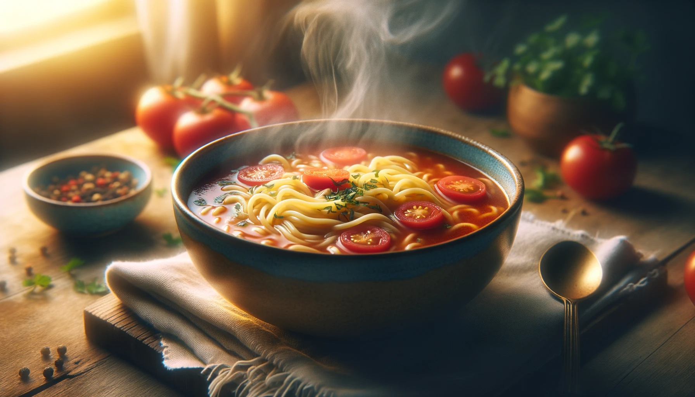
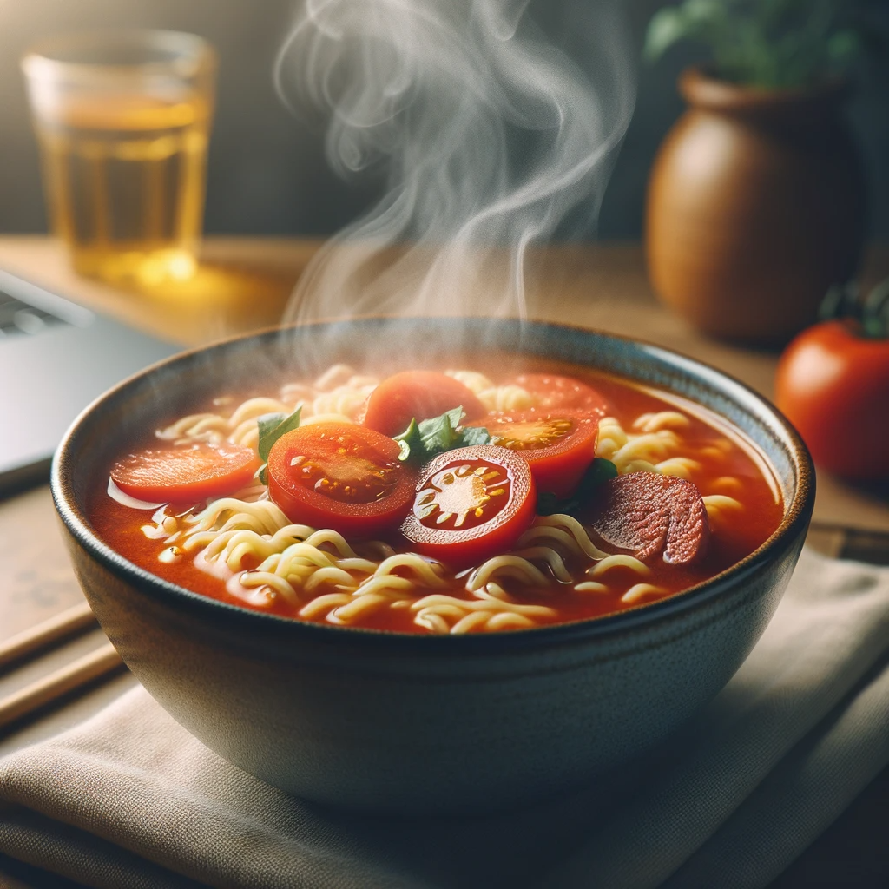

# 【随笔】废寝忘食

晚上有同事打电话来，交代一件蛮重要的事情。大约讲清楚之后，他说：

> 你抓着小伙伴们先讨论，我先吃口饭。

我看了看时间，差不多已经过了晚饭时间。算算时差，他那边更是早过了饭点，哎，真是辛苦。就在这时，我忽然想起来，自己也没吃饭啊！

更想起前一天，我完全忘记了吃午饭这回事儿。到了晚饭时分，坐在电脑边的我猛然觉得饿起来。而且是立刻饿得肚子咕咕叫，脑袋天旋地转起来。这才想起，中午饭忘记吃了。曾经有一瞬间计划着要去吃饭来着，然后被一件事情把这个想法打断，之后就完全忘记了。

在以前，自己曾经以「废寝忘食」为荣，觉得那是自己努力与专注的表现，谁让我们小时候都是把这些当作正面典型宣传呢？什么周公一沐三握发，一饭三吐哺啊，什么王羲之蘸着墨汁吃馒头啊，什么铁人王进喜啊？

现在我却这么想：废寝忘食这程度，确实很专注，可是，总这样，也确实太伤身体了。

甚至，我还会觉得，这是一种觉知力不够的表现。有真正重要的事情和远大的目标，当然可以不惜身体、甚至不惜生命。然而，我们这样的普通人，哪里遇得到那么多真正重要的事情呢？

回望过去几十年，似乎没有几个通宵是真正值得的，似乎也没有忘掉的那一顿饭是真正值得的。当时放弃睡觉、放弃吃饭所投入的那些事情，回头看，真的没有那么重要。

锅里的水烧开了，我扔进去几块切好的西红柿，看着红色的西红柿块在沸水中翻滚，慢慢地，白开水变成了好看的西红柿汤，我又把一块方便面扔进锅里，撕开调料包倒进去。煮了两分钟，再从冰箱上面取出三大片切好的肉片，也扔进依旧沸腾的面汤里滚了三滚。

唔，此时此刻，再没什么比好好享用这碗方便面更重要的事情了！

