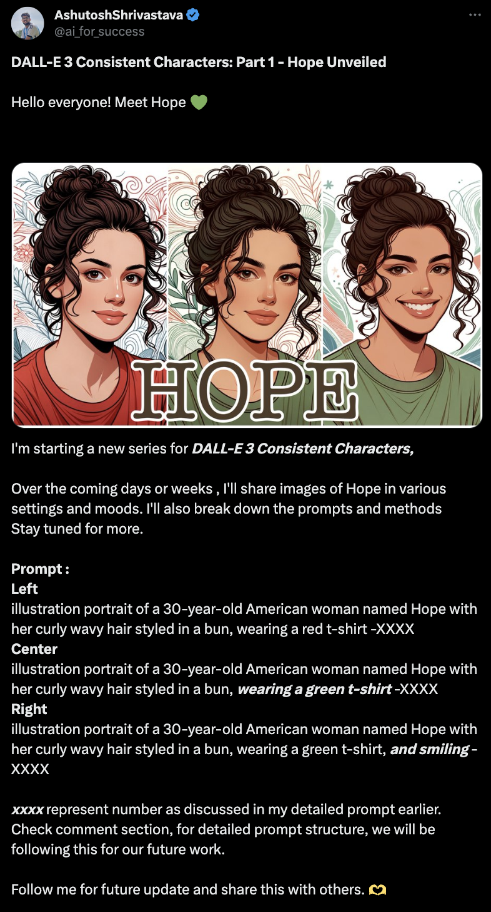
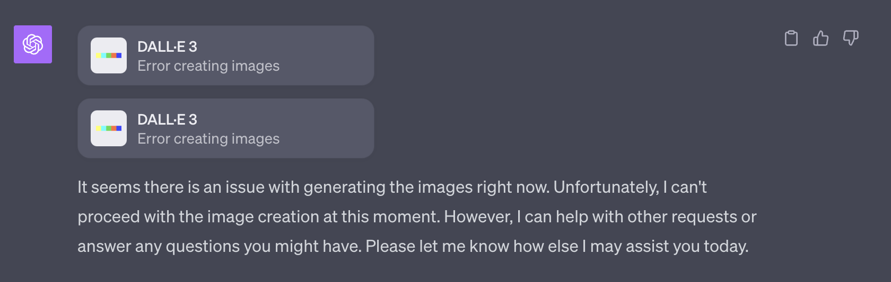

### 【教程】ChatGPT的角色一致性

前两天看到[这篇文章，讲ChatGPT DALL-E 3的角色一致性](https://mp.weixin.qq.com/s/p-w-F9a90t0z7IVAYvf-7A)，看上去好像非常管用，于是迫不及待地想要尝试一下。我到Twitter上看了一眼，发现这位AshutoshShrivastav真的很厉害，他贴了一系列的教程：

1. **DALL-E 3 Consistent Characters: Part 1 - Hope Unveiled** (https://twitter.com/ai_for_success/status/1715631036145836047)
2. **DALL-E 3 Consistent Characters: Part 2 - Hope: How to write prompt?** (https://twitter.com/ai_for_success/status/1718996316473438369)
3. **DALL-E 3 Consistent Characters: Part 3 - How to structure Prompt?**  (https://twitter.com/ai_for_success/status/1718996318872547663)
4. **DALL-E 3 Consistent Characters: Part 4 - How to structure Prompts for Outdoor/Indoor Activities?**  (https://twitter.com/ai_for_success/status/1718996321338818668)
5. **DALL-E 3 Consistent Characters: Part 5 - How to Craft Prompts for Emotions in Illustration/Photorealistic Subjects?**（https://twitter.com/ai_for_success/status/1716792768352440725）
6. **DALL-E 3 Consistent Characters: Part 6 - The Final Chapter: Camera Angles and Shot Types!**  (https://twitter.com/ai_for_success/status/1717499700503617769)

我打算从这第一个开始学起，大家不妨跟着我也试试看。

## 基本套路

这里核心在于两点：

1. Basic Prompt + 种子数 （以后每一个变化都在这个种子数上加一），例如：

   > portrait of a 30-year-old Indian man named Ashutosh with short hair. -0000

2. Basic Prompt + 附加信息 / 修改信息 + 种子数+1，例如：

   > portrait of a 30-year-old Indian man named Ashutosh with short hair wearing a red jacket -0001

## 具体步骤

### 1. 初始化角色

> **Prompt :**  
>
> **Left** illustration portrait of a 30-year-old American woman named Hope with her curly wavy hair styled in a bun, wearing a red t-shirt -XXXX 
>
> **Center** illustration portrait of a 30-year-old American woman named Hope with her curly wavy hair styled in a bun, **wearing a green t-shirt** -XXXX 
>
> **Right** illustration portrait of a 30-year-old American woman named Hope with her curly wavy hair styled in a bun, wearing a green t-shirt, **and smiling** -XXXX 

上面是AshutoshShrivastav给的例子，我决定直接开始我的：

> 画三格人物肖像（注意用英文提示词）。
>
> Left 结合中国水墨工笔画风，加上岭南画派风格，再有一点漫画风格的人物肖像。男士叫「浩然」，年龄看起来在30到40岁之间，中国人、双眼皮、适中浓度的眉毛和明显的鼻梁。他脸型修长，下巴略圆润，没有留胡子。身材中等，看起来很健康。他穿着红色的T恤。戴着适合他脸型的时尚黑色方形框架眼镜。-0000
>
> Center 结合中国水墨工笔画风，加上岭南画派风格，再有一点漫画风格的人物肖像。男士叫「浩然」，年龄看起来在30到40岁之间，中国人、双眼皮、适中浓度的眉毛和明显的鼻梁。他脸型修长，下巴略圆润，没有留胡子。身材中等，看起来很健康。他穿着白色的T恤。戴着适合他脸型的时尚黑色方形框架眼镜。-0001
>
> Right 结合中国水墨工笔画风，加上岭南画派风格，再有一点漫画风格的人物肖像。男士叫「浩然」，年龄看起来在30到40岁之间，中国人、双眼皮、适中浓度的眉毛和明显的鼻梁。他脸型修长，下巴略圆润，没有留胡子。身材中等，看起来很健康。他穿着中式立领衫。没有戴眼镜。-0002

然而！ChatGPT 报错了！再也无法为我画图。不知道怎么回事！

从此之后，我的GPT DALL-E 3 就进入了极其不稳定时期。又一个会话还能继续为我画画，新开一个会话有时能画，有时不能画。但只要输入我这些画肖像的描述，他就挂啦！！！

真是让人困惑啊！ 